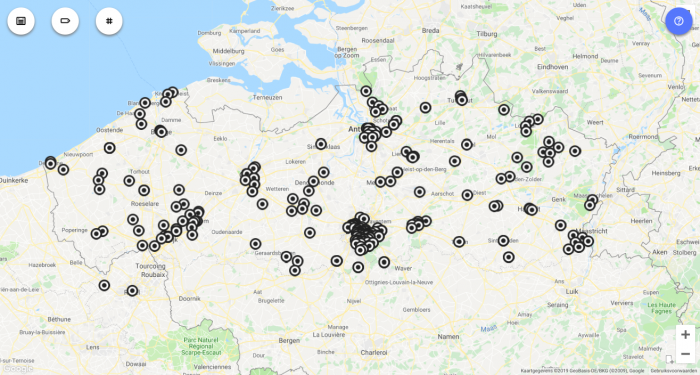
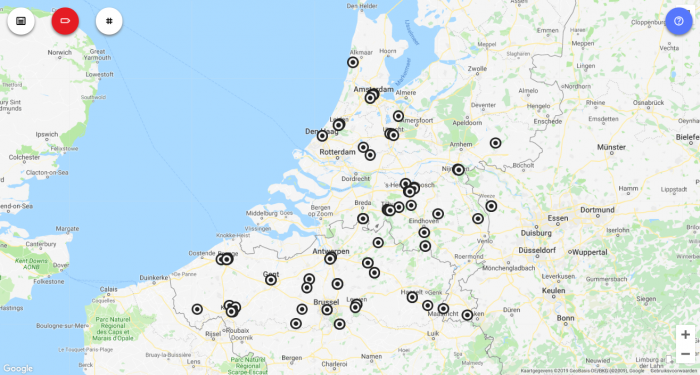
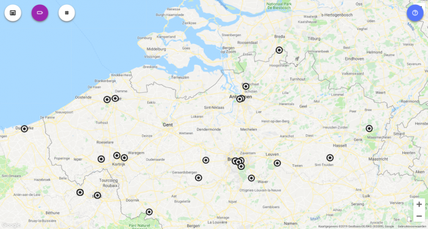

Ergens terug in 2014 kwam ik op het idee om een website te maken waar je gemakkelijk zou kunnen opzoeken waar en wanneer je naar de mis kan gaan. Die data zijn allemaal beschikbaar op de regionale pagina's van Kerk en Leven, maar niet publiek toegankelijk. Zelfs abonnees moeten het stellen met de papieren versie, die zich beperkt tot de kerken vlak in de buurt.   

Die website werd [MapTiming](http://www.maptiming.com). Het is een generiek platform waar je plaats, datum en tijd van (weerkerende) events kan invoeren en visualiseren op een landkaart. Toendertijd was er nog de oude website van Kerknet, die de uren van de normale zondagsmissen publiceerde voor gans Vlaanderen. Die heb ik vlak voor het verdwijnen van de oude website [geplunderd](/blog/kerknet-gehackt-om-naar-de-mis-te-gaan/) en op MapTiming gezet. Intussen zijn die data hopeloos verouderd. Actuele gegevens komen met mondjesmaat beschikbaar op de [nieuwe website van Kerknet](https://www.kerknet.be/zoeken/vieringen/lijst) (en zijn niet half zo overzichtelijk ;-).  

MapTiming was oorspronkelijk gebaseerd op [Google Fusion Tables](https://support.google.com/fusiontables/answer/2571232), een soort van database waarmee je gemakkelijk visualisatie op een landkaart kon aanbieden. Google heeft besloten de stekker uit dat project te trekken. De voorbije maanden is de _back-end_ van MapTiming herwerkt om gebruik te maken van [Google Datastore](https://cloud.google.com/datastore/).   

De data van de zondagsmissen van het oude Kerknet zijn niet mee gemigreerd. MapTiming concentreert zich nu op drie katholieke niches:  

**Aanbidding:** [https://adoremus.maptiming.com/50.845514,4.358497,9z,782px/all](https://adoremus.maptiming.com/50.845514,4.358497,9z,782px/all)  

Adoremus - eucharistische aanbidding in Vlaanderen

**Biechtgelegenheid:** [https://naar-de-mis.maptiming.com/51.715703,4.627662,8z,782px/all/biecht](https://naar-de-mis.maptiming.com/51.715703,4.627662,8z,782px/all/biecht)  

Biechtgelegenheid in Vlaanderen en Nederland

**Tridentijnse missen:** [https://naar-de-mis.maptiming.com/51.113546,4.152503,9z,782px/all/eucharistie](https://naar-de-mis.maptiming.com/51.113546,4.152503,9z,782px/all/eucharistie)  

Tridentijnse missen ("buitengewone ritus") in Vlaanderen

Heb je nieuwe gegevens voor deze kaarten, moeten er aanpassingen gebeuren of wil je zelf een heel nieuwe kaart aanmaken en onderhouden, contacteer [info@maptiming.com](mailto:info@maptiming.com) ! Experimenteren met MapTiming kan je op de testkaart [test.maptiming.com](https://test.maptiming.com/).
