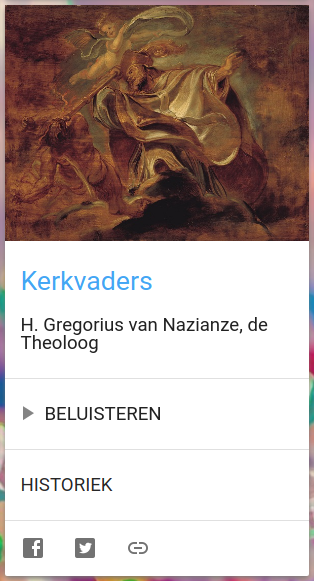

[Alledaags Geloven](https://alledaags.gelovenleren.net/) heeft er een nieuwe kaart bij. Op Radio Maria zijn ze al enkele maanden bezig met een [programmareeks over de kerkvaders](http://www.radiomaria.be/de-kerkvaders/). Vanaf nu verschijnt de [laatste aflevering](https://alledaags.gelovenleren.net/link/MTkyNTA0NDQwMDkxMTY1) op Alledaags Geloven. Hopelijk blijven de programma's online nadat de reeks afloopt!

Kerkvaders op Alledaags Geloven

#### Dashboard voor dagelijks gebed, studie of bezinning

Alledaags Geloven is geen website die eigen content levert. De toegevoegde waarde van Alledaags Geloven zit hem in de verbetering van jouw workflow. De luttele minuten die je dagelijks kan of wil vrijmaken voor gebed moeten efficiënt besteed worden. Als je elke dag meer tijd verspilt om je gebedsmateriaal bijeen te zoeken dan dat je tijd kan besteden aan je eigenlijke gebed, ben je verkeerd bezig, dus dat doet Alledaags Geloven voor jou! Je hebt maar je tablet te pakken, de pagina te openen en met een enkele klik bereik je al je gebeden, bijbelteksten, catechese en bezinningen, opengeslagen op de pagina van vandaag, of waar je laatst gebleven was.
