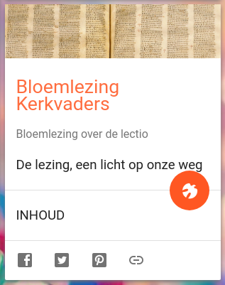

Weer een nieuwe kaart op [Alledaags Geloven](https://alledaags.gelovenleren.net/), en weer met kerkvaders. Ditmaal van de website [Leerhuis van de Kerkvaders](https://kerkvaders.be/), een organisatie in Gent die lessen, leesavonden, colloquia en pelgrimsreizen organiseert met de kervaders als thema. Zij hebben op hun website een kleine bloemlezing van teksten van de kerkvaders. Wie teksten zoekt van de kerkvaders, kijkt best even op hun [pagina met externe verwijzingen](https://kerkvaders.be/websites), waar tal van buitenlandse tekstverzamelingen te vinden zijn.

Bloemlezing van de Kerkvaders
