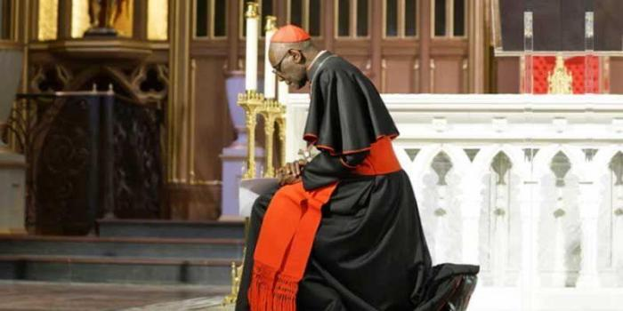

In een vorig artikel publiceerde ik een [gebed](/blog/gebed-voor-een-nieuw-humanae-vitaewonder/) dat mgr. Pope schreef om genade te vragen voor de Paus bij het schrijven van de exhortatie over de Amazonesynode.

Het gebed is voor de christen het laatste redmiddel, de reddingsboei waaraan hij zich kan vastklampen als alle hoop is geweken. Het wordt zowaar een tendens. Ook kardinaal Sarah publiceerde onlangs een [bijzonder gebed, voor Duitsland](https://de.catholicnewsagency.com/story/ein-gebet-fur-deutschland-von-kardinal-robert-sarah-5339). Niet toevallig vindt ook daar kortelings een synode plaats met tegendraadse agendapunten.

Hierbij het gebed in eigen vertaling:

> Heer, blijf bij ons; omdat het avond wordt en de dag is geweken!  
> Heer, blijf bij ons; omdat droefheid en lauwheid onze harten hebben overvallen!  
> Heer, blijf bij ons; want aan alle kanten bedreigt de duisternis, van de leugen en van de afvalligheid, Uw Kerk.  
>   
> Kom, verwarm onze harten en ontsteek ze met een grote liefde voor U, ware God en ware Mens.  
> Doe ons leven ontvlammen, laat het schijnen in de pracht van het evangelie, maak het onderworpen aan de Geest van waarheid en heiligheid.  
> Kom, verwarm onze harten en laat ze branden voor Uw heilige Kerk, de enige ark van het heil.  
>   
> Heer, begeleid ons en verklaar ons de Schrift; begeleid ons en leer ons dat het Kruis de wijsheid van God is; begeleid ons op onze levensweg, Gij, Verrezene, en moedig ons aan U te volgen, zodat we met vreugde, met geloof en met het vuur van Uw liefde in onze harten, de herberg kunnen bereiken waar U het brood zult breken om Uzelf aan ons te openbaren.  
>   
> We hebben U verraden en U verloochend.  
> We hebben U verkocht voor de rijkdom en goederen van deze wereld.  
> We hebben U achtergelaten, bang voor de mening van anderen, en we vluchtten.  
>   
> Laat ons, net als Petrus, aan het kraaien van de haan herkennen dat we U drie keer hebben verloochend. Deze schreeuw kondigt ons immers de opgang aan, de komst van de zon, die leven geeft.  
>   
> Laat ons U herkennen en liefhebben in Uw eucharistische aanwezigheid.  
> Laat ons U steeds waardiger ontvangen met een gelovige, aanbiddende, eerbiedige ingesteldheid.  
> Laat ons U aanbidden in het Heilig Sacrament van het altaar, het middelpunt van ons leven en van onze gemeenschap.  
>   
> U zijt de enige Weg; leer ons het geluk om U aan alle mensen te tonen zonder angst of valse terughoudendheid.  
> U zijt de enige Waarheid; leer ons om ze helder te verkondigen aan deze materialistische en misleide wereld.  
> U zijt het enige Leven; leer ons de vreugde elk leven te ontvangen, van de conceptie tot de natuurlijke dood.  
>   
> Heer, geef ons herders naar Uw hart, die arm, gehoorzaam en in onthouding leven.  
> Geef ons bisschoppen en priesters - apostelen die branden van liefde voor U.  
> Geef ons bisschoppen en priesters - heiligen die ons naar U leiden.  
> Kom, roep mensen die het evangelie prediken, heilige herders uit onze eigen gezinnen. Maak onze gezinnen heilige plaatsen waar veel kinderen met vreugde worden geboren.  
>   
> Kijk met liefde neer op het Westen en op alle christelijke landen die ooit diep van U gehouden hebben, U gediend hebben, U aanbeden hebben, maar U nu lijken te vergeten.  
> Leer hen dat ze slechts in de Opstanding van Pasen een echte toekomst kunnen vinden.  
> Leer hen dat het licht van de hemel de duisternis overwint en dat de Mensenzoon door Zijn dood de dood heeft overwonnen.  
> Ja, blijf bij ons, Heer; laat ons huis niet in de steek!  
>   
> Stuur ons de Trooster, om het leven en de werken van de Kerk te sturen, te begeleiden en te leiden.  
> Moge de Maagd Maria, moeder van de Kerk, ons beschermen wanneer stormen boven ons woeden.  
> Blijf bij ons, Heer; U zijt de zon van ons leven en de levende bron van de Kerk!  
>   
> Amen.  
> 
> Gebed voor Duitsland van Kardinaal Sarah  

mgr. Sarah
