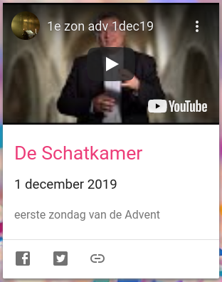
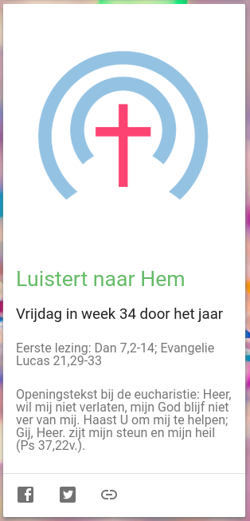
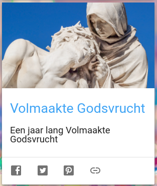

Alledaags Geloven is drie dagelijkse kaarten rijker!

[De Schatkamer van de Kathedraal](http://www.deschatkamervandekathedraal.be/) is een Youtubeproject van kanunnik Bart Paepen, pastoor van de Antwerpse kathedraal, die vanaf komende zondag, bij het begin van de Advent, elke week een stukje schrijft over de lezingen van de zondagsmis en er ook een filmpje bij publiceert, waarin telkens een ander kunstwerk of voorwerp uit de kathedraal wordt getoond dat op een of andere manier naar die lezingen verwijst.

De Schatkamer

[Luistert naar Hem](https://petruscanisiusstichting.nl/) is een project van de Petrus Canisiusstichting. Pater J. Bots sj geeft dagelijks een bezinning bij de teksten van de mis van die dag, te beluisteren via de [app](/portfolio/luistert-naar-hem-app/) of op de [website](https://petruscanisiusstichting.nl/).

Luistert naar Hem

[Volmaakte Godsvrucht](/blog/een-jaar-lang-volmaakte-godsvrucht/) is een projectje van dit blog, waar vanaf komende maandag een jaar lang het Gouden Boek van Louis-Marie Grignion de Montfort wordt gepubliceerd. 

Volmaakte Godsvrucht

Alledaags Geloven volg je via de [website](https://alledaags.gelovenleren.net/), waar je een overzicht vindt van alle kaarten met de meest diverse geloofsbronnen, intussen al ruim meer dan 50, of via de [app](/portfolio/alledaags-geloven-app/), die je een willekeurige kaart voorschotelt.
