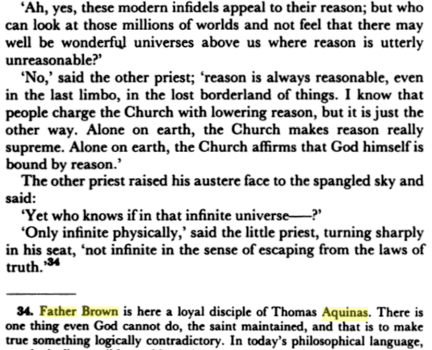

Op de website [summa.gelovenleren.net](https://summa.gelovenleren.net/) is een tweede set Nederlandse vertalingen toegevoegd van Sint Thomas' Summa Theologiae. Quaestiones 27 tot 43 uit de Prima Pars behandelen de Heilige Drievuldigheid.

De Summa is droge kost, maar hier en daar tref je wel passages die het bezinnen waard zijn, bijvoorbeeld deze over de zending van de Heilige Geest en het inwonen in de mens:

> Gezonden te worden komt toe aan een goddelijken Persoon doordat Hij in iemand een nieuwe bestaanswijze krijgt; gegeven te worden komt Hem toe, doordat iemand Hem bezit. Geen van beiden nu geschiedt tenzij door de heiligmakende genade. Er is immers een gewone wijze waarop God in alle dingen is door wezenheid, macht en tegenwoordigheid, zooals de oorzaak in de uitwerkselen die hare goedheid deelen. Boven deze gewone wijze bestaat er nog een bijzondere die aan het redelijk schepsel toekomt. Hierin immers is God aanwezig als het gekende in den kenner en het beminde in den minnaar. En daar het redelijk schepsel door zijn ken- en liefdedaad God zelf bereikt, zoo is God, door deze bijzondere wijze, niet slechts tegenwoordig in het schepsel, maar woont er in als in zijn tempel. Geen enkel uitwerksel dus, tenzij de heiligmakende genade, kan de voldoende reden zijn voor een nieuwe bestaanswijze van een goddelijken Persoon in het redelijk schepsel. De goddelijke Persoon wordt dus gezonden en komt voort in den tijd door de heiligmakende genade alleen. — Insgelijks alleen datgene wat wij vrijelijk kunnen gebruiken en genieten noemen wij ons bezit. Het vermogen nu om een goddelijken Persoon te genieten komt enkel van de heiligmakende genade. — Door de gave zelf van heiligmakende genade bezitten wij nochtans den Heiligen Geest en woont Hij in den mensch. Daarom wordt de Heilige Geest zelf geschonken en gezonden.
> 
> [Iª q. 43 a. 3 co.](https://summa.gelovenleren.net/liber-1-quaestio-043.html#articulus3)

Laatst kwam ik Sint Thomas nog tegen op een onverwachte plaats. Father Brown is de hoofdrolspeler in de [detectiveromans](https://books.google.be/books?id=0L3CAgAAQBAJ&pg=PA34&lpg=PA34&dq=father+brown+aquinas&source=bl&ots=3fWqEd_zVB&sig=ACfU3U2SG9MKqAo-CEmo6NqqadwXkWOI5g&hl=en&sa=X&ved=2ahUKEwjEobuQ7PDkAhVYAmMBHQobDWkQ6AEwF3oECAQQAQ#v=onepage&q=father%20brown%20aquinas&f=false) van G.K. Chesterton en ik las hoe hij de aartsschurk Flambeau, meesterlijk vermomd als collega-priester, ontmaskert door met hem in discussie te gaan over de theologie van Sint Thomas. De falsaris valt door de mand door zijn relativistische houding --- zo kennen we er nog vandaag:

Father Brown in discussie met aartsschurk Flambeau

De Summa is nu ook onderdeel van [Alledaags Geloven](https://alledaags.gelovenleren.net/), een website met bijhorende [app](https://play.google.com/store/apps/details?id=net.gelovenleren.alledaags) die je dagelijks nieuwe voeding voor je geestelijk leven voorschotelt.

Summa Theologiae op Alledaags Geloven

Denk je dat het nuttig is dat deze teksten online staan, overweeg dan een van de [veertien overblijvende boekdelen](https://summa.gelovenleren.net/about.html) te reviseren!
