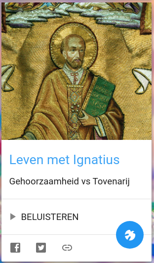
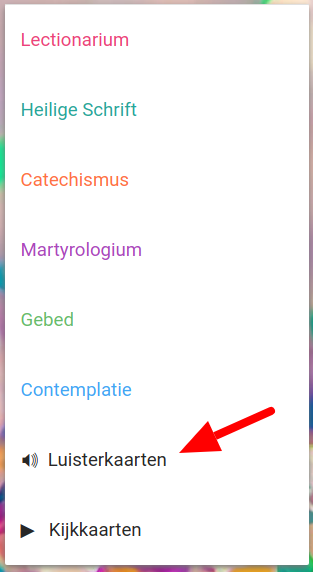

_[Leven met Ignatius](https://www.jezuieten.org/nieuws/ignatiaanse-spiritualiteit-in-elf-podcasts/)_ is een 11-delige podcast waarin het boek 'Leven met Ignatius – Op het kompas van de vreugde', van Nikolaas Sintobin sj wordt voorgelezen. Nu ook te beluisteren op [Alledaags Geloven](https://alledaags.gelovenleren.net/).

Leven met Ignatius

Intussen staan er al een tiental "luisterkaarten" online, die je nu ook apart kan uitfilteren. Als je elke dag wat tijd kan vrijmaken voor bezinning, maar niet van lezen houdt, heb je daarmee al heel wat materiaal voorhanden!

Luisterkaarten
