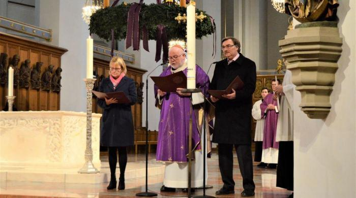

Voor Duitse katholieken worden het twee lange jaren. Twee jaar duurt het proces van de "[Synodale Weg](https://www.kerknet.be/kerknet-redactie/nieuws/duitse-katholieke-kerk-start-vandaag-synodale-weg)". Kerkleiding en leken gaan debatteren over de toekomst van de Kerk, die---zoals overal in West-Europa---in crisis is. De kaarten liggen al lang op voorhand open op tafel: de vooropgestelde doelstellingen omvatten opheffing van het celibaat, wijding van vrouwelijke diakens en kerkelijk homohuwelijk. Dit alles vindt nota bene plaats onder het mom, dat het veranderingen zouden zijn die opgedrongen worden door het misbruikschandaal. Misbruik van het misbruik, noem ik dat...

Zelf volg ik nauwelijks Duitse media, toch zou ik graag een oogje in het zeil houden. Met Google Translate actief in mijn browser, heb ik al een staalkaart genomen van de websites die de moeite zijn om op te volgen:

[www.synodalerweg.de](https://www.synodalerweg.de/) **Der synodaler Weg** is de officiële website van heel het gebeuren [\[RSS\]](https://script.google.com/macros/s/AKfycbyQuZ-TZe-8sqTpaG3VLu6XUu6IHNDdAQG1K5P9/exec)

[www.dbk.de](https://www.dbk.de/) **Deutsche Bischofskonferenz**, dat zijn de Duitse bisschoppen [\[RSS\]](https://script.google.com/macros/s/AKfycbzrxKDpK_j7Lj9ZaNiuTyyboIL9vF9wbZvxQcGOkE7Zgs4mWbM/exec)

[www.zdk.de](https://www.zdk.de/) **Zentralkomitee der deutschen Katholiken** is de lekenorganisatie die als officiële vertegenwoordiger van de Duitse katholieken zal deelnemen aan de Synodale Weg [\[RSS\]](https://script.google.com/macros/s/AKfycbzsN3JoqIXawzM7TYzwX9l1t_ENPoe2emWs2ukd6g/exec)

[www.katholisch.de](https://www.katholisch.de/) **Het mediaportaal van de Kerk**, zeg maar het Duitse Kerknet [\[RSS\]](https://script.google.com/macros/s/AKfycbz8cOfVVCeXmg10lQ2iwYiuYvE3RaahlAngVCCO39MIdHPDHAE/exec)

[www.kirche-und-leben.de](https://www.kirche-und-leben.de) **Een uitgave van het bisdom Münster**, maar met een [onafhankelijke](https://www.kirche-und-leben.de/faq/) redactie [\[RSS\]](https://script.google.com/macros/s/AKfycbyQjCq2yH8D_rQL9oZbgg5m-99JDTghvT_CNCUaVxmPZtb7iqrw/exec)

Omdat de websites in het Duits zijn en ik liefst nieuws volg in mijn RSS-feed in het Nederlands of het Engels, heb ik me voor elke site geabonneerd op de bijhorende news-feed, met behulp van [fetchrss.com](http://fetchrss.com/rss/5de7fefe8a93f8b33c8b45675de7fe628a93f8d2328b4567.xml) voor het aanmaken van ontrekende feeds en van [Google Scripts](https://www.labnol.org/internet/google-translate-rss-feeds/5110/) voor het vertalen van de feeds. De links naar de Nederlandstalige RSS-feeds vind je hierboven.

Het [eerste berichtje](https://www.katholisch.de/artikel/23792-der-synodale-weg-droht-asymmetrisch-zu-werden?utm_source=standpunkt&utm_medium=Feed&utm_campaign=RSS) dat ik binnenkreeg, kwam van katholisch.de, het Duitse Kerknet. Het was een opinieartikel. De publicist vond het niet kunnen dat bij de openingsceremonie de mevrouw van het ZdK niet genoeg in beeld was gekomen. Ze had alleen een kaars mogen aansteken en een kort woordje zeggen, en de rest van de aandacht was opgeeist door kardinaal Marx, de snoodaard!... Zie je wel dat de Kerk nog steeds klerikaal denkt!

Zal dit het niveau zijn van de meningsuitwisselingen gedurende de komende twee jaar? Ik maak me weinig illusies, want dit is gedurende de voorbije 50 jaar onveranderlijk het niveau geweest van de meningsuitwisselingen over het thema "de rol van de leek in de Kerk". _Been there, done that._ En dan heb ik uit zelfbehoud nog afstand gehouden van websites van drukkingsgroepen, zoals die van [Maria 2.0](https://www.mariazweipunktnull.de/), die alle katholieke verbeelding tarten.

De mevrouw van ZdK kwam niet genoeg in beeld

Hier in Vlaanderen gaat het er gelukkig veel rustiger aan toe. Geen kerkstakende vrouwen en ook geen s(y)node wegen. Alles peis en vree dus? Ik geloof er niks van! Ons kerkvolk denkt precies hetzelfde als het Duitse en ook onze bisschoppen denken precies hetzelfde als de Duitse. Waarom woedt bij ons het debat dan niet zo hevig? Niet alleen omdat 'de Vlaming' makker en volgzamer is dan 'de Duitser'. Zeker ook omdat de overheidssteun van de Kerk in Duitsland rechtstreeks afhangt van het aantal gelovigen dat zich jaarlijks als katholiek bekent, terwijl die in Vlaanderen voor onbepaalde tijd verzekerd is, zelfs al lopen alle kerken leeg.

Het Vlaamse status quo weerhoudt een hoofdredacteur van het Vlaamse Kerk en Leven er intussen niet van, ook zijn duit in het zakje te doen. Zijn [jongste editoriaal](https://www.kerkenleven.be/uitgave/1949/artikel/5b) is voor de goede lezer een duidelijk pleidooi voor vrouwelijke priesters. Dat soort van omfloerste stemmingmakerij zijn we intussen van ons katholiek lijfblad wel gewend, maar het illustreert nog maar eens dat, eens de Duitsers het vuile werk hebben opgeknapt, de Kerk in ons land zonder kritiek de vernieuwingen zal kunnen omarmen: de geesten zijn reeds murw gemaakt.

Een niet te onderschatten factor in het debat is de publicatie binnen enkele maanden van de pauselijke exhortatie over de Amazonesynode. Als de paus de _viri probati_ installeert in de Amazone, zal dat het debat in Duitsland een duidelijke richting geven.

Ik ben hier nu weer veel kritiek aan het geven, maar weet je, eigenlijk is er principieel niks mis mee, dat leken met hun eigein inspiratie vorm geven aan de kerk van de toekomst, die onvermijdelijk anders zal zijn dan de kerk van vandaag en dan die van vorige eeuw, of de eeuwen daarvoor. Wat mijn weerstand voedt tegen zowat alle voorgestelde veranderingen in dit debat, is dat ze toegejuicht worden door een grote en zelfingenomen (want nooit tegengesproken) groep van "gelovigen" van wie ik het sterke vermoeden heb dat ze eigenlijk nauwelijks nog geloven in enige vorm van transcendentie, laat staan in verrijzenis, eeuwig leven, eucharistie of andere wezenlijke katholieke geloofspunten. Dat gebrek aan geloof wil ik niemand kwalijk nemen. Het is ook niet eigen aan leken. Ik zie het echter wel als de belangrijkste oorzaak van de crisis in de Kerk. Als de "Synodale Weg" zich tot doel stelt die crisis het hoofd te bieden, lijkt het me geen goed idee de oorzaak van die crisis te versterken. 

* * *

PS. Op RKDocumenten is een [dossier "Synodale Weg"](https://www.rkdocumenten.nl/rkdocs/index.php?mi=650&dos=497)  aangelegd, maar daarin is nog niet veel verschenen.
