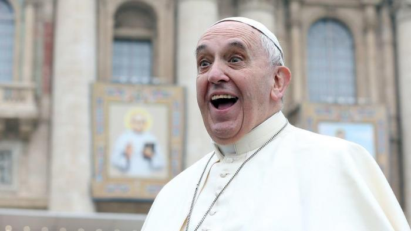
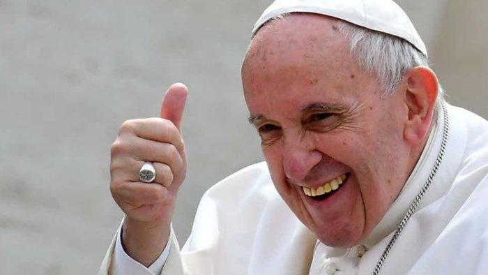

In oktober 2019, tijdens de Amazonesynode, schreef ik een artikeltje onder de titel ["Zoiets aberrants als een priester"](/blog/zoiets-aberrants-als-een-priester/). Ik was een beetje cynisch toen, want ik ging ervan uit, zoals zovelen, dat de synode, nog voor de stemmen goed en wel geteld waren, onherroepelijk zou leiden tot een pauselijke exhortatie die in de Amazone gehuwde mannen tot de priesterwijding zou toelaten.

Die veronderstelling heeft paus Franciscus vandaag ontkracht. Ik betuig mijn spijt over mijn gebrek aan vertrouwen in de heilige Vader.

De Duitse organisatie van leken, ZdK, is er daarentegen als de kippen bij om paus Franciscus een [gebrek aan moed te verwijten](https://www.zdk.de/veroeffentlichungen/pressemeldungen/detail/ZdK-Praesident-Sternberg-bedauert-fehlenden-Mut-zu-echten-Reformen-1305s/). Hun teleurstelling heeft weinig te maken met bezorgdheid over de Amazone. Zij zaten natuurlijk op hete kolen, omdat ze de exhortatie wilden gebruiken als een katalysator in de Duitse "Synodale Weg". Streep door de rekening van vele opiniemakers, zeker in onze kontreien. Je zal nu trouwens in de media en op blogs plots weer foto's zien opduiken van de paus die een beetje nors kijkt, maar niet hier!

Duimpje!

Dat het moed vergt veranderingen door te voeren, daarin hebben ze gelijk. Dat het soms meer moed vergt veranderingen **niet** door te voeren, daarvoor lijk je blind te zijn, als je meent dat er slechts één weg vooruit is. 

Het zou interessant zijn te weten waarom de paus geen openingen heeft gemaakt. Is het zijn persoonlijke onderscheiding? Wat zouden zijn goede geesten en zijn kwade geesten geweest zijn? Staat hij onder invloed van kardinalen zoals mgr. Sarah? Wil hij bepaalde evenwichten in het kardinaalscollege bewaren, wie weet al in het vooruitzicht van de verkiezing van een volgende paus? Zitten de geilogende Duitsers, wiens hete adem de paus in zijn voelde, er voor iets tussen? 

Wat de achtergrond van de beslissing ook weze, ik noem ze moedig! Deze exhortatie is één van de belangrijkste documenten van dit pontificaat. Het mag gerust een wonder genoemd worden, net zoals _Humanae Vitae_ dat was. En daarmee is het [gebed van mgr. Charles Pope](/blog/gebed-voor-een-nieuw-humanae-vitaewonder/) dus toch nog verhoord!
