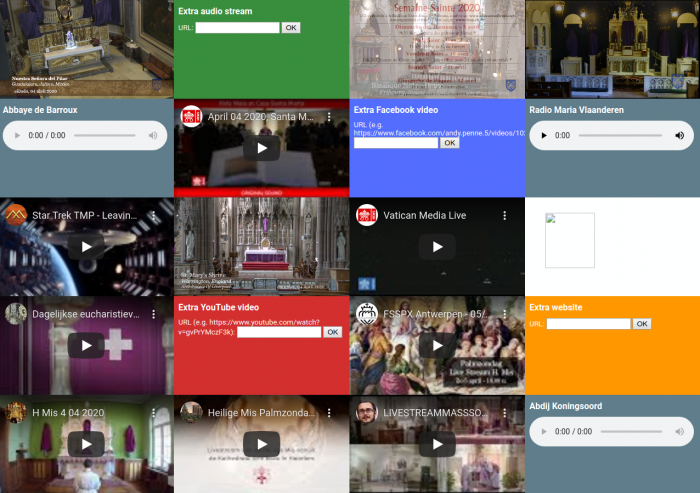

Vroeger hadden we op onze kabel-tv een "mozaiek-kanaal", waarop je op alle zenders tegelijk kon zien wat er op was. Sinds de lock-down, heb ik een nieuwe obsessie met het livestreamen van eucharistievieringen. Ik ben dus even aan het _hacken_ gegaan om zo'n mozaiek-kanaal te maken met katholieke livestreams.

Eigenlijk is het idee een vervolg op de [livestreammasssoundscape](/blog/livestreammasssoundscape-een-artistieke-interpretatie-van-12-live-uitgezonden-eucharistievieringen-%ef%bb%bf/) uit mijn vorige artikel. Weinig mensen zullen het interessant vinden meerdere streams tegelijk te beluisteren, maar ik vind het persoonlijk wel een mooi effect hebben. Zeker als je er tridentijnse missen tussen mixt, waarin veel stiltes vallen. Het effect is heel meditatief. Je hebt dat minder met het voortdurend gekakel dat de novus ordo zo kenmerkt en dat bij simultaan beluisteren snel een kakafonie wordt.

Het is een experiment en heeft niet de bedoeling een volledig aanbod te bieden. Er zitten ook nog heel wat technische haken en ogen aan. Maar als _proof of concept_ mag het er wel zijn, vind ik.

Het resultaat is niet meteen van praktisch nut en in die hoedanigheid eerder als artistiek project te benaderen. De _crux_ blijft echter, te benadrukken hoe belangrijk het is voor een gelovige, te beseffen dat op zovele plaatsen het heilig Misoffer wordt opgedragen, ook al is het vandaag zonder gelovigen aanwezig, om het heil van Christus in de wereld tegenwoordig te stellen!

Meerdere streams staan gereed om opgestart te worden. Er zijn ook andere bronnen, zoals Radio Maria, Organroxx (orgelradio) of het live getijdengebed van Abdij Koningsoord of Barroux, die je in je persoonlijke _soundscape_ kan verwerken. Er zijn ook velden om zelf hokjes toe te voegen, door een link in te vullen naar een Youtube-filmpje, Facebook-filmpje of andere website die geluid produceert. Die links worden toegevoegd aan de URL van de site, dus als je er nadien een bookmark van maakt, komen die vanzelf mee op. Dat hoeven niet per se kerkelijke geluidsbronnen te zijn, zo heb ik standaard de soundtrack van Star Trek The Motion Picture mee opgenomen :)

Heb je last van de stilte, ga naar [http://mosaic.gelovenleren.net](http://mosaic.gelovenleren.net), en word zelf een liturgische DJ door je favoriete livestreams te mixen!

Livestream Mass Mosaic
