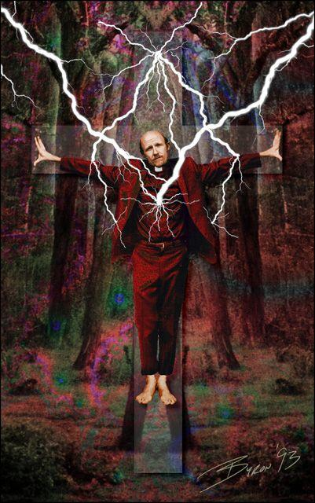

Geconfronteerd met een ernstige besmettelijke ziekte maatregelen treffen om de impact te beperken, is redelijk. Het is de taak van de **geneeskunde** en zonodig ook van de **overheid** om ons te beschermen. Als christenen kunnen we ons daar helemaal in vinden. Het is ook de roeping van elke **christen** om het leven, dat van Gods gegeven is, te behoeden voor onheil. Zowel vanuit christelijk perspectief als vanuit seculier/wetenschappelijk perspectief, streven we voor de maximale bescherming tegen de ziekte.

_Is dat zo vanzelfsprekend? Blijven de strategieën gelijklopen in extreme gevallen? Is de coronacrisis zo'n extreem geval?_

Als antithese zou ik willen stellen dat het uiteindelijke doel van de geneeskunde duidelijk **verschilt** van dat van de christelijke leer. De geneeskunde wil zorgen dat we zo lang mogelijk in zo comfortabel mogelijke omstandigheiden kunnen _leven_. **De christelijke leer wil finaal dat we zo goed mogelijk kunnen _sterven_.** De leer van de uitersten mag dan wat weggemoffeld zijn in het hedendaags christelijke discours, ze geldt nog steeds, en wil dat elke ziel na de verrijzenis het licht van God mag zien, niet door _lang_ of _comfortabel_ te leven, maar door _goed_ te leven, volgens Gods geboden.

**Hoe meer middelen we in handen krijgen om ons levenseinde te beïnvloeden, hetzij negatief, hetzij positief, hoe sterker het onderscheid **tot uiting komt** tussen de christelijke en de seculiere finaliteit van het leven.** 

Voorbeelden waar dit onderscheid al sinds geruime tijd aan het oppervlakte is gekomen, zijn **euthanasie** en **abortus**. Beide praktijken zijn volgens de criteria die wetenschap/overheid hanteert, volstrekt legitiem, want ze verhogen wat gepercipieerd wordt als "kwaliteit van het leven". Volgens de christelijke leer zijn ze ontoelaatbaar, want ze gaan in tegen het vijfde gebod "gij zult niet doden". Je mag dan nog langs beiden zijden de nodige nuances aanbrengen, verzoenbaar worden de standpunten niet.

Andere voorbeelden zijn praktijken zoals kunstmatige **geboortebeperking** en **geslachtsverandering**, en neem **homoseksulateit** er ook maar bij. Die gaan evenwel niet in tegen het vijfde gebod, maar toch leert de christelijke moraal dat ze op onnatuurlijke wijze de voortplanting, deel van het scheppingsproces, verstoren.

Een nog moeilijker voorbeeld is de **kunstmatige voortplanting**. Volgens de geneeskunde perfect mogelijk, maar de kerk stelt er erstige vragen bij. Niet uitsluitend omdat er overbodige embryo's worden gedood of omdat de techniek wordt toegepast buiten het huwelijk, maar ook om hetzelfde principiële bezwaar dat er op onnatuurlijke wijze wordt ingegrepen in het scheppingsproces.

Is de kerk dan plots niet meer _pro life_, maar _tegen_ het leven?

De rode draad in de christelijke moraal is niet de bescherming van het leven op zich, maar **respect voor de _gegevenheid_ van het leven**. Ons leven is geen doel op zich, het is de weg naar ons doel, bij God te zijn. Pas als we ons in de plaats van de Schepper stellen, hetzij aan het begin, hetzij aan het einde van het leven, gaan de alarmbellen af. Deze ethiek is gebaseerd op onze onderworpenheid aan de natuurwet. 

De natuurlijke dood is op dezelfde wijze een wezenlijk aspect van ons bestaan en kan daarom bij een christen geen weerzin oproepen. Juist christenen zouden zich ten volle op de dood moeten voorbereiden. Klassieke gebeden drukken dat uit. In elk weesgegroet bidden we "bid voor ons, nu _en in het uur van onze dood_". De oefeningen van geloof, hoop, liefde en berouw uit de Mechelse catechismus besluiten met de formule "in dit geloof/hoop/liefde/berouw wil ik leven _en sterven_". 

In het euthanasiedebat wordt geschermd met de term "voltooid leven", wat christenen tegen de borst stuit. Een christen hoort nochtans te allen tijde klaar te zijn te verschijnen voor de Heer, daartoe heeft Christus ons aangespoord in tal van parabels. **Het leven van een christen is in wezen op elk moment 'voltooid'.** Wat een christen tegen de borst stuit, is de gevolgtrekking dat je een 'voltooid leven' actief zou mogen beëindigen. Van oude mensen hoor je wel eens zeggen "die is gereed om te gaan" of "onze lieve Heer mag mij nu komen halen". Dat is helemaal geen cynisme en heel iets anders dan een spuitje vragen. 

De verhalen die me tijdens de coronacrisis het meest getroffen hebben, zijn die van zieken, al dan niet slachtoffer van het virus, die in een ziekenhuis of bejaardenhuis onder lock-down hun sterfbed gevonden hebben, zonder de nabijheid van hun familie. **De maatregelen om het leven te beschermen, schermen ons ook af van het sterven.** Voor een christen zou ook hier de alarmbel moeten afgaan. De bescherming van het leven, correct volgens seculiere moraal, verwordt tot een afwijzing van het natuurlijk sterven. 

Ik las laatst een SF-reeks _[Hyperion](https://en.wikipedia.org/wiki/Hyperion_(Simmons_novel))_, waar in een verre toekomst de katholieke kerk, geleid door een jezuiet als paus (!), met de naam Teilhard I, in de macht komt van een Artificiele Intelligentie die door middel van een kruisvormig implantaat in de borstkas parasiteert op het brein van gelovigen, in ruil voor een middel om het eeuwige leven te verkrijgen: wanneer iemand sterft, zorgt het parasiterend organisme na drie dagen voor een heropstanding van lichaam en geest, onder het mom van de christelijke opstanding. 

Dystopische romans kunnen profetische elementen bevatten. De kerk moet waakzaam zijn niet blindelings de drang van de wetenschappelijke ontwikkeling te volgen om op mechanische wijze de natuurlijkheid van het sterven weg te nemen. **De finaliteit van het christelijk leven is mooier en beter dan gekluisterd aan medische apparaten in eenzaamheid de grenzen van de wetenschap te ervaren.**

* * *

Paul Duré sj, die zichzelf kruisigde aan een Teslaboom en later paus Teilhard I zou worden, tot de AI de macht overnemen.
