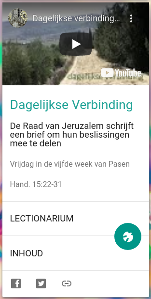

Van Paasmaandag tot de zaterdag voor Pinksteren heeft mgr. Johan Bonny, bisschop van Antwerpen, via Youtube een lezingenreeks over het boek _Handelingen van de Apostelen_ uitgezonden, in 42 afleveringen. 

Daarmee is het eerste jaar afgesloten van het driejarige pastorale project rond de _Handelingen_. Het eerste jaar stond onder het motto _Neem en lees!_ Het tweede jaar, dat nu aanvangt, heeft als motto _Gebruik uw voeten!_ Benieuwd wat dat zal leveren… Meer daarover in de [homilie van Pinksteren](https://youtu.be/pWuLBvDraGw?t=1718) of de [projectwebsite](https://www.kerknet.be/thema/pastoraal-thema-handelingen-van-de-apostelen-2019-2022).

De afgeronde lezingenreeks is terug te bekijken op het Youtubekanaal van de Kathedraal van Antwerpen onder de titel "[Dagelijkse Verbinding](https://www.youtube.com/playlist?list=PLsTqv8iy6f_1nQPx21yCdmgPxofTNBkaJ)" en verschijnt ook op [Alledaags Geloven](https://alledaags.gelovenleren.net/link/Njg0NjkwMjY2OTkyOTk=)! Bij elke aflevering is een link naar het Lectionarium voorzien, zodat je de besproken tekst erbij kan nemen.

Alledaagse Verbinding
