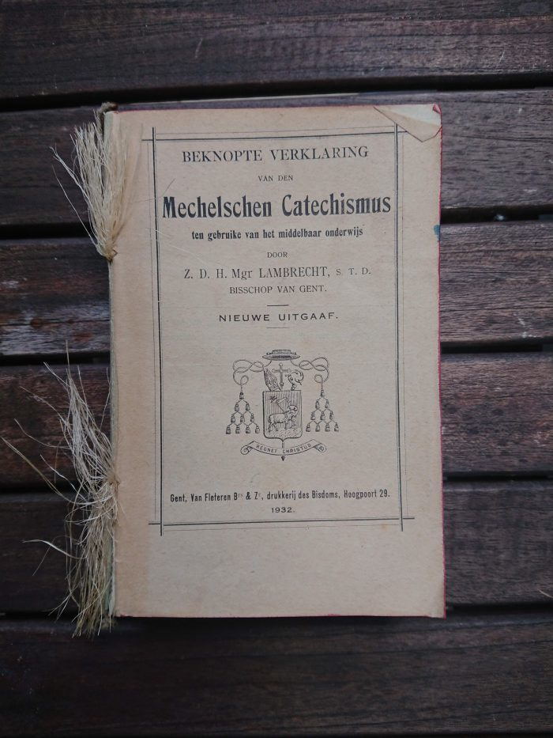
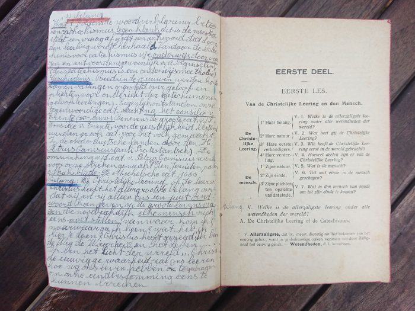
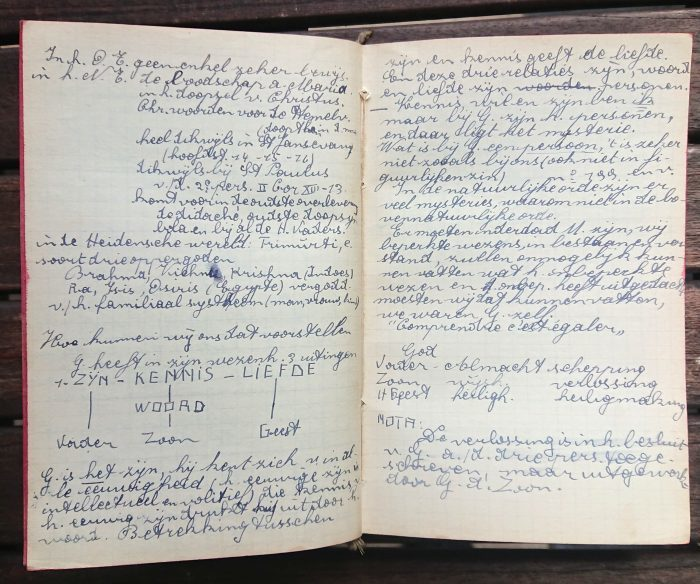
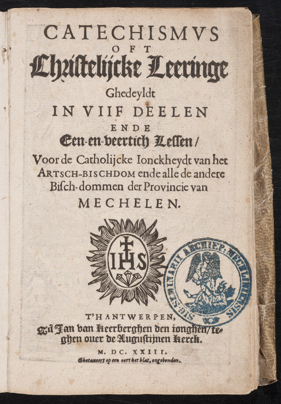
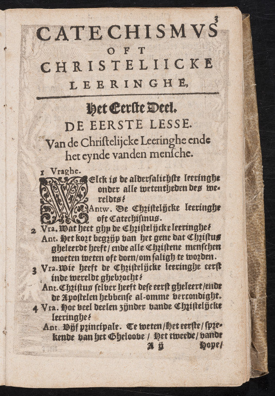

Gisteren, 17 augustus, kwam ik op heiligen.net terecht op de vita van [Lodewijk Makeblijde sj](http://www.heiligen.net/heiligen/08/17/08-17-1630-lodewijk.php). Een heel uitvoerige levensbeschrijving met op het einde de mededeling dat deze pater eigenlijk nooit heilig verklaard is... En toch op heiligen.net? Deze website wordt onderhouden door een jezuïet, dus deze kleine broederdienst kan niet euvel geduid worden. Zeker niet omdat Makeblijde sj een interessant figuur is! 

Hij heeft een uitvoerig palmares in de Lage Landen en was o.a. als Vlaming (Poperinge) op missie in Nederland, in de tijd van de contrareformatie. De verwezenlijking die mijn aandacht trok, was zijn auteurschap van de eerste editie van de Mechelse Catechismus, in opdracht van Matthias Hovius, aartsbischop van Mechelen, die verscheen in Antwerpen in 1609.

Daar heb ik wat op doorgezocht. Op de Digitale Bibliotheek voor de Nederlandse Letteren (DBNL) vond ik in interessante tekst uit 1937 die de complexe geschiedenis van de Mechelse (en aanverwante) catechismussen in Vlaanderen uit de doeken doet: [De Didactiek tegenover den zoogezegden ‘verouderden’ Mechelschen Catechismus, door Kan. J. Jacobs, werkend lid der Koninklijke Vlaamsche Academie](https://www.dbnl.org/tekst/_ver025193701_01/_ver025193701_01_0039.php). 

In de nasleep van het Concilie van Trente kwamen verschillende nederlandstalige catechismussen uit. Ieder bisdom had zijn eigen catechismus, gebaseerd op de Romeinse Catechismus van paus Paulus V en op de drie catechismussen die pater Canisius sj schreef in opdracht van keizer Ferdinand. Die laatste introduceerde het concept van vraag-en-antwoord, dat de basisopmaak zal blijven van de latere publicaties.

De Mechelse Catechismus van Makeblijde sj was een gezamenlijk inititief van bisdommen Brugge, Ieper, Antwerpen, Gent, 's Hertogenbosch en Roermond. Er was echter al snel kritiek op zijn werk en in 1623 verscheen een tweede editie, van de hand van pater De Pretere sj, in 5 delen en 41 lessen. Deze editie van de Mechelse Catechismus kende grote bijval, maar in de verdere geschiedenis beginnen de bisdommen weer met eigen herwerkte of zelfs geheel nieuwe publicaties, ook in Mechelen. 

Ik lees echter: "In het Bisdom Gent bleef het leerboek van 1623 nagenoeg ongewijzigd bewaard", dit tot spijt van de auteur van het artikel op DBNL, die het verouderde taalgebruik aanklaagt. 

Het toeval wil echter, dat ik in mijn bezit een "Beknopte verklaring van den Mechelsen Catechismus ten gebruike van het middelbaar onderwijs" heb, door mgr. Lambrecht, bisschop van Gent, uit 1932. Een boek dat mijn grootvader (Cyriel Houben, 1918-1984) heeft gebruikt in zijn opleiding op de normaalschool. Dit is dus wellicht de tekst die van alle catechismussen die in die periode in omloop waren, het nauwst aansluit bij de originele tweede editie van de Mechelse Catechismus uit 1623!

Deze catechismus is niet te verwarren met de Mechelse Catechismus die de ouderen (en traditionalistische jongeren) onder ons kennen: het dunne boekje waaruit in de lagere school godsdienst werd gegeven (dat nog her en der op internet te vinden is en waarvan zelfs een [studie-app voor Android](/portfolio/mechelse-catechismus/) beschikbaar is!), maar dat wellicht ook het resultaat is van vier eeuwen redactie. Mijn Mechelse Catechismus is _the real thing!_ 

Zoveel heb ik steekproefsgewijs ook kunnen verifiëren op basis van deze ingescande versie van de originele uitgave uit 1623 uit de bibliotheek van de KULeuven: [Catechismus oft christelijcke leeringe ghedeyldt in viif deelen ende een-en-veertich lessen, voor de catholijcke ionckheydt van het artschbischdom ende alle de andere bischdommen der Provincie van Mechelen \[door Guilielmus de Pretere\]](http://depot.lias.be/delivery/DeliveryManagerServlet?dps_pid=IE4698284&). 

Inclusief de verklarende teksten bij elk vraag-en-antwoord, is mijn Catechismus een boek van 348 bladzijdes, maar---wie weet---durf ik er ooit wel eens aan beginnen het de digitaliseren! Dat zou toch moeten lukken tegen 2023, dan viert de tekst zijn 400ste verjaardag!

- 
    
- 
    
- 
    

Mechelse Catechismus voor het middelbaar onderwijs, met aantekeningen van mijn grootvader... dat is nog eens studeren!

- 
    
- 
    

Het originele werk uit 1623
