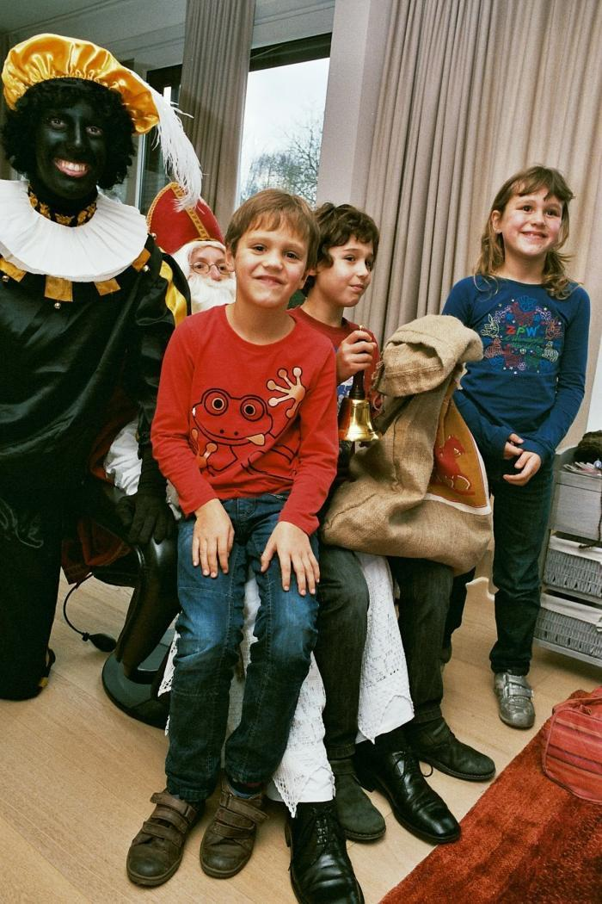
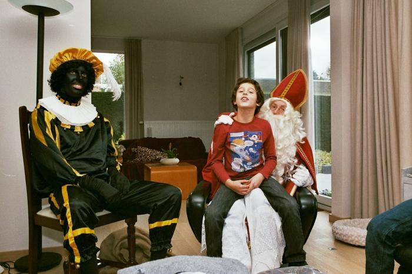
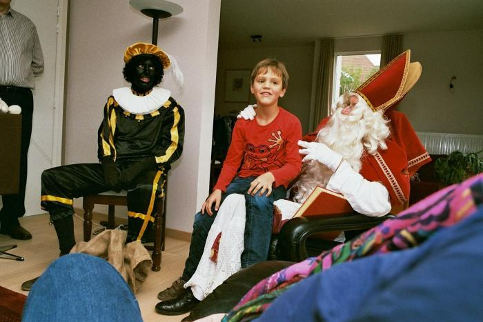

Het was als zachte provocatie bedoeld. De dag waarop in het nieuws kwam dat Instagram foto's van Zwarte Piet zou verwijderen, heb ik enkele familiefoto's gepost van een sinterklaasfeest bij de grootouders enkele jaren geleden, waarop we zowaar bezoek kregen van de echte Sinterklaas en Zwarte Piet! 

Vandaag werden die foto's verwijderd. Het geeft mij zo'n beklemmend gevoel dat ik me niet langer veilig voel op dit medium. Ik heb me dan ook terstond verwijderd van Instagram. Ik kijk graag naar dystopische films, maar ik speel er niet graag in mee. De duistere machinaties van Facebook, Instagram en consorten, die aan niemand verantwoording af te leggen hebben, wil ik niet als een juk op mijn schouders dragen.

Op zich kan je er niets op tegen hebben dat ze eender welke willekeurige censuurmaatregel nemen. Je maakt gebruik van een gratis service van een bedrijf, zij bepalen de regels, en als die regels je niet bevallen, is dat pech, dan ga je elders. 

Net zoals vroeger, als de parochiale bibliotheek je boek niet had, omdat het op de 'index' stond, had je pech, dan moest je het elders zoeken. Dan kon je het bijvoorbeeld zoeken in de socialistische bibliotheek in een naburig dorp. 

Met sociale media is het iets lastiger, want al de mensen met wie je contact wil houden en die niet even principieel zijn, verhuizen natuurlijk niet mee, dus je blijft wel alleen achter...

Het censureren van enkele foto's is op zich tamelijk onschuldig. De _cancel culture_ gaat intussen veel verder en bedreigt mensen in hun persoonlijk en professioneel leven. Je denkt altijd dat het _jou_ zo snel niet zal overkomen, maar de duisternis grijpt sneller om zich heen dan je je kan voorstellen. Het is onvoorstelbaar hoe gemakkelijk een samenleving zich kan verlagen tot een equivalent van de fascinerende laat-Middeleeuwse boekverbrandingen en heksenjachten uit onze geschiedenisboekjes. 

Er zijn [alternatieven](https://greycoder.com/a-list-of-alternative-social-networks-similar-to-reddit-twitter-instagram-and-facebook/). Een beetje googlen leert dat er sociale platformen zijn die gebruik maken van peer-to-peer of gedistribueerde netwerken. Daar is geen censuurorgaan aanwezig om alles in de gaten te houden. Je bereik wordt er plots wel een pak kleiner. Om de temperatuur van het water eens te voelen, heb ik me ingeschreven bij [beta.sociall.io](https://beta.sociall.io/), [friendica.vrije-mens.org](https://friendica.vrije-mens.org/) en [www.minds.com](https://www.minds.com/). Ook op Reddit wordt het sommigen blijkbaar te heet onder de voeten, waarna je terecht kan op [saidit.net](https://saidit.net/) of [ruqqus.com](https://ruqqus.com/)

Het beste alternatief is mensen met wie je echt iets wil delen, een mailtje of een kaartje te sturen… Intussen vraag ik me af of ik uiteindelijk veel verloren heb. In elk geval zal ik tijd hebben gewonnen, want dat eindeloos scrollen door grappige foto's en filmpjes, waartoe ik me al te vaak liet verleiden, hoeft nu niet meer!

En Sinterklaas die met een echte Zwarte Piet op bezoek kwam bij oma en opa, dat blijft onvervangbaar!

- 
    
- 
    
- 
