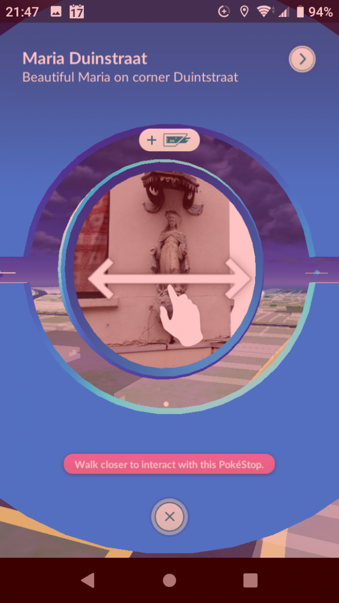
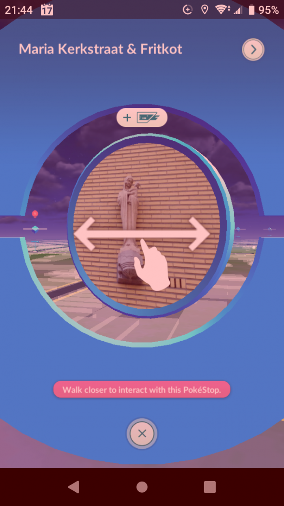
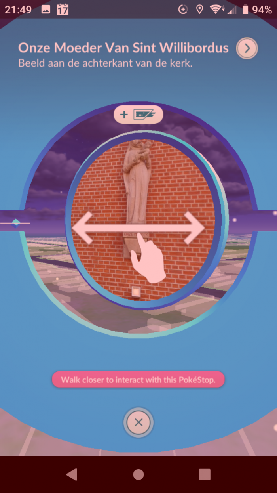
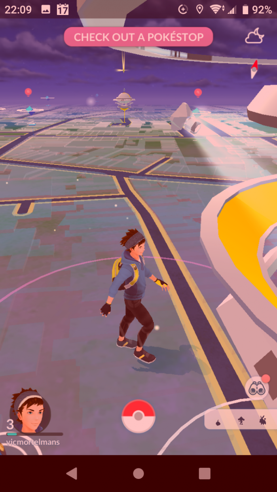

Af en toe gluur ik eens mee als één van de kinderen op de gsm aan het spelen is en daarnet was dat Pokémon Go. In dat spel moet je Pokémons verzamelen in de echte wereld. Die vind je bij zogenaame Pokéstops, dat zijn lokaties die je op een kaart kan terugvinden in je omgeving en pas als je er echt naartoe gaat, kan je de Pokémons vangen die zich daar ophouden.

Ik vroeg om eens zo'n paar Pokéstops in de buurt te zien en wat bleek, onder de herkenningspunten waren heel wat mariabeelden, die zich in de koekenstad op elke hoek van de straat bevinden. 

- 
    
- 
    
- 
    
- 
    

Spelers kunnen zelf zo'n Pokéstop aanmaken (hoe dat precies gaat, weet ik ook niet), en zo'n stop moet [aan bepaalde voorwaaren voldoen](https://www.nwtv.nl/188880/de-dos-en-donts-van-pokestop-submissions-op-een-rijtje): het moeten herkenbare plaatsen zijn met een historische, culturele of artistieke betekenis. Blijkbaar blijven de vele mariabeelden in onze buurt de spelers daarbij niet onopgemerkt! 

Dat Pokémon Go een spel is dat kinderen uit hun zetel kan trekken, vond ik al een goeie zaak (hoewel die van ons nu nog niet bepaald veel op zoektocht zijn gegaan), maar dat ze er ook nog [_en stoemelings_ een snuifje cultuur](https://www.voanews.com/arts-culture/pokemon-go-players-stumble-hidden-history) mee opsnuiven, had ik me nooit gerealiseerd!
