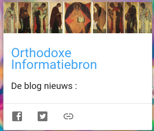
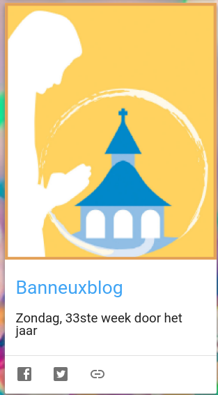
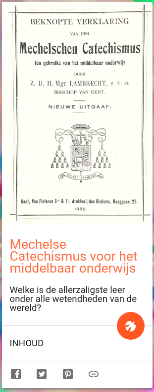

De [android-app Alledaags Geloven](https://play.google.com/store/apps/details?id=net.gelovenleren.alledaags) is aangevuld met enkele nieuwe kaarten. Een verfrissende gebedspraktijk bestaat erin dagelijks de app te openen en een willekeurige kaart te trekken. Elke kaart verwijst naar een website waar je een korte tekst, een filmpje of een andere bron voor bezinning vindt. Elke dag worden de links vernieuwd met de meest recente publicaties op de gekoppelde websites. De kaarten met een heilig-geestikoontje zitten in een vaste reeks, als je op het ikoontje klikt, krijg je een andere kaart uit de reeks te zien.

Bezoek voor een volledig overzicht van alle kaarten de [website Alledaags Geloven](https://alledaags.gelovenleren.net/).

De nieuwe kaarten:

Orthodoxe Informatiebron

Banneuxblog van kapelaan Zuidinga

Mechelse Catechismus voor het middelbaar onderwijs
