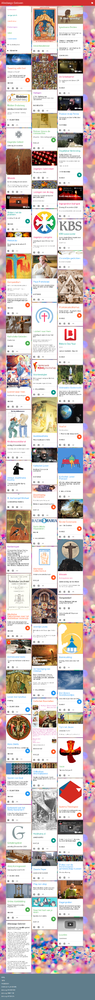

Maak van Alledaags Geloven je geestelijke adventskalender dit jaar! Op de website of via de app krijg je elke dag nieuwe items voorgeschoteld met bezinningsteksten, bijbellezingen of filmpjes over geloof, al dan niet gekoppeld aan de liturgische kalender (Lectionarium).

Meer dan 50 katholieke websites heb je zo binnen handbereik!

Vind je echt niks dat je meteen aanspreekt, laat de Heilige Geest zijn werk doen, en klik op het ikoontje met de duif, zo krijg je een willekeurig item, waarmee je wonderwel vaak toch iets kan!

Download de app voor Android:  
[play.google.com](https://play.google.com/store/apps/details?id=net.gelovenleren.alledaags)

Ga naar de website:  
[alledaags.gelovenleren.net](https://alledaags.gelovenleren.net/)

