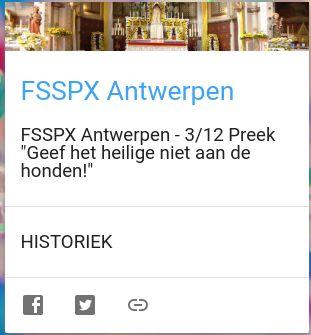

In de coronacrisis is de Antwerpse kathedraal heftig in de weer gegaan met videopastoraal, door niet alleen de eucharistievieringen uit te zenden, maar daarnaast ook verschillende andere programma's te maken. Vier daarvan zijn intussen opgenomen op [Alledaags Geloven](https://alledaags.gelovenleren.net/): Sterke tijden, Licht op mijn pad, De schatkamer en Dagelijkse verbinding (de reeks over Handelingen met mgr. Bonny). 

Ook elders in Antwerpen heeft men het videopastoraal omarmd. De [priesterbroederschap Pius-X](https://www.youtube.com/c/FSSPXAntwerpen) produceert vanuit de Hemelstraat eveneens verschillende reeksen programma's met liturgie, gebed, homilie en catechese. Op [Alledaags Geloven](https://alledaags.gelovenleren.net/) vind je vanaf vandaag een kaart met de "Preken in het Nederlands".


