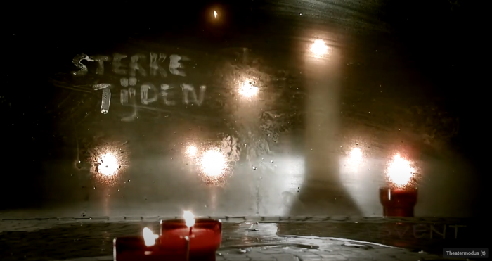

In de [Antwerpse kathedraal](https://www.youtube.com/channel/UCaJVmTdNm9JBwpI1z8XwV4w) zijn voor Advent een aantal nieuwe videoproducties in omloop gebracht, waarvan er twee een plaats krijgen op [Alledaags Geloven](https://alledaags.gelovenleren.net/), de grootste adventskalender van Vlaanderen en Nederland ;)

**Sterke tijden komt dagelijks uit en bevat beschouwingen en overwegingen.**

Licht op mijn pad is een dagelijks gebedsmoment.


