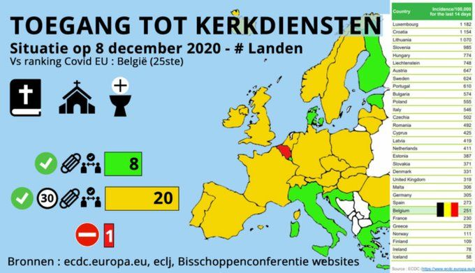
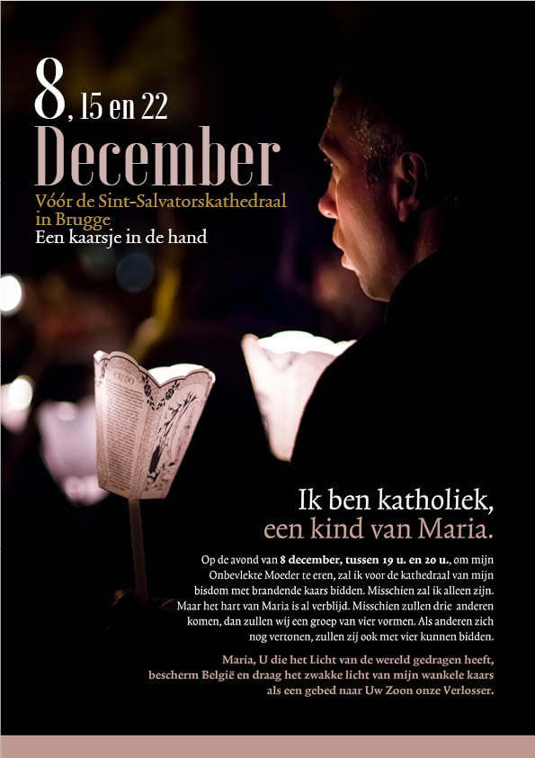
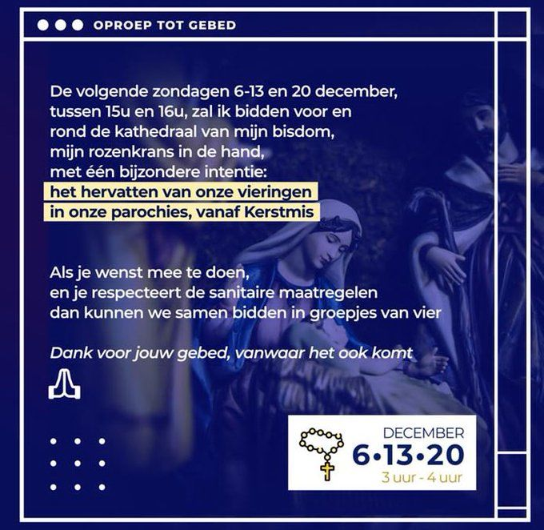

Net voor de Advent had ik een goed voornemen en heb ik mijn Twitter opgekuist. Het is mijn voornaamste nieuwsbron en ik merkte dat ik er veel tijd aan besteedde om eigenlijk alleen maar zaken te lezen die nodeloos ergernis opwekken. Systematisch heb ik er alle accounts uitgegooid die artikels verspreidden met overwegend negatieve teneur. Dat waren er heel wat, en gedurende een tweetal weken merkte ik dat mijn tijdsbesteding veel lager was, dat ik veel meer zinvolle artikels oppikte zonder het gevoel te hebben iets echt relevants te missen en---niet onbelangrijk---dat ik beduidend minder ergernis ondervond.

Maar wat als het nieuws zelf ergerniswekkend is? Deze week was er weer geen ontsnappen aan. 

## De blamage van onze bisschoppen

De nieuwsfeiten van de laatste week deden mijn ergernis steigeren over de houding van onze kerkelijke overheid. Vandaag verschijnt in het nieuws dat de nieuwe 'versoepeling' van de coronamaatregelen om erediensten met max 15 personen toe te laten is ["samen uitgewerkt met de grote geloofsgemeenschappen"](https://www.vrt.be/vrtnws/nl/2020/12/09/van-quickenborne-raad-van-state-erediensten/). In een mededeling van de bischoppen heet het dat zij ["hebben kennis genomen van het voorstel van de minister"](https://www.kerknet.be/bisschoppenconferentie/persbericht/reactie-bisschoppen-op-versoepeling-lockdown-voor-erediensten). Dat de bischoppen nooit vragende partij zijn geweest voor versoepeling van de maatregelen, wisten we al. Deze versoepeling komt er immers omdat de joodse (!) gemeenschap de regering had aangeklaagd bij de Raad van State. Blijkbaar hebben de bisschoppen bij de regering ook geen eisen gesteld, enkel "kennis genomen" van een voorstel, dat als 'versoepeling' nog altijd strenger is dan de maatregelen die hun Franse collega's met succes zelf (!) hebben aangevochten bij hun Raad van State. Wat is het verschil tussen een Franse en een Belgische katholiek?

Nu schuiven de bisschoppen de verantwoordelijkheid door naar hun parochies, om uit te maken "of dit veilig en praktisch haalbaar is of niet". Ik weet alvast dat _veilig_ zeker haalbaar is, dat hebben we aangetoond in onze kerken tussen de twee lock-downs. Van besmettingen die door _tracers_ zijn teruggevoerd op katholieke erediensten, heb ik nog niet gehoord en uit de VS vernam ik dat een studie van "[1 million public Masses where the guidelines were in place, has shown that no outbreaks of COVID-19 have been linked to church attendance.](https://www.ncregister.com/news/balancing-lives-and-livelihoods-catholics-clash-over-pandemic-positions)" 

En ik weet ook dat het _praktisch_ een gekkenwerk is om met maximum 15 personen (inc. priester/acoliet/lector) een H. Mis op te dragen. Tijdens de lock-down droeg onze pastoor twee keer in de week de Mis op, die werd _live_ uitgezonden, en telkens probeerde hij enkele andere mensen te betrekken als "medewerkers", want dat was toegelaten tot een maximum van 10 personen. Het leverde het gekke tafereel dat de kerk (500 vierkante meter) open was voor persoonlijk gebed voor maximum 4 personen, terwijl in de winterkapel (50 vierkante meter) met meer mensen een besloten Mis werd opgedragen voor de _livestream_. En nu zouden we dus een publieke eucharistieviering moeten organiseren met maximum 15 personen, terwijl er op een gewone zondag gemakkelijk 60 gelovigen kwamen? Met een maximum van 30 personen was het misschien mogelijk om twee missen mekaar te laten opvolgen, dat hadden we al in petto in juni, die week wanneer de maatregelen vier keer veranderd zijn. Wat nu gedaan, 3 missen, 4 missen? De bisschoppen hebben verzaakt de versoepeling, die er tegen hun zin is gekomen, te onderhandelen tot een realistische maatregel en schuiven nu de rommel door naar hun pastoors. Niet zo fraai!

## De blamage van onze katholieken

Ik heb het natuurlijk gemakkelijk met scherp te schieten op de hoogwaardigheidsbekleders, maar de vraag mag ook worden gesteld of de gelovigen zelf eigenlijk nog wel een H. Mis _willen_? Er is zeker een kleine groep die alle coronamaatregelen zou negeren om toch aan het misoffer te kunnen deelnemen. Ik kan daar zelfs nog ergens inkomen, maar die houding valt natuurlijk niet redelijk te verdedigen. Als je echter ziet dat België onevenredig strenge maatregelen treft voor religieuze bijeenkomsten, houdt het argument van de veiligheid mijns inziens geen steek meer, dan is het gewoon de politiek die de factor 'religie' in onze samenleving even netjes op zijn plaats zet.

België als enige land waar de H. Mis verboden is

En dan stel ik me de vraag: hoe zien de gelovigen dat? De mening van de gewone gelovige vind je natuurlijk niet in de kranten, dus ik ben weer terug waar ik begonnen ben: Twitter. Daar zitten ongetwijfeld heel wat gewone gelovigen die over een en ander hun mening laten horen. Ik vond heel wat tweets van mensen die het onrechtvaardig vinden dat gelovigen nu plots wel met 15 man bijeen mogen komen en zij niet, maar tweets van katholieken die reageren op de versoepeling, negatief of positief, kan ik op 1 hand tellen.

Toch zijn ze er, die gelovigen die terug naar de mis willen. De open brief aan de eerste minister [Voor de Mis](https://www.pourlamesse-voordemis.be/) kreeg reeds 13000 handtekeningen. Ik zag op youtube een gesprek tussen de woordvoerder van de bisschoppen en de initiatiefnemer van de petitie. Over de bisschoppen hebben we het al gehad, maar Benoît de Baenst is als pastoor misschien geen 'gewone' gelovige, maar staat toch wat dichter bij ons en---eerlijk gezegd---ondanks de massale steun die zijn campagne vindt bij gelovigen, stelt zijn makke betoog weinig verwachtingen aan de vertegenwoordiger van de bisschoppen, hoewel die toch niet helemaal aan hetzelfde zeel trekken.

https://youtu.be/VcSzjTNZuj8

Er worden nochtans acties gevoerd. Via Twitter zag ik twee affiches van gebedsacties waarbij gelovigen op straat komen om te bidden voor hervatting van de eucharistie. Of die acties enig succes of weerklank vinden, durf ik niet zeggen. Misschien moet ik zelf maar eens gaan kijken…

Alles bij mekaar blijf ik dus achter met het ongemakkelijke gevoel dat de bisschoppen perfect beantwoorden aan de verwachtingen van hun gelovigen en dat hun dus eigenlijk niet veel kwalijk kan genomen worden.

## En de moslims?

Ik stel me tot slot nog een andere vraag. Hoe zit het met de moslims? We weten nu al dat de joden de onredelijke beperking van de godsdienstvrijheid durven aanvechten en dat de katholieken dat helemaal niet nodig vinden. Maar wat met de islam? Voelen zij zich niet bezwaard, of staan zij misschien zowiezo losser tegenover het wekelijkse vrijdaggebed en hebben ze misschien genoeg aan hun dagelijkse gebedstijden? Zij hebben geen beschikking over (te) grote kerken, zoals de katholieken en ik vraag me af of het daarom is dat de regering obstinaat vasthoudt aan de onproportionele beperking, zodat er geen praktisch onderscheid ontstaat tussen katholieken en moslims in hun recht op uitoefening van hun godsdienst. Dat staat eigenlijk met zoveel woorden in de verklaring van de minister: "Als er een uitzondering komt, moeten we zien dat we de godsdiensten op gelijke voet behandelen". Zo neemt solidariteit andermaal de vorm aan van gijzeling.
