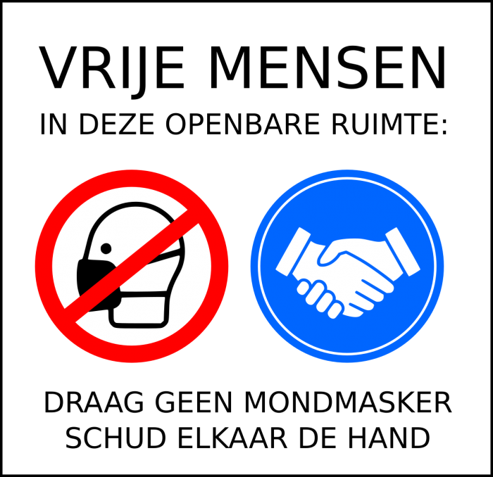

Erg nauwgezet volg ik het nieuws over de coronamaatregelen niet, maar ik heb wel opgevangen dat de maatregelen kortelings versoepeld zullen worden. Ondertussen lopen de inentingen voort en binnen een maand of twee schat ik dat tenminste de kwetsbare bevolking immuun zal zijn tegen de coronagriep. Het kan dus niet lang meer duren tot de virologen zullen oordelen dat het risico van de coronaziekte voor de bevolking herleid is tot dat van een gewone griep en tot de regering kan afkondigen dat alle maatregelen worden opgeschort en zijn we weer even vrij als in februari 2020. 

Ik hoop het!

Ik geloof het niet… Doemdenkers fluisteren me in het oor dat maatregelen gehandhaafd zullen worden. "Nieuwe varianten van het virus", "Vaccin sluit besmetting niet uit", "Het risico is te hoog", ...

"Risico" is het toverwoord dat vrijheid doet wegsmelten als sneeuw voor de zon. De vrijheid om te gaan en te staan waar je wil en met wie je wil, om maar iets te noemen, als u dat nog iets zegt. Al een jaar lang worden we om de oren geslagen met immer stijgende cijfers, grafieken en curves om ons op het risico te wijzen en de maatregelen te verantwoorden. Net zoals ik ervan uitga dat het risico daadwerkelijk groot genoeg was om de maatregelen noodzakelijk te maken en die zonder enige zin voor nuance op te leggen, ga ik er ook van uit dat we binnenkort dalende cijfers, grafieken en curves zullen zien en dat er een bepaald punt zal komen waarop het risico dusdanig beperkt is dat al die maatregelen---even ongenuanceerd---opgeschort kunnen worden.

Ik ben bang dat het zo niet zal lopen. Plots zullen de beleidmakers toch oog krijgen voor nuance en her en der nog risicogroepen- of situaties ontwaren die maatregelen nodig maken, tot de laatste patient van de IC is ontslagen, als het moet. En als de overheid het niet doet, zullen angstige mensen zichzelf (en mekaar) maatregelen blijven opleggen. 

Mensen moeten tegen zichzelf beschermd worden. Dat was het motto van de herhaalde lock-downs. Dat zal ook het motto moeten worden van het herstel!

Als de D-dag is aangebroken waarop het einde van de crisis wordt afgekondigd, zie ik het gebeuren dat her en der, in het onderwijs, in kerken, in bedrijven, in verenigingen, mensen zullen blijven mondkapjes dragen of opereren in bubbels of lessen en vergaderingen organiseren via de computer. Als dat gebeurt, wil dat zeggen dat we ons de onvrijheid hebben eigen gemaakt, en dat is een maatschappelijk risico dat minstens zo groot is als dat van een woedend virus. 

Tegen dat risico zal geen overheid ons beschermen. Er zal moed nodig zijn om vanuit de basis te sensibiliseren voor het opheffen, ja zelfs verbieden, van "middenveldmaatregelen" en om mensen van de illusie te bevrijden dat zij zichzelf en anderen moeten blijven beschermen tegen een ingebeeld gevaar. Een samenleving die elk risico tot nul wil herleiden, is neurotisch. Een samenleving die daarvoor beroep doet op---al dan niet zelfopgelegde---vrijheidsbeperking, is een neurotische dictatuur.

Ik heb alvast de eerste affiche gereed die in scholen, kerken, musea, sportzalen, bedrijven, winkels, horecazaken, ja zelfs in bejaardenhuizen en ziekenhuizen uitgehangen kan worden om elke burger te wijzen op zijn verantwoordelijkheid in een menselijke samenleving:

Mondkapjes verboden, handen schudden verplicht!
