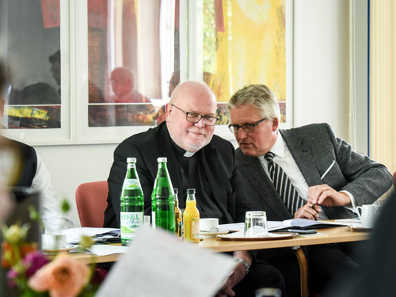

Bij voorbaat betuig ik mijn spijt over de onchristelijke houding die ik in volgende paragrafen zal aannemen, maar het werd me even teveel, wanneer ik de persmededeling las van het ZdK (_Zentralkomitee der deutschen Katholiken_) over het ontslag dat mgr. Marx vorige week aanbood aan de Paus.

[Ontslagbrief van mgr. Marx](https://www.erzbistum-muenchen.de/news/bistum/Kardinal-Marx-bietet-Papst-Franziskus-Amtsverzicht-an-39545.news)

[Persmededeling van ZdK](https://www.zdk.de/newsletter/pm-kardinal-marx/MXwzNXw2MTYyOTh8MzR8NDc4N3w0/)

De persmededelingen van het ZdK doen me regemlatig de haren ten berge rijzen, want ik zit niet met hen op dezelfde golflengte als ze het hebben over de 'synodale weg' en de kerkelijke hervormingen die ze daarmee willen bewerkstelligen. Kwalijk kan ik het hen niet nemen, het is waarvoor ze staan.

Ik duid het mijn achterdocht euvel, maar met deze persmededeling komt het me voor dat de ontslagbrief van mgr. Marx hen wel verdacht goed uitkomt! Zou het afgesproken spel zijn, vraag ik me dan af. 

Kardinal Reinhard Marx, Vorsitzender der Deutschen Bischofskonferenz (DBK), und Thomas Sternberg, Präsident des Zentralkomitees der deutschen Katholiken (ZdK), während der Gemeinsamen Konferenz von DBK und ZdK zum "synodalen Weg" der katholischen Kirche in Deutschland am 5. Juli 2019 in Bonn. Foto: Julia Steinbrecht/KNA

Om te beginnen krijgt mgr. Woelki een ferme veeg uit de pan, die een notoir criticus is van de synodale weg en op dit moment een pauselijke visitatiecommissie op bezoek heeft in zijn bisdom, om verborgen misbruikschandalen te onderzoeken. Niet dat zijn naam genoemd wordt, zo christelijk is men wel. Onderhuids wordt de boodschap wel gemasseerd: "Is het wel de juiste bisschop die ontslag neemt?" Hoe heet deze vraag op de lippen van de publieke opinie brandt, blijkt uit dit filmpje.

Het imago en de positie van Mgr. Marx zelf grijpt aanzienlijke winst met dit manoeuvre. Hoewel het lang niet zeker is dat de Paus zijn ontslag zal aanvaarden---hij kan gerust nog jaren aanblijven---en hoewel zijn kardinaalschap en zijn functies in het Vaticaan níet in vraag gesteld worden, kan hij zich nu presenteren als iemand die gezuiverd is van de smet van "het systeem". Dat kan best handig zijn als je een rol wil spelen in de grondige hervorming van datzelfde "systeem"! ZdK schrijft in zijn mededeling nogal naïef: "Es gebe künftig eine Stimme weniger, die den Reformanliegen in Rom Gehör verschaffe." Integendeel, zou ik zeggen! Zelfs indien de Paus zijn ontslag toch zou aanvaarden, is dat een opsteker. Dan kan mgr. Marx er achter de schermen helemaal voor gaan, zonder nog de voorzichtigheid en neutraliteit te moeten bewaren waartoe de functie van aartsbisschop hem toch enigszins verplicht. Een "Danneelske doen", zoals dat heet in kerkelijke kringen.

https://cruxnow.com/news-analysis/2021/06/a-bit-of-clarity-about-spectacular-resignation-of-german-cardinal/

Tenslotte krijgt heel het proces van de synodale weg door dit spel een krachtige _boost_. De actie en de _spin_ van de mededelingen heeft een duidelijk doel: de ermst van de crisis màg niet onderschat worden! Als iedereen ervan overtuigd is dat de crisis zulke dramatische vormen aanneemt dat zelfs een aartsbisschop geen andere uitweg ziet dan ontslag te nemen, hebben de hervormers vrij spel.

Winst over de hele lijn!

Zoals vaak wanneer ik dit soort van bezorgde artikels schrijf op mijn blogje, hoop ik dat het mijn fantasie is, die op hol slaat. Ik hoop dat mgr. Marx bovenstaande berekeningen niet heeft gemaakt en mocht hij ze gemaakt hebben, dat ze in het proces van onderscheiding aan de kant van de kwade geesten stonden. Ik hoop dat het van de kant van het ZdK een schaamteloze recuperatie is van een oprechte persoonlijke keuze. Maar ik ben er niet helemaal zeker van...
