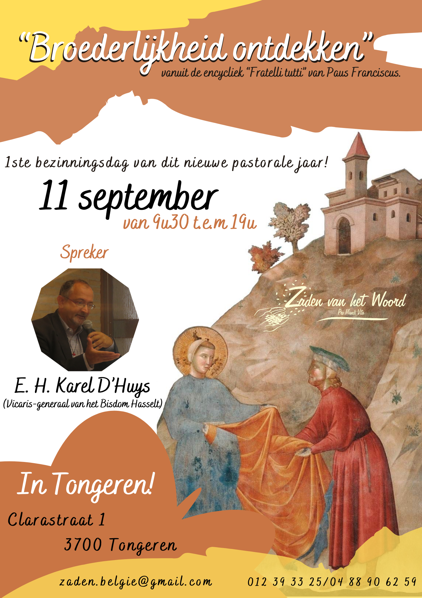

AANKONDIGING:

Bezinningsdag "Broederlijkheid Ontdekken vanuit de encycliek *Fratelli Tutti* van paus Franciscus"

Eerste bezinningsdag van het nieuwe pastorale jaar!

11 september 2021 van 9u30 tot 19u.

Spreker: E.H. Karel D'Huys, vicaris-generaal van bisdom Hasselt

Organisatie: gemeenschap *Zaden van het Woord*, Clarastraat 1, 3700 Tongeren

Contact: [zaden.belgie@gmail.com](mailto:zaden.belgie@gmail.com), 012 39 33 25, 0488 90 62 59

