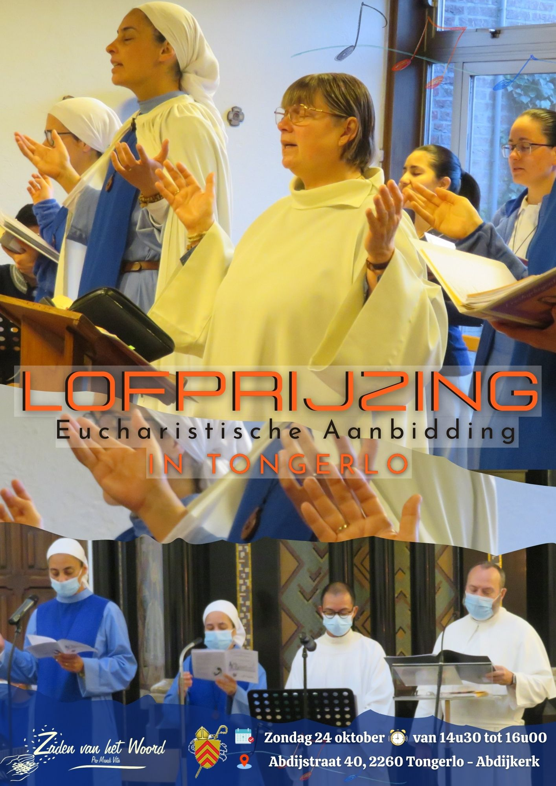
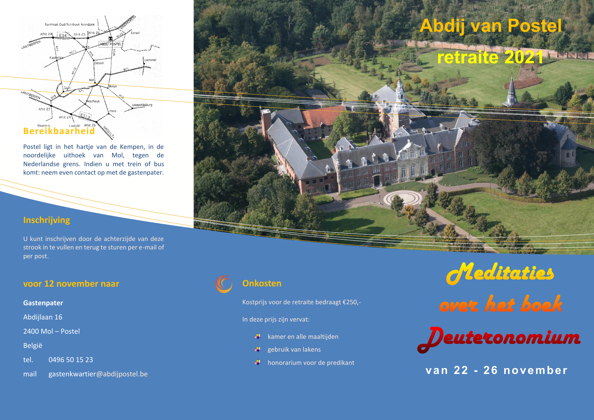
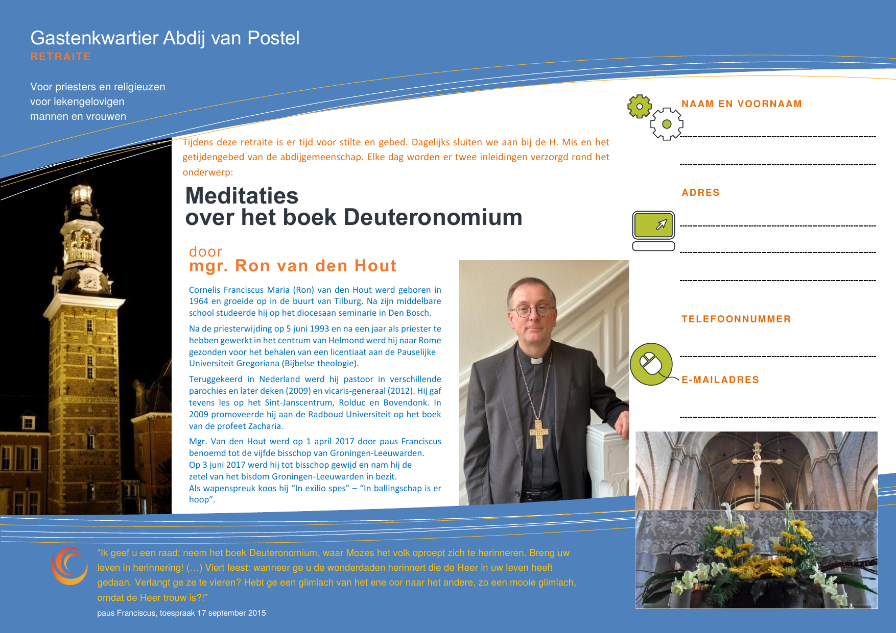

Ik laat mijn blog graag gebruiken als kanaal om katholieke evenementen aan te kondigen. Voor komende maanden vroeg men me volgende activiteiten te vermelden:

- **Zondag 17 oktober** Tongerlo, Missiedag door gemeenschap *Zaden van het Woord*, inschrijving via [dit formulier](https://forms.gle/ZphgcgAwfvxGnkqx8)
- **Zondag 24 oktober** Tongerlo, Lofprijzing en Eucharistische Aanbidding door gemeenschap *Zaden van het Woord*
- **Maandag 22 tot vrijdag 26 november** Postel, Retraite "Meditaties over het boek Deuteronomium" door de *Abdij van Postel*

