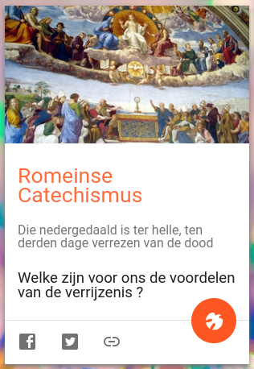
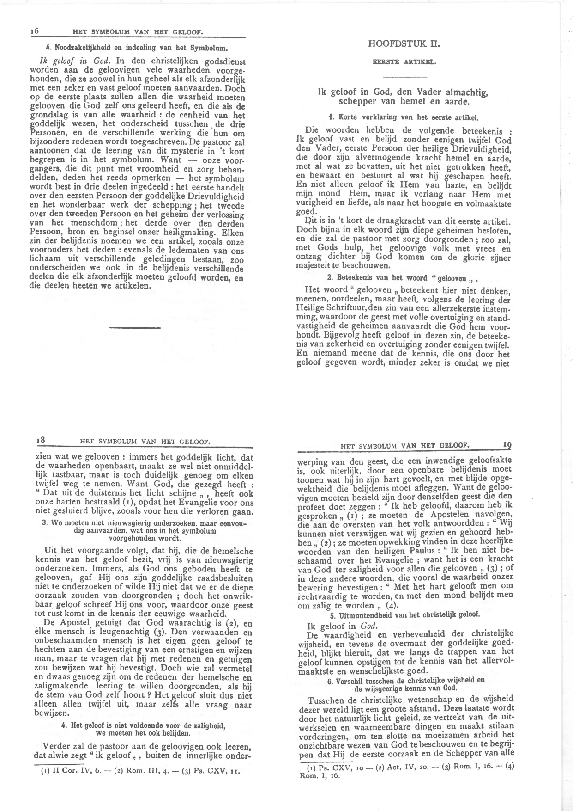

Het [digitaliseren](https://gelovenleren.net/blog/super-pastorale-catechismus/) gaat voorspoedig! Het eerste deel van de Romeinse Catechismus staat reeds online. Op dit adres kan je reeds een kijkje nemen:

## [trente.gelovenleren.net](http://trente.gelovenleren.net/)

&nbsp;

In de [verantwoording](http://localhost:1313/docs/0-inleiding/inleiding/) lees je meer over de achtergrond van de publicatie. 

En natuurlijk is er ook een nieuwe kaart toegevoegd op [Alledaags Geloven](https://alledaags.gelovenleren.net/), waarop dagelijks een vers artikel uit de catechismus getoond wordt. Ik open elke dag de [app](https://play.google.com/store/apps/details?id=net.gelovenleren.alledaags) en laat de Heilige Gest me leiden naar een—niet altijd vanzelfsprekend—geloofsfragmentje.

Mocht er iemand geïnteresseerd zijn in de technische procedure van het digitaliseren, zal ik die hieronder toevoegen. Ik moet zeggen dat ik zelf zeer enthousiast ben over het resultaat. Het vertrekpunt was een facsimile van een boek uit 1935, met telkens vier (verkleinde!) bladzijdes uit het origineel op één A4. Uiteindelijk moet ik per pagina maar een handvol spelfouten corrigeren! En dat allemaal met gratis tools. Het inscannen heeft me in de *copyshop* net geen 15 euro gekost, voor 200 blz. Er zijn mensen met duurdere hobby's :)

{}
  
Voorbeeld van een pagina uit de heruitgave van 1984
{}
1. pdf omgezet naar png-bestanden met [pdftk](https://www.pdflabs.com/tools/pdftk-the-pdf-toolkit/)  
`pdftk scan.pdf burst`
2. er stonden telkens 4 pagina's op 1 blad, die heb ik opgesplitst met [Imagemagick](https://imagemagick.org/index.php):  
`convert bladxxx.png -crop 2x2+20+20@  +repage  +adjoin  bladxxx.png-%d.png`
3. ik heb [ScanTailor](https://scantailor.org/) gebruikt om de tekst op de pagina's recht te zetten en overal dezelfde marges toe te passen (ik weet niet of dat echt geholpen heeft met de OCR, maar zo heb ik ook een nette PDF als resultaat)  
4. de pagina's terug gebundeld in een pdf  
`convert *.tif scan2.pdf`
5. OCR toegepast met [ocrmypdf](https://pypi.org/project/ocrmypdf/) (Python-script dat [Tesseract](https://github.com/tesseract-ocr/tesseract) gebruikt om OCR te doen)  
`ocrmypdf -l nld --remove-background --clean-final --optimize 3 scan2.pdf scan2-ocr.pdf`  
Dit script 'embed' de tekst in de PDF, zodat je de originele scan ziet, maar
toch op tekst kan zoeken.
6. de tekst uit de PDF geëxporteerd als tekstbestand, voor correctie en verdere verwerking:  
`pdftotext scan2-ocr.pdf scan.txt`
7. de spellingsfouten haal ik eruit met een spellingscorrectietool ([aspell](http://aspell.net/) op Linux), waarmee ik meteen ook de oude Nederlandse spelling van de originele tekst rechtzet.
8. de teksten worden beheerd in platte-tekstbestanden met [Markdown-opmaak](https://en.wikipedia.org/wiki/Markdown). [Hugo](https://gohugo.io/) bundelt alles tot één website en voor de layout zorgt het thema [hugo-book](https://github.com/alex-shpak/hugo-book), dat ik heb aangepast met enkele stijlelementen uit [tufte-css](https://edwardtufte.github.io/tufte-css/).

Bovenstaande zijn allemaal commando's op Linux, maar ik denk dat de belangrijkste tools ook op Windows beschikbaar zijn. Het is allemaal open source of alleszins gratis software en te vinden via je favoriete zoekmachine.

