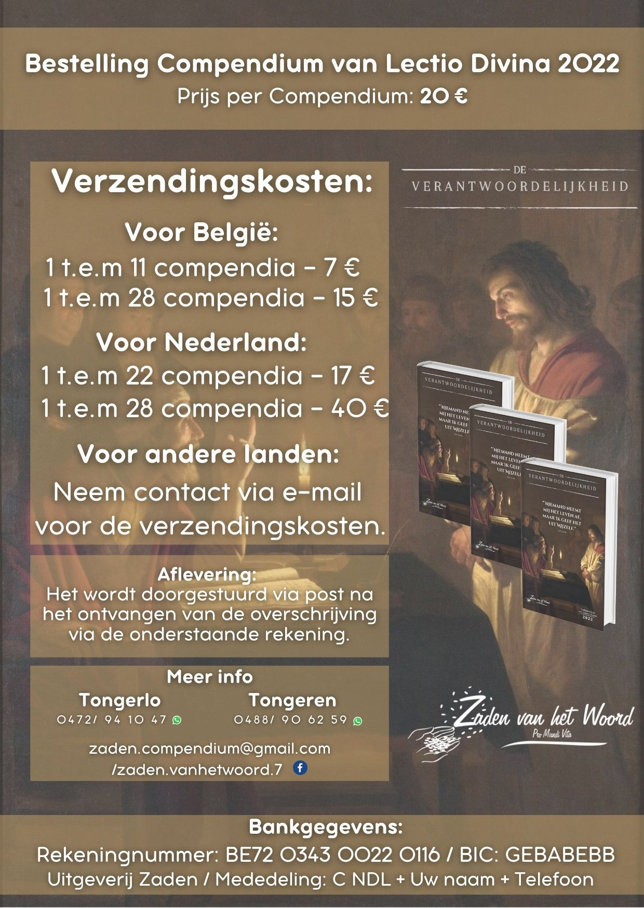

**Aankondiging vanwege gemeenschap Zaden van het Woord**

Met grote vreugde delen wij u mee, dat de redactie op volle kracht vooruit
werkt, aan de uitgave van het Compendium Lectio Divina 2022.

Na de meditatie van het vorige jaarthema over “de *Glorievolle vrijheid van
de Kinderen Gods”*, gaan wij nu over “*de Verantwoordelijkheid”* mediteren:

De verantwoordelijkheid om zichzelf te geven en een nieuwe wereld op te
bouwen, met alles wat ik ben en met alles wat ik heb.

*“Niemand neemt mij het leven* *af, maar ik geef het uit mijzelf”*
*Joh 10, 18*

Zoals velen van u misschien al weten, is het Compendium een hulpmiddel om
aan de slag te gaan met het Woord van God, aan de hand van de 5 stappen van
Lectio  Divina : Lezing, Meditatie, Gebed, Contemplatie en Handeling. Deze
methode helpt ons het Woord van God te leren beleven.

Durf in het komende jaar, deze biddende ervaring met het Woord van God te
beleven!

*U kunt uw compendium 2022, of meerdere exemplaren nu reeds bestellen om
samen met ons, mee te evangeliseren.*

Wie wenst, kan dagelijks een online begeleiding volgen via ons YouTube
kanaal. Het is een gratis aanbod dat vele mensen al heeft geholpen, om het
Woord van God werkelijk te beleven.

Eén keer per maand bieden we ook een inleiding aan, over de maandelijkse
bezinningsteksten van het Compendium via ons kanaal op YouTube, onze
Facebookpagina of via de website van de Abdij van Tongerlo.

*U kunt het Compendium 2022 bestellen via:*
{}

{}

* E-mail: zaden.compendium@gmail.com
* Telefoon of WhatsApp: 012 39 33 25 of 04 88 90 62 59 (Tongeren), 04 72 94 10 47 (Tongerlo)
* Facebook: https://www.facebook.com/zaden.vanhetwoord.7/

De betaling van uw bestelling verloopt via onderstaande **rekening**:

* Naam: Zaden van het Woord VZW
* Rekeningnummer: BE72 0343 0022 0116
* Mededeling: Compendium (+ Naam en telefoonnummer)

De prijs van het compendium  2022 blijft 20,00 € . Voor de verzending van
het compendium via bpost vragen we een extra bijdrage van 7,00 €.

Indien u nog vragen  heeft, aarzelt u dan niet ons telefonisch of per mail
te contacteren zodat wij u verder uitleg kunnen geven.

*Wees zo vrij om dit ‘Goede nieuws’ te helpen verspreiden !!!*

