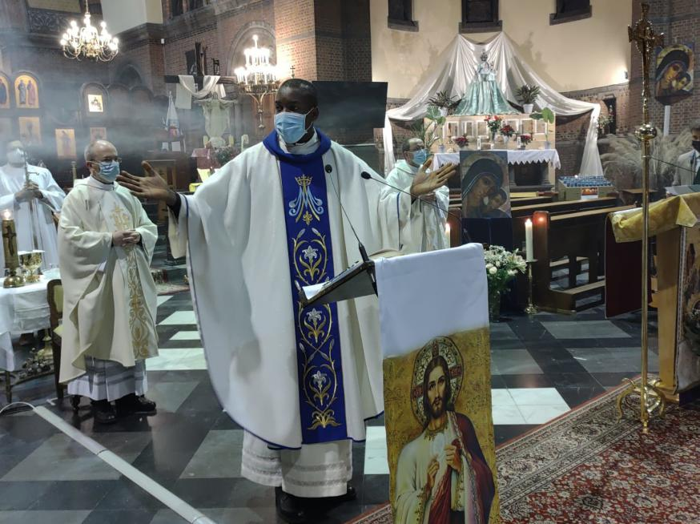

   _WherePeterIs_ is een blog waar volgens de beste apologetische methodes het kerkbeeld en -beleid van paus Franciscus van de nodige verantwoording wordt voorzien. De artikels zijn heel toegankelijk en toch beperken ze zich niet tot het herkauwen van de tussen progressieve en conservatieve katholieken immer over en weer geslingerde argumenten. 

   [Prayer Cards, Painting Class, and Liturgy Wars](https://wherepeteris.com/prayer-cards-painting-class-and-liturgy-wars/) sprong me direct in het oog. Het artikel behandelt de twee vormen van de liturgie, de "oude" tridentijnse liturgie en de "nieuwe" mis van paus Paulus VI. De auteur vergelijkt de ritussen op basis van hun **inculturaliseerbaarheid**. Voorspelbaar is dat de nieuwe mis superieur wordt voorgesteld, omdat die minder strikt afgebakend is en de inbreng toelaat van elementen uit de eigen cultuur, al is het maar door de ver- of hertaling van de latijnse teksten. 



## Inculturaliseren

   De auteur vergelijkt de tridentijnse Mis met bidprentjes die identiek uit de drukkerij rollen, netjes geplastificeerd opdat er geen kreuk of smet op komt wanneer gelovigen ze ter hand nemen en de nieuwe Mis met een schilderij dat elke geloofsgemeenschap voor zich maakt, telkens anders, maar toch elk een afspiegeling van hetzelfde tafereel. 

   Met dat beeld in het hoofd, zoekt de auteur een verklaring waarom de nieuwe Mis in het Westen vaak een doodse aangelegenheid is en—zo geeft hij toe—in vormelijke aantrekkelijkheid moet onderdoen voor de tridentijnse mis, terwijl in andere culturele settings, zoals de Afrikaanse of  Zuidamerikaanse, de nieuwe Mis een heel levendige geloofservaring wordt. 

   De verklaring is, kort gezegd, dat we in het Westen een gebrek hebben aan cultuur, en meer specifiek aan gemeenschapsbewustzijn. **We zijn gewoonweg niet in staat om aan de nieuwe Mis eigen cultuurelementen toe te voegen die nodig zijn om er iets moois van te maken, omdat we die niet hebben.** Dat zou, volgens de auteur, een gevolg zijn van onze welvaart. Het enige wat wij hebben zijn "activisten", zowel aan progressieve als aan conservatieve zijde, die aan de Mis willen sleutelen om hun gelijk te halen. Zo'n activisme levert echter niet de spontane en organische inbreng die de Mis tot een geloofsbeleving maakt.  

   Ik vind het een fascinerende stelling. 

## Wierook

{} *Immanuel Ikeobi in de wierook*{}
   Een kleine anecdote. Vorige maandag vierde in onze parochiekerk de gemeenschap van de neocatechumenale weg haar [tienjarige aanwezigheid in Antwerpen](https://www.kerknet.be/parochie-heilig-hart-van-jezus-antwerpen/fotoreportage/10-jaar-neocatechumenale-weg-antwerpen?microsite=12951). De Mis werd gecelebreerd door de nieuwe vicaris van Antwerpen, Immanuel Ikeobi, zelf van Nigeriaanse afkomst. In zijn slotwoordje na de Mis zei hij, haast ontroerd, dat het voor hem de eerste keer dit jaar was, dat hij wierook mocht gebruiken. Of hij daarmee het kerkelijk jaar bedoelt, dat nog maar twee weken jong is, of het burgerlijk jaar, dat tegen zijn einde loopt, weet ik niet, maar zijn vreugde om dit simpele liturgische element (dat in onze "[internationale mis](https://www.kerknet.be/parochie-heilig-hart-van-jezus-antwerpen/informatie/internationale-mis-%E2%80%93-international-mass)" wekelijks gebruikt wordt)  illustreert toch mooi hoe weinig voeling onze doorsnee westerse geloofsgemeenschap heeft met de betekenis van het opluisteren van haar liturgie. Ik denk dat ik begrijp wat de vicaris ervaarde. Jaren geleden vierde in onze kerk elke zondag de anglo-afrikaanse gemeenschap van Antwerpen en ik herinner me levendig hoe zij de heilige Mis opluisteren met eigen culturele elementen. In tegenstelling tot "opgeluisterde" Vlaamse missen, kon ik bij hen voelen hoe doorleefd hun organische bijdrage tot de ritus was!

## Omgekeerde metafoor

   Maar ik wil even een andere richting uitgaan met het beeld van het schilderij dat de auteur van _WherePeterIs_ aandraagt. Als wij zo discussiëren over de liturgie als een verbeelding van ons geloof, bevestigen we slechts een dieper liggend denkbeeld, dat liturgie een abstractie is, die ons eigenlijk wegvoert van de waarachtige aanwezigheid van Christus in ons leven. Dit denkbeeld is onderliggend aan de hedendaags visie op geloof. De meeste gelovigen relativeren liturgische discussies snel weg door te zeggen: "dat is allemaal bijkomstig, waar het werkelijk om gaat, is hoe we Jezus volgen in ons dagelijks leven, buiten de kerk!" (en door de verzen aan het einde van Mt 25 aan te halen). En wij, die ons wel bezighouden met het lezen en schrijven van artikeltjes over liturgie, doen eigenlijk vaak net hetzelfde, want we spreken over liturgie zoals marktkramers over hun koopwaar. 

   Het zou ons helpen als we die metafoor van het schilderij gebruiken, maar dan in omgekeerde zin. Niet alsof de sacramenten een vorm of een abstractie zijn van hoe wij in onze gemeenschap het geloof beleven, want dat betekent juist dat de liturgie een afgeleide is, op de tweede plaats komt. Als we de sacramenten werkelijk centraal willen stellen, keert de metafoor om. Dan is ons dagelijks leven, dat wat buiten de kerk gebeurt, juist een afgeleide van het sacramentele. **Ons gemeenschappelijk leven buiten de kerk is een schilderij, een beeld, de afspiegeling van de absolute kern van de werkelijkheid (of beter: waarheid), die slechts ín de kerk tot uiting komt.** 

