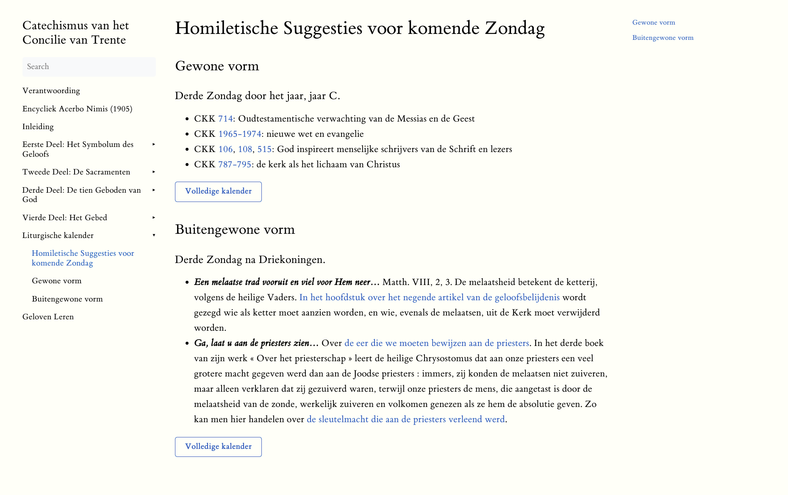

Bij het digitaliseren van de *[Romeinse Catechismus](http://trente.gelovenleren.net/)* (*Catechismus Romanus Ex Decreto Concilii Tridentini, 1566, vert. 1935*), nam ik de appendix mee op. Daarin vind je voor elke zondag en feestdag in de liturgische kalender een aantal artikels uit de catechismus, die van toepassing zijn op de evangelielezing van die dag. Deze catechismus was immers opgevat als een hulpmiddel voor pastoors bij het opmaken van hun preek: "homiletische suggesties" noemen we dat vandaag.

Deze suggesties vind je op de website [onder "Buitengewone vorm" achteraan in de gedigitaliseerde Romeinse Catechismus](https://trente.gelovenleren.net/docs/7-kalender/kalender-eo/), ongewijzigd overgenomen uit de Nederlandse publicatie van de catechismus in 1935. Het is me niet duidelijk of deze leidraad is opgesteld door de auteur van de vertaling, dan wel of die reeds deel uitmaakte van een vroegere publicatie van de catechismus. 

Vermits de publicatie stamt uit 1935, volgen de homiletische suggesties de kalender van de tridentijnse mis. De kalender op zich is nog redelijk gelijklopend met die we vandaag hanteren, maar de geselecteerde lezingen voor de H. Mis zijn na het tweede Vaticaans concilie helemaal [dooreengegooid](https://www.amazon.co.uk/Index-Lectionum-Comparative-Extraordinary-Lectionary/dp/1530230721) (daarover kan je een hele [boom opzetten](https://twitter.com/M_P_Hazell)). Dat betekent dat de preconciliaire homiletische suggesties vaak onbruikbaar zijn om een preek voor te bereiden, want er wordt altijd vertrokken van een specifiek evangelievers.

Er zijn lezingen die wel hetzelfde bleven of die nu op een andere dag gebruikt worden. Daarvoor blijven de homiletische suggesties wel bruikbaar. Het was even puzzelen, maar [onder "Gewone vorm" achteraan in de gedigitaliseerde Romeinse Catechismus](https://trente.gelovenleren.net/docs/7-kalender/kalender-of/) vind je nu de hedendaagse liturgische kalender en, waar van toepassing, de homiletische suggesties uit de *Romeinse Catechismus*. 

Voor de dagen met evangelielezingen waarvoor in de oorspronkelijke uitgave *geen* suggesties voorkwamen, heb ik het ambitieuze plan opgevat deze zelf verder in te vullen. De vraag is echter: hoe? Om zelf op zoek te gaan naar relevante artikels uit de catechismus, ontbreekt me de tijd en voldoende theologische achtergrond. Het feit is ook dat deze catechismus, hoewel onveranderlijk geldig, een stuk geschiedenis is, dus als ik de aanvullingen daaruit zou putten, is dat gedoemd tot *hineininterpretierung*. 

Bij al dit werk, verzuchtte ik: waarom hebben we zo'n homiletische suggesties niet volgens het *huidige* lectionarium en de *huidige* catechismus? Onze pastoors vandaag zouden dat toch ook goed kunnen gebruiken! En wat bleek, na enig zoekwerk: we hebben dat wel!

## Homiletic Directory

In 2015 publiceerde de *Congregatie voor de Goddelijke Eredienst en de Regeling van de Sacramenten* het document *[Homiletic Directory (homiletisch directorium)](https://www.vatican.va/roman_curia/congregations/ccdds/documents/rc_con_ccdds_doc_20140629_direttorio-omiletico_en.html)*. Dit is---ter informatie---dezelfde congregatie die eerder dit jaar in de actualiteit kwam met de ultra-strenge [antwoorden](https://www.vatican.va/roman_curia/congregations/ccdds/documents/rc_con_ccdds_doc_20211204_responsa-ad-dubia-tradizionis-custodes_en.html) op de *dubia* bij het motu proprio *Traditionis Custodes*. 

De kans is groot dat je van dit document nog nooit hebt gehoord. Veel aandacht lijkt die *Homiletic Directory* in de kerk niet te krijgen. Op google [wordt er nauwelijk naar gezocht](https://trends.google.com/trends/explore?q=homiletic%20directory) en op twitter vind ik welgeteld 12 vermeldingen na het wegdijen van de berichten over de persmededeling bij de publicatie in 2015. Verheugend is wel dat de bisschoppenconferenties de moeite genomen hebben het document te vertalen, bijvoorbeeld naar het [Nederlands](https://halewijn.info/catalogus/homiletisch-directorium?q=directorium), [Frans](https://liturgie.catholique.fr/bibliotheque/ressources-et-initiatives/5255-nouveau-directoire-sur-l-homelie/) en [Duits](https://www.erzdioezese-wien.at/pages/inst/14431713/liturgischediensteaemter/priester/article/45131.html). Tijd is in de kerk een rekbaar begrip, dus misschien moeten we geduld oefenen om het document te laten 'rijpen'. 

Laat ons alvast eens kijken hoe het tot stand gekomen is. Volgens de [inleiding](https://www.vatican.va/roman_curia/congregations/ccdds/documents/rc_con_ccdds_doc_20140629_direttorio-omiletico_en.html#Introduction) was het de bisschoppensynode van 2008, toen nog voorgezeten door paus Benedictus XVI, die om de totstandkoming van dit document verzocht. De pauselijke exhortaties *[Verbum Domini](https://www.vatican.va/content/benedict-xvi/en/apost_exhortations/documents/hf_ben-xvi_exh_20100930_verbum-domini.html)* (paus Benedictus XVI, 2010, na de synode van 2008) en *[Evangelii Gaudium](https://www.vatican.va/content/francesco/en/apost_exhortations/documents/papa-francesco_esortazione-ap_20131124_evangelii-gaudium.html)* (paus Franciscus, maar voorbereid door paus Benedictus, 2013, na de synode van 2012 over nieuwe evangelisatie) leverden inspiratie voor het document.

## Appendix I

Ga je nu zelf de *Homiletic Directory* lezen, zul je meteen geen verwijzingen naar de catechismus aantreffen. Het is een zeer lijvig document en ik heb het zelf niet doorgenomen. Mijn aandacht ging immers uit naar de [appendix](https://www.vatican.va/roman_curia/congregations/ccdds/documents/rc_con_ccdds_doc_20140629_direttorio-omiletico_en.html#Appendix_I), die voor elke zondag of feestdag verwijst naar een aantal artikelen uit de hedendaagse catechismus, die thematisch bij de evangelielezing aansluiten.  

De inleiding tot de appendix stelt: *"A concern that has been voiced often in the years since the Second Vatican Council, notably in Synods of Bishops, has been the **need for more doctrine in preaching**."* De prefect van de Congregatie ten tijde van de publicatie was mgr. Sarah. Het zou me niet verbazen dat hij de appendix als een persoonlijke toets aan het document toevoegde, want dat er meer kerkelijke leer in de prediking nodig is, lijkt me in het Franciscustijdperk typisch iets dat alleen zo'n rigide kardinaal over de lippen krijgt. 

Verder verwijst de inleiding ook naar de *Romeinse Catechismus*, waaraan de *directory* conceptueel erflastig is: *"The Roman Catechism was published at the direction of the Fathers of the Council of Trent, and some editions included a Praxis Catechismi which divided the contents of the Roman Catechism according to the Gospels for the Sundays of the year. It is not surprising that, with the publication of a new catechism in the wake of the Second Vatican Council, the suggestion has been raised to do something similar with the Catechism of the Catholic Church."* (blijkbaar heet het dus een *"praxis catechismi"*, zo'n leidraad… weer wat bijgeleerd).

Die appendix ga ik nu gebruiken om op de website van de *Romeinse Catechismus* de nodige aanvullingen te voorzien om ook voor de hedendaagse liturgische kalender homiletische suggesties te voorzien. 

Het resultaat, de [hedendaagse liturgische kalender met een mix van verwijzingen naar de oude en de nieuwe catechismus](https://trente.gelovenleren.net/docs/7-kalender/kalender-of/), kan vreemd overkomen, maar voor mij zal het een bevestiging zijn van de 'hermeneutiek van de continuïteit', die onder paus Franciscus abrupt gesmoord werd.

Hopelijk wordt het ooit nog wel wat, die "Homiletische Leidraad"…

[Homiletische suggesties voor komende zondag](https://trente.gelovenleren.net/docs/7-kalender/suggesties/).

