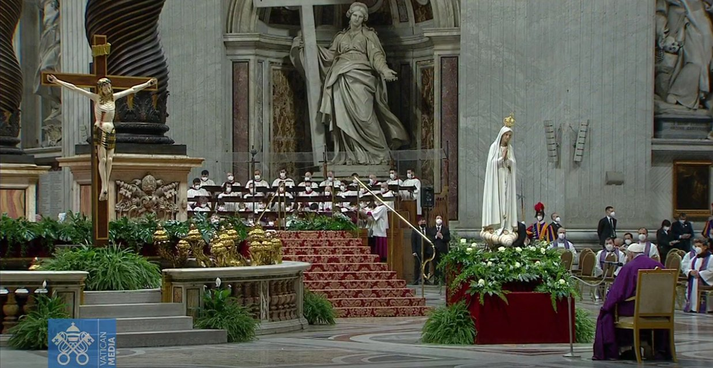

*De paus heeft iets echt heel ergs gedaan! Hij heeft Rusland en Oekraine "toegewijd aan het heilig hart van Maria". Op zich geen ramp, maar hij heeft dat gedaan bij een beeld van Onze Lieve Vrouw van Fatima en heeft hij zijn aalmoezenier in het bedevaartsoord van Fatima en alle bisschoppen in hun eigen bisdom dezelfde toewijdingsakte laten bidden. Misschien beseft u niet half hoe erg dit wel is! Hiermee wordt onze kerk regelrecht teruggekatapulteerd naar de eerste decennia van de vorige eeuw, de meest sinistere periode uit de geschiedenis van de Kerk, waarbij de duistere Middeleeuwen simpelweg verbleken. Hoogtijdagen van integralisme, moralisme, anti-modernisme, clericalisme, ultramontanisme, dogmatisme en meer van die verderfelijke houdingen, die we nu al zestig jaar lang aan het proberen uitroeien zijn. Precies die periode waarheen traditionalisten ons terug willen keren!*

*En Fatima is het traditionalistische paard van Troje! Ziet niemand dat? Begin vorige eeuw geloofden mensen nog aan Mariaverschijningen en [geheime voorspellingen](https://gegroetokruis.org/2017/07/14/o-l-v-van-fatima-de-verschijning-van-13-juli-en-het-geheim/) en bovennatuurlijke krachten. En nu doet onze lieve Paus mee met al die o-jee-zo-rigide dingen… Ga op google en zoek naar "toewijding rusland fatima" en kijk op wat voor akelige rechts-reactionaire websites je allemaal terechtkomt! Met zo'n ideeën _kan_ je je op geen enkele manier willen verbinden! We moeten een krachtig signaal van eerherstel laten klinken opdat deze Fatimamanie geen smet op onze progressieve Kerk wordt!*

   Bovenstaande kleine tirade is een 'gekuiste' weergave van wat zich in de hoofden van meerdere katholieke theologen en/of commentatoren moet hebben afgespeeld de voorbije dagen. 

   Hendro Musterman (correspondent Algemeen Dagblad) nagelde op Twitter [67 stellingen](https://twitter.com/HendroM/status/1506975237010825225?s=20&t=FgTu4neKZ_MSEqbBpmPWqw) tegen de muur waarin hij met alle denkbare en ondenkbare argumenten betoogt dat zo'n toewijding echt wel in alle opzichten helemaal fout is.  

   Anton de Wit (hoofdredacteur Katholiek Nieuwsblad) is net dat beetje sluwer dan Hendro en in plaats van de rol van de paus in dit alles aan het twijfelende oordeel van de lezer over te laten, gunt hij de heilige Vader een [actieve rol in het ontmaskeren van de Fatimaketterij](https://www.kn.nl/verdieping/commentaar/de-paus-redt-marias-boodschap-uit-verkeerde-handen/), precies door de toewijding nu _wel_ uit te voeren! 

   Op Kerknet pakken ze het op zijn Vlaams aan: er gewoon over zwijgen, dan weten de mensen niks en kunnen ze er ook geen kwaad van maken. De toewijding zelf wordt wel vermeld, want de bisschoppen doen er ook aan mee, maar dat er een link met Fatima zou zijn, dat [hoeft de Vlaamse katholiek niet te weten](https://www.kerknet.be/zoeken/artikels?text=fatima) en dat deze toewijding zowat het grootste wereldwijde _event_ is dat de Kerk in de laatste tien jaar meemaakte, hoeft ook niet echt veel aandacht te krijgen, want mensen zouden wel eens wat durven gaan opzoeken en gekke ideeen krijgen.

   Ik moet voor mezelf zeggen dat het de eerste keer was in Franciscus' pontificaat dat hij me werkelijk gegrepen heeft met wat hij doet. Ik heb heel wat kritiek op deze Paus en de goeie dingen die hij zegt en doet heb ik de neiging te negeren, maar dat is voor een stuk omdat er zoveel aandacht gaat naar dingen die een directeur van een NGO _ook_ zou kunnen zeggen of doen. 

   Deze toewijdingsakt, trouwens heel goed spiritueel gekaderd met een voorafgaande boeteviering, is nu precies iets wat een directeur van een NGO _nooit_ zal kunnen doen. Hiervoor moet je Paus zijn! Hiervan leeft de Kerk! 

  
*Paus Franciscus tijdens het uitspreken van het toewijdingsgebed in de Sint-Pietersbasiliek*
