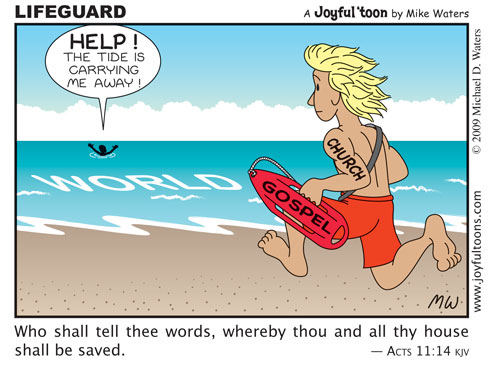

{}"De redder"{}
De scoutsgroep van zoonlief organiseert de jaarlijkse overgang altijd in de Hoge Rielen. Het zijn zeescouts, dus het overgangparcours loopt langs en door het water van de zwemvijver. Vanaf dit jaar geldt: verboden te baden als er geen redder van het domein aanwezig is, en dat is in oktober niet het geval. Niet erg. Ze passen hun parcours wel aan.

Zo is er weer een stukje vrijheid verloren. Waarom? Omdat de uitbaters schrik hebben dat er iemand zou verdrinken? Omdat er nieuwe wetgeving is voor de uitbating van zwemvijvers? Wat ook de reden is: het is goed bedoeld, om onze jongens te beschermen van ongelukken.

## Onze risicoanalyse

De basis van zo'n maatregel is een risicoanalyse. Daarin wordt geevalueerd wat de ernst van het gevaar is (dood, verwonding, ongemak) en de waarschijnlijkheid ervan. Als het te erg is, wordt een maatregel gezocht om het risico te verminderen. 

In dat proces zitten twee manco's. Eerst bij de evaluatie van de ernst. Het valt op dat veel maatregelen in het leven geroepen worden, zonder dat er sprake is van een aanwijsbare stijging van het risico. Is zo'n zwemvijver in 2022 gevaarlijker dan enkele jaren geleden? Ik zou denken van niet. Toch blijkt zich nu plots een onaanvaardbaar risico te stellen. Het zijn de criteria waarmee het risico wordt ingeschat die verschuiven, eerder dan het risico zelf. Er wordt steeds 'voorzichtiger' geoordeeld.

Wat er ook van zij, het resultaat is een maatregel die bij correcte toepassing ontegenzeggelijk  het risico op verdrinking zal verminderen.

Er is een tweede manco. Opgelucht dat er een maatregel is ingevoerd, wordt de vraag genegeerd of de neveneffecten van de maatregel in verhouding zijn tot de beperking van het risico. Het zwemverbod heeft twee neveneffecten: kampen worden duurder, want in de zomermaanden moet extra personeel worden ingezet als redder bij de zwemvijver, en in oktober kan de overgang niet meer in het water doorgaan. Staat dat in verhouding tot de beperking van het risico dat er iemand zou verdrinken? Op het eerste zicht lijkt de maatregel wel in proportie. Iemand die verdrinkt, dat is wel heel erg, en de maatregel kan bezwaarlijk draconisch genoemd worden. 

Er zijn echter ook subtielere neveneffecten. Er zal bijkomende handhaving nodig zijn, meer controle en toezicht, niet enkel door redders, maar ook buiten het seizoen, om erop toe te zien dat er geen overtredingen gebeuren. Die controle zal het gevoel van vrijheid dat zo'n kampterrein bij jongeren doet opwellen, een deuk zal geven. Wanneer er dan wel gezwommen kan worden, zijn er redders aanwezig, wat dan weer het verantwoordelijkheidsgevoel bij de jongeren en hun begeleiders zal dempen (hoewel er bij de zeescouts genoeg rondlopen met een reddersbrevet). 

Na die 'subtiele' neveneffecten mee in rekening te nemen, vraag ik me af of de maatregel nog steeds in proportie is. Ze doet immers veel teniet aan de inherente bestaansreden van zo'n kampterrein c.q. het hele scoutsproject: in groep met leeftijdsgenoten en gelijkgezinden  vrijheid ontdekken en verantwoordelijkheid leren opnemen.

Die zwemvijver is een typevoorbeeld van de maatregelen waarmee ons dagelijks kleine morzeltjes vrijheid worden ontnomen en nieuwe regels opgelegd. Het argument is altijd hetzelfde: bescherming tegen risico's. De neveneffecten zijn: vermindering van vrijheid en verhoging van complexiteit en kosten. Ook de verborgen neveneffecten zijn altijd dezelfde: meer controle en toezicht op ons doen en laten en de ontmoediging om zelf verantwoordelijkheden op te nemen, "want er wordt in voorzien door de overheid".

**Mij lijkt intussen het risico dat jongeren fysiek gevaar lopen een ongeluk tegen te komen, veel kleiner dan het risico dat ze geestelijk  'verdrinken' in een poel van beklemmende maatregelen die elke vorm van uitdaging om de wereld te ontdekken en motivatie om zich te ontplooien, in de kiem smoren.**

## Jezus' risicoanalyse

Jezus zegt:

{}
Wie [ergernis](https://gelovenleren.net/blog/schandalig-geloof/) geeft aan een van deze kleinen, die in Mij geloven, het ware hem beter, dat hem een zware molensteen om de hals werd gehangen, en hij zo in de zee werd geworpen.
{}

En ook: 

{}
Als uw rechteroog u ergert, ruk het dan uit en werp het van u weg.
{}

Jezus gebruikt twee analogieen waarmee een morele 'val' wordt voorgesteld in fysieke begrippen. Het lijkt erop dat Jezus ervan uitgaat dat zijn toehoorders, net als wij, het voorbeeld van absurd radikale maatregelen om fysiek onheil te vermijden het best begrijpen om het belang te tonen van iets dat minder vanzelfsprekend is: het nemen van radikale maatregelen om een morele val (zonde) te vermijden. 

De woorden van Jezus indachtig, zet de Kerk zich schrap voor de christelijke moraal. Dat doet ze bij uitstek als het gaat om de twee cruciale aspecten van het menselijk bestaan: het levensbegin en het levenseinde. Het levensbegin belichaamt zich in het huwelijk van man en vrouw, in de natuurlijke vruchtbaarheid  en in het gezin. Het levenseinde belichaamt zich in het aanvaarden van het natuurlijk sterven. Het behoeft slechts elementaire logica om te begrijpen dat de Kerk het moeilijk heeft met zaken als abortus, euthanasie, geboortebeperking, draagmoederschap en ja, ook met seksueel andersgeaarde gezinsvormen. 

{}{}
Laten dit nu net de thema's zijn waar de samenleving  alle beperkingen losgooit, terwijl ze op zoveel vlakken een haast neurotische drang vertoont om elke stap die we zetten te controleren opdat we toch maar geen risico zouden lopen onszelf te kwetsen. Jongeren worden aangespoord om zonder enig toezicht of beteugeling "zichzelf te ontdekken" en in volledige autonomie "baas te zijn over hun eigen lichaam", alsof we ons erover verheugen dat ze bij nacht en ontij, met of zonder zwembrevet, een duik nemen in de zwemvijver, liefst zonder redders in de buurt. 

**De kans dat jongeren zo hun waarachtige 'identiteit' en levensstaat ontdekken, lijkt me veel kleiner te zijn dan dat ze---ten tweede male---geestelijk verdrinken in een poel van stuurloze vrijheid die elk streven naar standvastigheid en zelfbeheersing in de kiem smoort.**

{}
Weest niet bevreesd voor hen, die wel het lichaam doden, doch de ziel niet kunnen doden; vreest liever Hem, die èn ziel èn lichaam in de hel kan verderven.
{}

Jezus' risicoanalyse lijkt niet bepaald op de onze. Hij wil geen risicobeheersing die enkel gericht is op het fysieke kwaad en de ziel niet beschermt. Het heeft geen zin onze vrijheid op te geven om statistisch wat minder kans te hebben op een ongeluk, als we onze ziel ten prooi laten van zoveel bekoring en verwarring. Jezus is niet tegen redders, Hij is immers zelf de opper-Redder, van onze ziel. 

