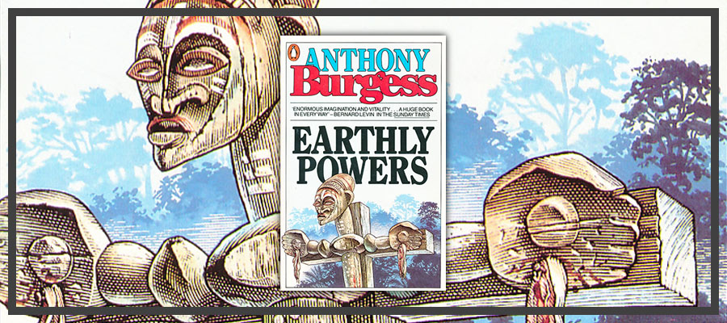

_Earthly Powers_ is een roman uit 1980 van Anthony Burgess. Ik ben geen erudiet lezer, laat staat literatuurcriticus, maar dat mag me niet tegenhouden toch enkele beschouwingen aan dit boek te wijden.

{}
_A Clockwork Orange_ bracht ik vorig jaar nog ter sprake in [Repressieve sensibilisering](/blog/repressieve-sensibilisering/), toen ik me in de piek van de coronamaatregelen afvroeg of goedheid wel kan bestaan als er geen vrijheid is.
{}
Het is het eerste boek dat ik lees van Burgess, maar ik zag vanzelfsprekend de beroemde film die op een van zijn boeken is gebaseerd, _A Clockwork Orange (*)_, een roman uit het dystopische genre. _Earthly Powers_ beschrijft niet de toekomst, maar het verleden. Het bevat veel fictieve personages en gebeurtenissen, maar heeft een historische leidraad in de geschiedenis van de ganse twintigste eeuw. 

Een rode draad doorheen het boek is het katholieke geloof en de rol die het speelt in het leven van de verschillende personages: een rijke auteur uit een katholieke Frans-Britse familie die bij het begin van zijn carriere Engeland is ontvlucht wegens zijn homoseksuele geaardheid, diens echtgescheiden lesbische zus, de broer van dier zwarte partner die in Afrika de kolonisatie bestrijdt, haar schoonfamilie met haar serieel monogame en onvruchtbare ex-man, haar overspelige schoonvader en haar geadopteerde schoonbroer die het van priester-exorcist tot hervormingsgezinde Paus schopt. 

Er valt veel te zeggen over dit dikke boek, waarvan de samenhang me niet altijd duidelijk is, mogelijks omdat ik de vele verwijzingen naar politiek en literatuur niet altijd snap. Gelukkig is de complexiteit van de dooreenlopende verhaallijnen en het aantal personages niet van die aard dat ik erop afknapte, zoals ik wel deed bij _Honderd jaar eenzaamheid_ van Márquez, wiens naam zo gelijkluidend is met die van Burgess dat ik hen eerst verwarde. 

Je zou kunnen zeggen dat het boek handelt over het onderscheid tussen goed en kwaad, maar welk boek doet dat niet? Het kwaad bewandelt in dit boek de weg van de toevalligheid, door de handen van de personages. Door ogenschijnlijk onschuldige handelingen of keuzes, werken de personages ongewild afschuwelijk kwaad in de hand. 

Het hoofdpersonage is een tachtigjarige man die de geschiedenis van de twintigste eeuw overschouwt. Je zou het dramatisch kunnen noemen dat hij in zijn memoires de dood van zoveel personages moet beschrijven, waarbij vaak het adagium geldt "de goeden gaan het eerst", maar dat is natuurlijk niet zo. Het enige verschil tussen een personage dat vroeg sterft en een personage dat lang leeft, is dat de laatste op de eerste kan terugkijken en niet andersom. Dat is in het echte leven net zo. 

Hoewel het boek nu al meer dan veertig jaar oud is, blijft het actueel. Van _Black Lives Matter _over het kerkelijk homohuwelijk tot zelfs een clandestiene Tridentijnse Mis, het zijn topics die nog steeds mijn twittertijdlijn overheersen. Gelukkig is het geen _woke_ propagandaschrift, want daar heb ik mijn buik van vol, zover dat ik het nauwelijks aandurf verpozing te zoeken in meer hedendaagse literatuur, omdat het strijk en zet van dat is. Een hedendaags criticus zou ongetwijfeld zeggen dat Burgess die thema's te ongenuanceerd benadert en een eenzijdig beeld ophangt van homo's en zwarten. Mij best. 

Als ik uit het boek één boodschap zou mogen distilleren, is het, in mijn eigen bewoordingen: _"Don't mess with the sacraments of the Catholic Church!"_. Knoeien met het geloof is als spelen met vuur, maar niet weten hoe ermee om te gaan. Doorheen de verhaallijnen en zeker na de ontwikkelingen op het einde van het boek, ervaar je de kracht die uitgaat van de sacramenten (en sacramentaliën) van de kerk, meerbepaald ook de vernietigende kracht als ze oneigenlijk gebruikt worden. Pal in het midden van het boek zegt de latere Paus na een uiteenzetting over zijn eigen neo-Pelagiaanse theologie: _"Religion is the most dangerous thing in the world. It is not little girls in their communion frocks and silly holy pictures and the Children of Mary. It is high explosive, dynamite, the, [he smiled at the conceit] splitting of the atom."_ Een zinvolle waarschuwing, ook voor de leerling-tovenaars van onze eeuw.

