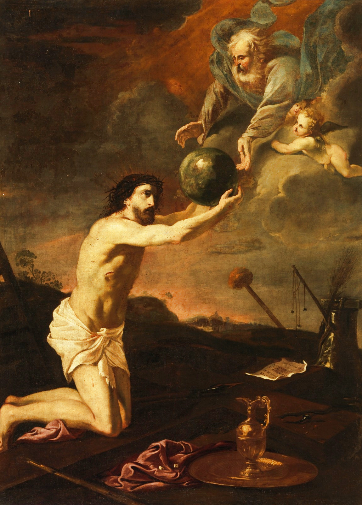

Een vriend deelde me een afbeelding van een [werk van de zeventiende-eeuwse Spaanse schilder Antonio Fernández Arias](https://www.museodelprado.es/en/the-collection/art-work/jesus-receiving-the-world-from-god-the-father/d22f53c3-f475-4415-9bd7-a2558babbb72). Het beeldt de lijdende Christus af die, geknield, van God de wereld overhandigd krijgt.  

Het is een leuk tijdverdrijf na te gaan waarop zo'n allegorische voorstelling zou kunnen gebaseerd zijn; mij was dat immers niet meteen duidelijk. Een beetje zoeken in de bijbel, levert volgende verzen op, die bij deze afbeelding passen:

> *[Mattheus 11](https://bijbel.gelovenleren.net/mt.html#mt-11):27*  
> 25 In die tijd nam Jesus het woord, en sprak: Ik dank U, Vader, Heer van hemel en aarde, omdat Gij deze dingen voor wijzen en verstandigen hebt verborgen en aan kleinen geopenbaard. 26 Ja, Vader, zo is uw welbehagen geweest. 27 **Alles is Mij door mijn Vader in handen gegeven.** En niemand kent den Zoon, dan de Vader alleen; en niemand kent den Vader, dan de Zoon alleen, en hij, aan wien de Zoon het openbaren wil. 28 Komt allen tot Mij, die vermoeid en belast zijt, en Ik zal u verkwikken. 29 Neemt mijn juk op, en leert van Mij, omdat Ik zachtmoedig ben en nederig van harte; dan vindt gij rust voor uw zielen. 30 Want mijn juk is zacht, mijn last is licht.

Jezus sprak die woorden tijdens zijn prediking, wanneer hij rondging en wonderen deed. Net voordien had Hij nog de menigte uitvoerig gesproken over Johannes de Doper, die in de gevangenis zat.

> *[Lucas 10](https://bijbel.gelovenleren.net/lc.html#lc-10):22*  
> 21 Toen jubelde Hij het uit in den Heiligen Geest, en sprak: Ik dank U, Vader, Heer van hemel en aarde, omdat Gij deze dingen voor wijzen en verstandigen hebt verborgen, en aan kleinen geopenbaard. Ja, Vader, zó is uw welbehagen geweest. 22 **Alles is Mij door mijn Vader in handen gegeven**; en niemand weet, wie de Zoon is, dan de Vader alleen; of wie de Vader is, dan de Zoon alleen, en hij, wien de Zoon het openbaren wil.

Jezus' woorden zijn bij Lucas een antwoord op de terugkeer van de 72, die Jezus verheugd vertellen dat ze duivels hebben uitgedreven in zijn naam!

> *[Johannes 3](https://bijbel.gelovenleren.net/jh.html#jh-3):35*  
> Hij, dien God heeft gezonden, spreekt de woorden van God; God immers geeft den Geest zonder maat. 35 **De Vader bemint den Zoon, en heeft Hem alles in handen gegeven.**— 36 Wie in den Zoon gelooft, heeft het eeuwige leven; maar wie in den Zoon niet gelooft, zal het leven niet zien, maar Gods gramschap blijft op hem liggen.

Merkwaardig genoeg, betreft het ditmaal woorden die Johannes de Doper sprak óver Jezus. 

Bij Johannes is er echter een tweede passage die bij het schilderij past:

> *[Johannes 17](https://bijbel.gelovenleren.net/jh.html#jh-17):25*  
> 18 Zoals Gij Mij in de wereld hebt gezonden, zo heb Ik ook hen in de wereld gezonden. 19 En Ik heilig Mijzelf voor hen, opdat ook zij in waarheid geheiligd mogen zijn. 20 Ik bid niet voor hen alleen, maar ook voor allen, die door hun woord in Mij geloven. 21 Mogen ze allen één zijn, gelijk Gij, Vader, het zijt in Mij, en Ik in U; mogen ze ook één zijn in Ons, opdat de wereld gelove, dat Gij Mij gezonden hebt. 22 En de glorie, die Gij Mij hebt gegeven, heb ook Ik aan hen gegeven, opdat ze één zouden zijn, gelijk Wij één zijn: 23 Ik in hen, en Gij in Mij. Mogen ze volmaakte eenheid bezitten, opdat de wereld erkenne, dat Gij Mij hebt gezonden, en dat Gij hen hebt bemind, gelijk Gij Mij hebt liefgehad. 24 Vader, Ik wil, dat **zij, die Gij Mij hebt gegeven,** met Mij mogen zijn, waar Ikzelf ben; dat ze mijn heerlijkheid mogen aanschouwen, die Gij Mij hebt gegeven, omdat Gij Mij hebt liefgehad vóór de grondlegging der wereld. 25 Gerechte Vader, wel heeft de wereld U niet gekend, maar Ik heb U gekend; en zij hebben erkend, dat Gij Mij hebt gezonden. 26 Ik heb aan hen uw naam bekend gemaakt, en zal dit blijven doen, opdat de liefde, waarmee Gij Mij hebt bemind, in hen moge zijn, en Ik in hen.

Dit is het besluit van de lange rede die Jezus hield tijdens het Laatste Avondmaal, waarin Hij zijn Lijden voorziet. Gezien de thematiek van het schilderij, waarop verschillende attributen van het lijdensverhaal staan afgebeeld en dat deel uitmaakt van een serie schilderijen over het Lijden van Christus, is dit dus ongetwijfeld het meest rechtstreeks ankerpunt in de Bijbel, waarop het gebaseerd is. 

De passages die verbeeld worden, zijn juist die waarin Jezus (of de Doper) zonder beelden of versluiering expliciet spreekt over de relatie van Christus tot de Vader en over zijn verlossingswerk voor de wereld. Expliciete woorden, maar moeilijk af te beelden, en toch heeft de kunstenaar de uitdaging aangenomen! 

