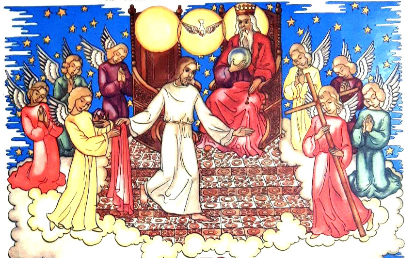

Trouwe klanten wint een handelaar door mensen waar voor hun geld te geven. "Waar" staat voor "koopwaar", maar ook voor "echt" en "overeenkomstig wat werd beloofd". Alles wat de Kerk doet, staat ten dienste van haar unieke zending: Christus verkondigen, die gestorven is en verrezen voor de redding van de wereld (vgl. [CDS §8](https://docs.google.com/document/d/1VytKEhPY7IiRn0nEp8PYP0S8io5PW8Iz/edit)). De verrijzenis van Christus is een [bovennatuurlijke gebeurtenis](https://catholicsstrivingforholiness.org/summaries-of-catholic-teaching-topic-3-supernatural-faith/), waarop een theologie berust die [barst van de bovennatuurlijkheden](https://www.catholic.com/magazine/online-edition/what-true-faith-requires), heel concreet werkzaam in de materiële werkelijkheid, even goed als in de geestelijke werkelijkheid. **Dat verkondigen, is het marktaanbod van de Kerk**, het is wat mensen van haar verwachten. Klanten die waar krijgen voor hun geld, keren tevreden terug.

## Bovennatuur in de verdediging

Het komt echter niet vaak voor dat ik gelovigen oprecht en vol overtuiging over hun bovennatuurlijk geloof hoor spreken. Dat zal wel aan de menselijke natuur liggen, want ik ben ook niet erg geneigd met open visier diepgaande gesprekken daarover aan te gaan. Kwestie van karakter, of is er meer?

Waar zo'n gesprekken over geloof---met medegelovigen!---op uitdraaien, heeft de ervaring me geleerd. Al vrij snel komt een of ander bovennatuurlijk onderwerp ter sprake, hetzij de verrijzenis, die van Christus cq. de onze, hetzij een wonderverhaal uit de Bijbel, hetzij de stoffelijke werkelijkheid van een sacrament bv. de eucharistie, enz. Negen van de tien keer word je dan in de verdediging gespeeld, **omdat je die zaken niet letterlijk moet begrijpen**, maar interpreteren als een metafoor of vanuit de context waarin ze tot stand zijn gekomen. 

Archetype voor dat soort discussies is het scheppingsverhaal, dat anno 2023 nog steeds---anachronistisch---getoetst wordt aan details uit de eenentwintigste eeuwse astrofysica, hoewel de voorchristelijke auteur, zonder enige kennis daarvan, een [wonderbaarlijk accurate beschrijving](https://gelovenleren.net/blog/ik-moet-hier-iets-uit-mijn-botten-slaan-of-het-is-om-zeep/) biedt van de totstandkoming van het heelal, waarvoor een wetenschapper, mocht die ook de methode van de historisch-kritische lezing toepassen, in **volstrekte bewondering** zou moeten staan. Toch is het telkens het geloof dat haar bronnen moet wegcijferen, niet omdat het verhaal niet wetenschappelijk is, nee: omdat God erin ter sprake komt,  het is bovennatuurlijk.

## Metafysica

De elementen van het geloof die worden gerelativeerd zijn bovennatuurlijk van aard. Dat wil zeggen dat ze niet te vatten zijn door de subset van domeinen die we nu courant 'de wetenschap' noemen. Ze zijn slechts te vatten door die andere beschouwing van de waarheid, die we metafysica noemen. Bovennatuurlijke geloofswaarheden hebben een metafysische dimensie, dat wil zeggen dat ze **behalve hun aanspraak op 'werkelijkheid' ook een aanspraak maken op 'waarheid'**; ze hebben betekenis. Voor een gelovige is het zeker nuttig, zoniet noodzakelijk, ook die betekenissen te leren kennen. Het Rijk van God is niet alleen onze bestemming na de dood, het heeft ook een betekenis in _dit_ leven; de eucharistie is niet alleen de werkelijke aanwezigheid van Christus' lichaam in de gedaante van brood en wijn, ze heeft ook een betekenis als deelname aan de christelijke gemeenschap; de genezing van de lamme is niet alleen een bewijs van Jezus' goddelijke natuur, ze heeft ook betekenis voor onze eigen persoon en hoe we met onze eigen onvolmaaktheden omgaan. Al die inzichten _verrijken_ de geloofswaarheden, eerder dan hen te relativeren. Waarom zouden ze dan---voor een gelovige---reden zijn om **de geloofswaarheid zelf te verzwijgen of te ontkennen**? Wat is immers dat geloof waard als het slechts een lukrake verzameling interpretaties blijkt, een ethisch stelsel zonder fundament?

## Omgekeerde schijnheiligheid

Geloven die gelovigen die zo spreken dan niet in de bovennatuurlijke werkelijkheid? Misschien wel. Ik denk (...ik hoop) dat gelovigen die hun geloof wegrelativeren dat doen, bewust of onbewust, vanuit een defensieve reflex  of vanuit angst en schaamte. Wat moeten de mensen niet denken als ze horen dat je gelooft in opstanding, hemel en  hel, transsubstantiatie en wonderverhalen? **Dat kan je imago van 'weldenkend mens' een fikse deuk geven!** Tenzij je die geloofszaken zo verpakt dat ze ongevaarlijk worden, door ze zoals hierboven aangehaald, te relativeren en los te maken van de werkelijkheid. Met een uitspraak als "twijfel is een essentieel onderdeel van mijn geloof" als postmoderne kers op de taart, maak je zelfs nog kans indruk te maken op je even 'weldenkende' gesprekspartners! Het is een omgekeerde vorm van schijnheiligheid: wel een bovennatuurlijk geloof hebben, maar naar buiten toe laten schijnen dat allemaal erg te relativeren. 

Laatst las ik een [preek  op de dominicanenwebsite](https://alledaags.gelovenleren.net/link/MTM1MTUxMzcxNTM5NjI4), die aanving als volgt: _"Na de zaligsprekingen volgen twee aansporingen: “Jullie zijn het zout van de aarde” en “Jullie zijn het licht voor de wereld.” De vergelijkingen met het zout en het licht vinden we ook in de evangeliën van Marcus en Lucas. Ze gaan terug op de vroegchristelijke prediking. Waarschijnlijk horen we in deze woorden Jezus zelf aan het woord."_ Het is leuk als je je in je vrije tijd verdiept in historisch-kritische studies van het Evangelie. Ben je zelf het "licht voor de wereld" als je de liturgie gebruikt om de historiciteit van het Evangelie te relativeren? Slechte _vibes_, vind ik.

## Stokpaardjes

Anton de Wit van _Katholiek Nieuwsblad_ schrijft over de oorzaken van ontkerkelijking in zijn editoriaal "[De ontkerkelijking hangt niet af van ons toevallige stokpaardje](https://www.kn.nl/verdieping/commentaar/zie-je-nou-wel-de-ontkerkelijking-hangt-niet-af-van-ons-toevallige-stokpaardje/)" en somt een aantal van die stokpaardjes op, waaraan de Kerk volgens de één wel en volgens de ander juist niet zou moeten voldoen, om meer gelovigen aan te trekken:  synodaal, inclusief, pastoraal, diaconaal, liturgisch, modernistisch, traditionalistisch. _Mijn_ stokpaardje zit niet in het rijtje. Is het te vanzelfsprekend? Of juist niet? **Zou de Kerk niet beter worden van wat [meer expliciete bovennatuurlijkheid](https://media.ascensionpress.com/2020/01/03/faith-and-reason-in-the-catechism-and-aquinas-work/),** van "geloof" dus, zoals de betekenis van dat woord in brede kringen toch nog altijd omgaat?

## Bovennatuurlijk geloof

De Catechismus definieert in [§150](https://rkdocumenten.nl/toondocument/1-catechismus-van-de-katholieke-kerk-nl/?systeemnum=1-191) de bovennatuurlijke gave van het geloof als volgt: _"Het geloof is op de eerste plaats een zich persoonlijk bekennen van de mens tot God; het is tegelijkertijd, en hiermee onlosmakelijk verbonden, de vrije instemming met geheel de waarheid die God geopenbaard heeft."_

Ik las onlangs in een citaat van de paus dat [de aantrekkingskracht van het geloof de vreugde is](https://www.kerknet.be/kerknet-redactie/blog/zonder-vreugde-slaat-de-verkondiging-van-het-evangelie-niet-aan?microsite=571), hoewel het ook offers en zelfverloochening vraagt. Beide elementen, zowel de vreugde als de zelfverloochening, zijn de vruchten van een intens bovennatuurlijk geloof. Wie dat heeft verworven, kan zonder schroom alle andere stokpaardjes opzij zetten. Als ik een filmpje zie van een Afrikaanse mis met zang en dans en handgeklap, heb ik het gevoel dat die vreugde voortkomt uit een oprecht geloof en [kan het me niet maken](https://gelovenleren.net/blog/misbegrepen/) of de liturgie wel volgens het boekje loopt. Als ik te velde in een Vlaamse parochie liturgie meemaak die bulkt van de vrije tekstversies, erger ik me dood, want ik voel dat er heel wat stokpaardjes bereden worden, maar zie geen enkel teken van bovennatuurlijk geloof.

## Inclusiviteit is boerenbedrog

Pastoraal zal het allemaal wel kloppen en het zal wel heel "[inclusief](https://www.firstthings.com/web-exclusives/2023/02/inclusion-and-catholicism)" zijn, maar mij lijkt het boerenbedrog 'vreugde' te verkopen los van bovennatuurlijk geloof. Mensen lokken met een uithangbord "wij zijn inclusief, iedereen mag bij ons helemaal zichzelf zijn" en die mensen dan zelf laten ontdekken dat ze lid zijn van een club die ook offers, zelfverloochening en bekering vraagt, is op zijn zachtst gezegd misleidend. 

Wie nadenkt over de toekomst van de Kerk, kan zich suf tobben over hoe ze meer open, inclusief, participatief of betrokken kan zijn. Er telt maar één ding: **een "toegankelijke" Kerk opent de "toegang" tot de bovennatuurlijke werkelijkheid, waarvan haar vreugde een vrucht is.** De vraag is, hoe je dat aanpakt. 

## Mariale als geheim wapen

In de vorige eeuwen---want het probleem waarmee de Kerk worstelt is natuurlijk helemaal niet nieuw, hoewel we onszelf zo graag een unieke plaats in de geschiedenis aanmeten---is meermaals de mariaverering aangewend als 'geheim wapen' om het bovennatuurlijk geloof een _boost_ te geven. De twee mariale dogma's van de negentiende en de twintigste eeuw, de onbevlekte ontvangenis en de tenhemelopneming, hebben zeker en vast hun uitwerking niet gemist en nog steeds zijn ze een rijke voedingsbodem voor het geloof. Er is een levendige lobby voor een [vijfde mariaal dogma over Maria als medeverlosseres](https://www.motherofallpeoples.com/the-fifth-marian-dogma), maar er heerst geen overtuiging dat dit ook vandaag het gewenste effect zal bereiken. Knap was de daad die paus Franciscus begin 2022 stelde door **Rusland en Oekraine toe te wijden aan het heilig Hart van Maria** bij het beeld van O.L.V. van Fatima. Zijn oproep echter om hiervan een wereldwijd _event_ te maken, [viel in dovemansoren](https://gelovenleren.net/blog/hiervoor-moet-je-paus-zijn/). 

## Polarisatie

Die doofheid heeft te maken met polarisatie in de Kerk. Sommige stokpaardjes zijn van _rechts_ en andere van _links_. Mgr. Bonny sprak tijdens een vragenronde onlangs over polaristie: _"Als je de versleten woorden van links en rechts mag gebruiken: links is grotendeels vertrokken, rechts is gebleven en een heel stuk van rechts is zeer ideologisch verhard. Vanop links, de meer progressieve vleugel komt er bijna geen weerwerk meer, die heeft de voorbije twintig jaar gezegd: we haken af. De overtuigde, rechtse kant is gebleven en daar zit een heel harde vleugel in."_ 

Laat me allereerst  opmerken dat deze uitspraak het [synodaal verslag van bisdom Antwerpen](https://gelovenleren.net/blog/synthesetekst-bisdom-antwerpen-een-schandelijk-werkstukje/) in een nieuw daglicht stelt, waarin dat onevenwicht tussen de vleugels---naar mijn interpretatie---precies omgekeerd ligt. Maar de bisschop heeft zeker gelijk als hij communicatie via internet ziet als een grote bron van polarisatie. Dat kan ik beamen. Het is onmogelijk om via internet iemand persoonlijk te ontmoeten. Ik voel me zelf ook wel eens 'gepolariseerd' en wellicht neigen mijn artikeltjes vaak erg naar 'verharding'. **De beste remedie tegen polarisatie is een bovennatuurlijk geloof**, en dat delen met mekaar door het samen te beleven en er spontaan over te spreken, ook in dagdagelijkse gesprekken. Als gelovigen van mekaar aanvoelen dat ze het bovennatuurlijk geloof delen, is er veel meer ontvankelijkheid, ook voor heel uiteenlopende standpunten. Dat klinkt heel erg synodaal en daar ben ik helemaal voor, maar als we blijkbaar in één bisdom nog niet in staat zijn een eerlijk synodaal gesprek te voeren, op basis van een gedeeld bovennatuurlijk geloof, hoe zou het op wereldschaal mogelijk zijn?

## Waar kan bovennatuurlijk geloof leven?

Liturgie is een belangrijk biotoop voor de delen van een bovennatuurlijk geloof. Liturgische teksten (als ze correct gebruikt worden) spreken breeduit over die dimensie, maar omdat we ze enkel horen in hetzelfde formele kader van de liturgie, doen ze niet altijd ons gevoel voor trascendentie zinderen. **Homilie zou voor een pastoor de vrijplaats kunnen zijn om een spontaner bovennatuurlijk taalregister open te trekken**, maar om een mij onbekende reden blijven homilieën meestal erg _down to earth_. Hetzelfde met catechese, voor volwassenen of kinderen. 

{}_Zie je God de Zoon? Hij heeft zijn zetel verlaten. Een engel heeft zijn kroon en mantel aangenomen. Hij biedt Zich aan, aan God de vader, om mens te gaan worden. Hij wil op aarde komen om voor de mensen te lijden._{}

De catecheseteksten voor jonge kinderen uit het prentenboek _Luistert naar Hem_, gedateerd midden 20ste eeuw, ademen nog een bovannatuurlijk geloofsregister, wellicht als laatste uit hun soort. Deze prent vind ik een beklijvend voorbeeld. Het is een tafereel dat---bij mijn weten---nooit elders in de christelijke iconografie is afgebeeld. Het verbeeldt [Christus die van zijn Hemelse troon afdaalt](https://prentencatechismus.org/luistert-naar-hem/de-verlosser-is-god-de-zoon/), om mens te worden. De theologie leert dat Christus God is en bij de Vader en de Geest was van bij het begin der tijden en dat Hij mens is geworden in de volheid van de tijd. **Hoe persoonlijk en toegankelijk stelt dit tafereel die 'volheid van de tijd' voor!** We zijn zo vertrouwd met taferelen van de annunciatie en de geboorte van de Heer, maar we zien over het  hoofd dat er zich voorafgaand ook iets in de Hemel moet hebben afgespeeld. Waarom zouden we daar ook geen voorstelling van kunnen maken? Dit is een knap voorbeeld van theologische verbeelding---niet te verwarren met fantasie! 

Het is de eerste taak voor elke gelovige, het bovennatuurlijk geloof te koesteren en te cultiveren. De Kerk heeft daar als goede moeder veel middelen voor ter hand gegeven. Gebed, bedevaarten, sacramenteel leven, … het is niet eenvoudig om er altijd tijd voor te maken, zeker als je dat niet in gemeenschap kan, maar zonder die middelen is het aartsmoeilijk, zoniet onmogelijk.

## Een bovennatuurlijke dollemansrit op een draaimolen vol stokpaardjes

De lezer die tot hier de tekst doorstaan heeft, zou kunnen opmerken: wat zit je te klagen over een gebrek aan bovennatuurlijk geloof in de kerk, terwijl op dit eigenste moment het **meest omvattende bovennatuurlijke project plaatsvindt dat de Kerk ooit ondernomen heeft**: de synode over synodaliteit. Daarin is immers de Heilige Geest werkzaam op mundiale schaal. Hoeveel bovennatuurlijker wil je het nog hebben? 

Als ik [op een website zoals Kerknet zoek op het woord "bovennatuurlijk"](https://www.kerknet.be/zoeken/artikels?text=bovennatuurlijk), krijg ik bijna uitsluitend artikels te lezen die te maken hebben met het al dan niet erkennen van mariaverschijningen. Zoals eerder gesteld, bewijst dit dat het 'geheime wapen' dat de voorbije eeuwen herhaaldelijk is ingezet, nog steeds zijn werk doet! Het bewijst eveneens dat de Kerk best wel kritisch is als  het gaat over de **erkenning van de bovennatuurlijkheid van wonderlijke gebeurtenissen**, want lang niet alle vermeende verschijningen krijgen erkenning. Daar gaan [lange procedures](https://www.americamagazine.org/faith/2017/04/18/how-catholic-church-determines-true-marian-apparition) aan vooraf en worden strenge criteria toegepast. Zelfs als een verschijning erkend wordt, laat de Kerk het gelovigen vrij er individueel al dan niet geloof aan te hechten.

Het komt me niet voor dat een even kritische en voorzichtige houding wordt aangenomen tegenover de bovennatuurlijkheid van de _[sensum fidei](https://www.pillarcatholic.com/the-theology-behind-cardinal-mcelroy/)_ die zich dankzij [de Heilige Geest op de synode](https://www.catholicworldreport.com/2022/12/08/synodality-and-sinning-against-the-holy-spirit/) moet manfisteren. Terugkomend op De Wit, zijn de teksten die in de loop van de synode geproduceerd worden, **een dollemansrit op een draaimolen vol stokpaardjes**, waarop één stokpaardje lijkt te ontbreken. Getuigen de teksten immers ook van een bovennatuurlijk geloof in de geesten van de deelnemers? Medunkt mag tijdens de onderscheidingsfase van de synodale inzichten, dezelfde rigiditeit toegepast worden waarmee de boodschappen van mariale verschijningen beoordeeld worden, of, als dat niet nodig geacht wordt, zouden we dan toch niet beter overgaan tot de dogmatische afkondiging van het medeverlosserschap van Onze Lieve Vrouw?

