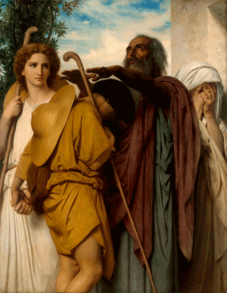
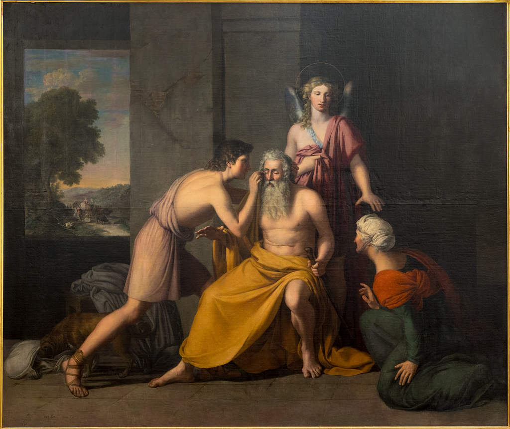

Welk boek uit de Bijbel is er meer gepast om met Valentijn ter hand te nemen dan [Tobit](https://bijbel.gelovenleren.net/tobit.html)? Het is een heel kort boek met een eenvoudige verhaallijn dat je op een klein uurtje gemakkelijk uitleest. Het gaat over een jongeman, Tobias, die door zijn blinde vader Tobit op een verre reis gestuurd wordt, vergezeld door de [engel Rafael](http://www.heilige-michael.nl/de-drie-aartsengelen/st-rafael/st-rafael-6/), die---incognito!---als zijn beschermer optreedt en er zelfs voor zorgt dat hij onderweg in het huwelijk treedt met Sarah, dankzij het uitdrijven van een demon.

Een zuiver geloof en een zuiver huwelijk, meer is er niet nodig om---met Gods genade---alles ten goede te keren. Het boek bevat vier relatief lange passages waarin een van de personages aan het woord is. Die passages komen los van het verhaal, het zijn gebeden of vermaningen die algemeen gebruikt kunnen worden, maar ze passen natuurlijk wel in het verloop van het verhaal, dat er een is van _bevrijding_, zoals gans de Bijbel. Die passages vind je onderaan dit artikel.

Tobit is het verhaal van gewone mensen, niet van profeten, koningen, rechters of andere belangrijke figuren. Daarom lijkt het me niet echt een kwestie om van wakker te liggen, of het verhaal ook historisch is, dan wel louter fictief. Toch zocht ik het even op en blijkbaar was het voor de kerkvaders een punt om de [historiciteit ervan te erkennen](https://taylormarshall.com/2012/03/defending-the-book-of-tobit-as-history.html). In het verhaal staat de joodse wet, het volk en de moraal centraal, maar omdat het niet draait om personages die in deze zaken gezag dragen, wordt het pas echt relevant voor 'gewone gelovigen', met name adolescenten, verliefden en gehuwden, maar ook ouderen, als voorbeeld hoe een leven dat gericht is op God, vol is van zegeningen.

Het bijbelboek is ook een [dankbaar onderwerp](https://womeninthebible.net/bible-extras/tobit/) voor de [christelijke iconografie](https://www.pinterest.com/upliftingart/the-book-of-tobit-in-art/). 

*The departure of Tobit with the angel Raphael, William Boureureau*

## [Tob 3](https://bijbel.gelovenleren.net/tobit.html#tobit-3):2-6. Tobit, geslagen met blindheid, bidt tot God

> Gij zijt rechtvaardig, o Heer, en rechtvaardig is geheel uw gericht; al uw wegen zijn barmhartigheid, waarheid en recht. Wees dus mijner gedachtig, o Heer, neem geen wraak over mijn zonden, en wil mijn overtredingen en die van mijn vaderen niet meer gedenken. Omdat wij niet gehoorzaamd hebben aan uw geboden, daarom werden wij overgeleverd aan plundering, verbanning en dood, aan bespotting en hoon voor alle volkeren, waaronder Gij ons hebt verstrooid. Ja, Heer; zwaar zijn uw straffen, omdat wij niet geleefd hebben naar uw geboden en niet in oprechtheid voor uw ogen hebben gewandeld. Welnu dan, Heer; doe met mij wat Gij wilt, maar laat mijn geest opgenomen worden in vrede; want sterven is mij liever dan leven. 

## [Tob 3](https://bijbel.gelovenleren.net/tobit.html#tobit-3):13-23. Meteen gevolgd door Sara, die ook bidt tot God

> Gezegend is uw Naam, o God onzer vaderen, Gij, die weer barmhartigheid toont, als uw toorn is bevredigd, en in dagen van lijden de zonden vergeeft aan hen, die U aanroepen. Tot U wend ik mijn aangezicht, Heer, op U richt ik mijn ogen. Ik bid U, Heer, mij uit de boeien dezer schande te bevrijden, of anders mij weg te nemen van de aarde. Gij weet, Heer, dat ik nooit een man heb begeerd, en mijn ziel rein heb bewaard van iedere lust. Nooit heb ik aan uitspattingen meegedaan en nooit omgang gezocht met lichtzinnige mensen. Ik heb slechts een man willen nemen in vreze voor U, en niet om mijn hartstocht te volgen. Maar òfwel ik was hunner niet waardig, of zij waren wellicht mijner niet waardig, omdat Gij mij misschien voor een anderen man hebt bestemd. Want uw raadsbesluit kan niemand doorgronden. Doch hiervan is ieder, die U eert, overtuigd: als hij in zijn leven beproefd wordt, zal hij worden gekroond; als hij in kwelling mocht zijn, zal hij worden bevrijd; en als hij straf ondergaat, zal hij de weg naar uw barmhartigheid vinden. Want Gij vindt geen behagen in ons verderf; maar na de storm geeft Gij rust, en na wenen en schreien weer blijdschap. God van Israël, uw Naam zij gezegend voor eeuwig!

## [Tob 4](https://bijbel.gelovenleren.net/tobit.html#tobit-4):6-20. Tobit aan Tobias, die hij uitzendt om zijn geld bij Gabaël op te halen

> Houd verder iedere dag van uw leven God voor de geest, en wacht u er voor, ooit toe te stemmen in de zonde, en de geboden van den Heer, onzen God, te overtreden. Deel aalmoezen uit van hetgeen ge bezit, en wend u nooit van een arme af; want dan wendt ook de Heer zijn aangezicht niet af van u. Zoveel gij kunt, moet gij barmhartigheid betonen. Hebt gij veel, geef dan overvloedig; hebt gij maar weinig, zorg er dan voor, ook van dat weinige gaarne iets weg te schenken. Want daardoor legt gij een heerlijke schat voor u weg voor de dag van nood; want de aalmoes bevrijdt van alle zonden en van de dood, en duldt niet, dat iemand de duisternis ingaat. Zo is de aalmoes voor ieder, die ze uitreikt, een waardevol onderpand bij den allerhoogsten God. Mijn zoon, wacht u voor alle ontucht, en zorg er voor, nooit een misstap te begaan met een andere vrouw. Laat nooit de hoogmoed heersen in uw hart of uw woord; want alle bederf vond daarin zijn oorsprong. Als iemand voor u enig werk heeft verricht, geef hem dan onmiddellijk zijn loon, en houd het loon van uw dienstknecht geen ogenblik achter. Wat gij niet wilt, dat u geschiedt, doe dat ook een ander niet. Deel uw brood met hen, die hongerig en behoeftig zijn, en dek met uw kleding den naakte. Schenk uw brood en uw wijn voor de begrafenis van een rechtvaardige, maar eet of drink er niet van met zondaars. Win altijd de raad in van verstandige mensen. Zegen God ten allen tijde, en vraag Hem, dat Hij uw wegen mag leiden, en al uw plannen doet slagen. 

## [Tob 13](https://bijbel.gelovenleren.net/tobit.html#tobit-13):1-23. Tobit, nadat de engel Tobias en zijn nieuwe echtgenote veilig thuisbracht

> Groot zijt Gij, Heer, in eeuwigheid, En tot in alle eeuwen duurt uw rijk. Want Gij slaat wel, maar geneest weer, Gij brengt naar de onderwereld, en voert eruit terug; Niemand is er, die uw hand kan ontlopen. Kinderen Israëls, looft den Heer, En prijst Hem, dat de heidenen het horen; Want Hij verspreidde u onder volken, die Hem niet kennen. Om zijn wonderdaden te verkonden en hen te doen weten, Dat er geen almachtige God is dan Hij. Hij heeft ons getuchtigd om onze zonden, Maar Hij zal ons weer redden om zijn barmhartigheid. Ziet toch, wat Hij voor ons heeft gedaan, En looft Hem in vreze en siddering; Verheerlijkt door uw daden den Koning der eeuwen. Ik zelf wil Hem loven in het land van mijn ballingschap; Want Hij heeft zijn glorie getoond aan het zondige volk. Bekeert u dan, zondaars; beoefent voor God de gerechtigheid; En gelooft, dat Hij u barmhartig zal zijn. Met geheel mijn ziel wil ik in Hem mij verblijden. Looft den Heer, gij allen, die Hij heeft uitverkoren; Viert dagen van blijdschap, en brengt Hem uw lof. Jerusalem, gij stad van God, De Heer heeft u gestraft, om wat uw handen misdeden. Loof nu den Heer door uw goede daden. En wil den God der eeuwen prijzen, Opdat Hij zijn tent weer in u opbouwe, Al uw ballingen tot u terugroepe, En gij weer vreugde moogt hebben in alle eeuwen der eeuwen. Gij zult stralen in schitterend licht, En alle uiteinden der aarde zullen u huldigen. Van verre zullen de volkeren komen, En met hun gaven in uw midden den Heer aanbidden; Uw land zullen zij beschouwen als heilig, Want zij komen tot U, om de heerlijke Naam te vereren. Vervloekt zijn allen, die u verachten; En die u belasteren, worden allen gestraft. Maar gezegend zijn zij, die u weer opbouwen. Dan zult gij weer vreugde vinden in uw kinderen, Daar zij allen gezegend worden en bijeengebracht bij den Heer. Gelukkig allen, die u beminnen, En verheugd zijn over uw vrede. Loof, mijn ziel, den Heer, Want Hij heeft Jerusalem, zijn stad, Bevrijd van al haar kwelling, Hij, de Heer, onze God! Ik zal gelukkig zijn, als mijn geslacht blijft bestaan, Om de heerlijkheid van Jerusalem te aanschouwen. Jerusalems poorten worden dan opgebouwd uit safier en smaragd, En heel de kring van haar muren uit kostbare steen. Al haar pleinen worden met zuiver wit marmer belegd, In haar straten wordt het Alleluja gezongen. Gezegend de Heer, die haar groot heeft gemaakt, Hij heerse over haar in de eeuwen der eeuwen! Amen!

*The Healing Of Tobias, Rafael Tegeo*

