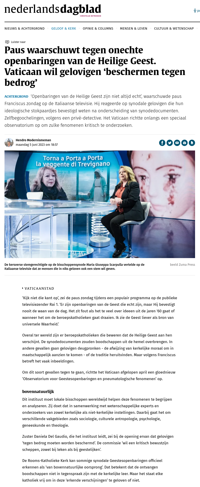

Dit kon ik even niet laten, amateursatiricus spelen. De grap is dat ik de tweede helft van het artikel eigenlijk helemaal niet hoefde te wijzigen :) :)  Het is een vermakelijke illustratie voor dit vorige artikel: [Geloven Leren - Het ontbrekende stokpaardje: &quot;bovennatuurlijk geloof&quot;](https://gelovenleren.net/blog/het-ontbrekende-stokpaardje-bovennatuurlijk-geloof/ "Geloven Leren - Het ontbrekende stokpaardje: &quot;bovennatuurlijk geloof&quot;")

Het origineel: [https://www.nd.nl/geloof/katholiek/1177957/paus-waarschuwt-tegen-onechte-mariaverschijningen-vaticaan-wi](https://www.nd.nl/geloof/katholiek/1177957/paus-waarschuwt-tegen-onechte-mariaverschijningen-vaticaan-wi)

Wist je trouwens dat het heel eenvoudig is om als satiricus met webpagina's aan de slag te gaan? Je drukt op F12, je gaat naar de tab 'console' en typt onderaan het commando: `document.documentElement.contentEditable = true;`. Nu kan je de tekst op de pagina wijzigen en als je klaar bent een screenshot nemen!
