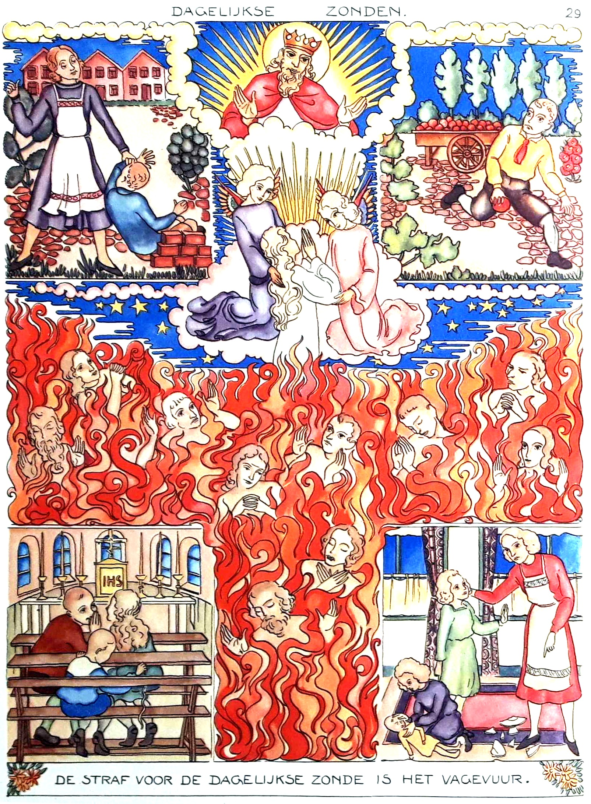
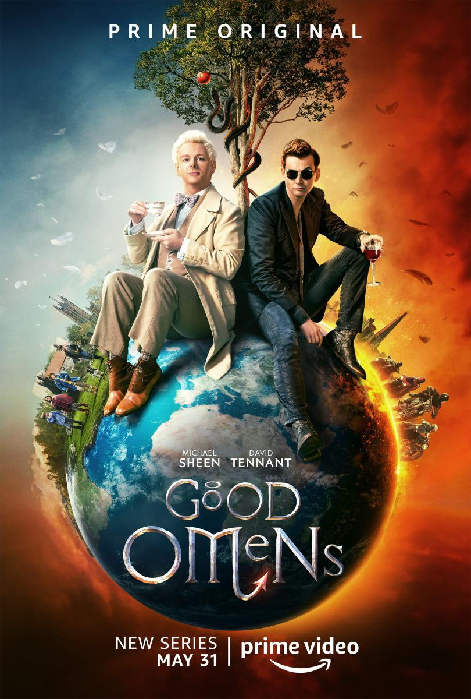

Ik heb weer inspiratie gevonden voor een artikel door twee nieuwtjes te mixen. 

1. Paus Franciscus gaat een nieuwe encycliek schrijven, heeft hij onlangs verklapt. Het wordt een nieuwe milieuencycliek, als vervolg op Laudato Si (2015). Die zal ongetwijfeld ruim ingaan op de klimaatverandering cq. -opwarming en de daaraan gekoppelde moraalleer.
  


2. Eigenlijk geen nieuwtje, maar gewoon een cartoon om de dagelijkse weerberichten op de korrel te nemen die mensen proberen bang te maken voor de opwarming van het klimaat.



De missing link tussen beide is dit prentje uit de prentencatechismus "Luistert naar Hem", want het combineert moraal en vuur:

[Dagelijkse zonden](https://prentencatechismus.org/luistert-naar-hem/dagelijkse-zonden/)

Wat hebben de weerkaart en de catechismusprent gemeenschappelijk?

Het weerbericht zowel als de catechismus wil de mensen aansporen hun gedrag te veranderen door hen visueel te tonen dat ze gestraft zullen worden voor hun slechte daden. Beide doen ze dat met het beeld van alles verzengend vuur dat lijden veroorzaakt. 

Als je er echter even verder over nadenkt, blijken de beelden erg verschillend in toepassing!

Het lijden van het vagevuur (waarover de catechismuprent handelt) is een zuiverend vuur dat gevolg is van de zonde, maar evenzeer noodzakelijk opdat de zielen zich na de loutering kunnen verenigen met God. Het lijden van het vagevuur is ook individueel: het treft uitsluitend de zielen die nog loutering nodig hebben en elk in de mate waarin ze loutering nodig hebben. 

Het vuur van de weerkaart treft iedereen, groene jongen of SUV-mobilist, het maakt geen onderscheid tussen personen en het heeft geen andere bedoeling dan de straf te verbeelden---die je eventueel nog als 'immanente rechtvaardigheid' zou kunnen duiden---die de mensheid wacht als we niet collectief electrisch gaan rijden. In bijbelse termen, lijkt het meer op het vuur dat Sodom en Gomorra treft, dan op het vagevuur, alles vernietigend en zonder onderscheid des persoons.

Het vuur als loutering is een veel dieper beeld dan het vuur als loutere straf. Wellicht is dat laatste een veel primitiever beeld, dat de mensheid in alle culturen gekend heeft, primitief genoeg om weerkaarten in te kleuren.

Archetypische beelden die voortkomen uit het geloof zijn vandaag belangrijker dan ooit, nu er een generatie opstaat die van elke godsdienstige opvoeding verstoken is. Achter elk beeld schuilt een schat aan inzichten, oneindig veel genuanceerder dan de atomische boodschappen van sociale media. Die inzichten leid je niet zomaar af uit het beeld op zich, je hebt ook de traditie nodig waarin het beeld zijn lading heeft gekregen. Als je een beeld wil laten 'werken', of zelfs als je wil voorkomen dat een beeld een eigen leven gaat leiden, mag je die traditie zeker niet verstoppen!

Je moet die traditie ook niet vastklinken aan het beeld, want je kan met een beeld een eind op weg zonder dat het veel uitleg behoeft, maar voor  wie iets meer wil weten over het beeld, moet de traditie beschikbaar zijn.

Er loopt nu een serie "Good Omens", vernam ik, waarin een engel en een duivel de hoofdrol spelen in een plot waarin het einde der tijden op handen is. Wat weten hedendaagse kijkers van de theologische begrippen der hemelse schepselen, van het bijbelboek Job of van de apokalyps? Niks natuurlijk! Toch zijn het precies deze beelden uit de christelijke theologie die in een breed publiek blijven resoneren en sterk genoeg zijn om een fictieserie aan op te hangen.

Als ik priester zou zijn en ik zou vernemen dat zo'n serie loopt, zou ik meteen beginnen preken over engelen en duivels, over hemel, vagevuur en hel en over de eindtijd, want als zo'n beelden blijken te resoneren en ze komen dan nog uit je eigen winkel, moet je daar beslist iets mee doen! Als ik paus was en ik zou vernemen dat zo'n serie loopt, zou ik meteen een encycliek beginnen die uitwijdt over de uitersten van ons menselijk bestaan. 

Dat gebeurt natuurlijk niet, wat had je gedacht? Hemel, vagevuur en hel en alle engelen en demonen erbij, zijn al decennialang door de Kerk achter slot en grendel opgeborgen. Het is zoals de gregoriaanse melodie van het Dies Irae uit de dodenmis, die blijft doorresoneren filmmuziek en rock, terwijl ze sinds Vaticanum II in geen kerk nog gehoord is, omdat de beelden uit de bijhorende tekst "niet van deze tijd" zijn… (tja, het stuk gaat dan ook over de eindtijd :) )

Mocht de Kerk nog de ambitie hebben mensen te intrigeren tot geloof, moet ze dringend aan de slag met oneigentijdse beelden uit haar traditie. Hoe oneigentijdser, hoe eeuwiger!

