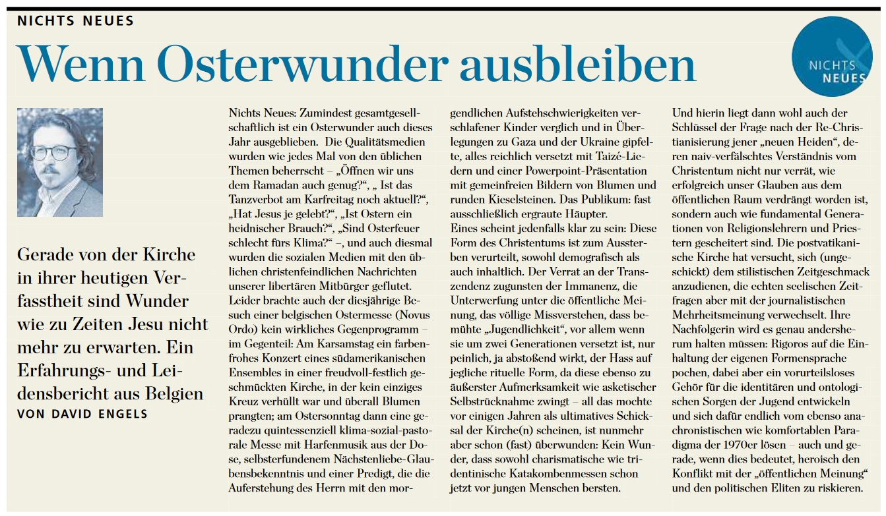
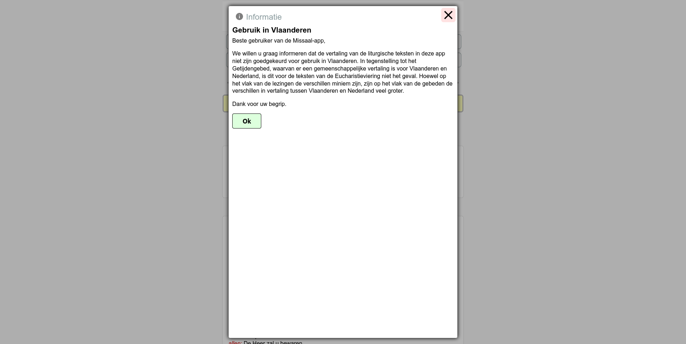

Sinds 8 oktober 2021 is het missaal voor de katholieke mis in het Nederlands [online beschikbaar](https://www.tiltenberg.org/missaal), op de portaalwebsite [Tiltenberg](https://www.tiltenberg.org/). Het digitaal missaal is, wat mij betreft, bij uitstek de [belangrijkste publicatie](https://gelovenleren.net/blog/het-digitaal-missaal/) door de Kerk sinds het ontstaan van het internet! 

## Volksmissaal

Struin eender welke rommelmarkt af en je vindt er gegarandeerd meerdere preconciliaire volksmissaals. Als je ouders of grootouders katholiek waren, heb je er vast en zeker zelf zo een ergens in een doos liggen, of al weggegooid, want vandaag onbruikbaar. Iedereen die naar de mis ging, had zo'n missaal en kon de teksten van de lezingen en de gebeden voor elke dag van het jaar zelf raadplegen. Dat de liturgie zich in het latijn voltrok, is daarvoor natuurlijk een goede reden, want het volksmissaal voorzag ook in een Nederlandse vertaling van de teksten, dus als je wilde weten wat er precies gebeden werd, had je een missaal echt nodig. Het gevolg was wel dat elke gelovige, niet enkel de priesters, een kopie van de liturgische teksten altijd bij de hand had.

Dat is dus helemaal omgekeerd sinds de liturgiehervorming. Volksmissaals waren niet meer nodig, want de mis werd opgedragen in het Nederlands. Met name in Vlaanderen heeft dat geleid tot een nog steeds niet uitgeroeide wildgroei van 'losbladige' missaals, waar naar eigen goeddunken teksten werden verwijderd, vervangen en toegevoegd tot er van de officiele missaalteksten [niks meer overschoot](https://gelovenleren.net/blog/allerzieligste-allerzielenherdenking/). Het kritiekloze kerkvolk laat dat allemaal over zich gaan, ook omdat het niet langer beschikt over een referentiebron. Het echte missaal staat waarschijnlijk wel ergens op een schap in de sacristie van de kerk, en dat is dan meteen ook de enige kopie van die teksten die in de ganse parochie beschikbaar is. Of de teksten die de pastoor 's zondags in de mis leest uit dat missaal komen, dan wel uit zijn duim gezogen zijn, is iets waar het volk het raden naar heeft.

Lees ook dit verslag van @DavidEngels12:

## Vlaanderen

Sinds 2021 dus niet meer, want iedereen kan nu op de website de volledige officiele teksten van het missaal terugvinden! Je zou denken dat priesters die hun eigen mis uitvinden daarmee vogelvrij verklaard zijn, maar niets is minder waar. Zelfs al zouden de Vlaamse bisschoppen de liturgische wantoestanden willen rechtzetten, dan krijgen hun pastoors het aan de stok met het grijze kerkvolk dat al dat losbladig gewouwel uit de "jongerenmis" van hun jeugd zo gewoon is geworden dat ze tegen een echte mis in opstand zouden komen!

Zelf ben ik zo blij dat ik vlakbij huis nu al meer dan twintig jaar in mijn parochie naar de mis kan gaan zonder systematisch met niet-liturgische teksten geconfronteerd te worden. Ik ben de gelukkige bezitter van een Latijns-Nederlands volksmissaal (dat nu jammergenoeg niet meer te verkrijgen is) dat ik nog elke zondag gebruik, al is het maar om de teksten van de lezingen vooraf even door te nemen. In Vlaanderen is dat lang niet vanzelfsprekend, leren me, weliswaar schaarse, ervaringen in andere parochies te lande. 

## Nederland

Nederland daarentegen, schijnt zich in een gans tegengestelde liturgische dimensie te bevinden. Soms schreeuwt de cognitieve dissonantie op dat vlak je werkelijk in het gezicht. Ik herinner me nog goed een artikel dat Jos Moons sj schreef op Kerknet (en dat ook [plots verdween](https://gelovenleren.net/blog/reality-check-onthult-jezuietenstreek/)) waarin hij het celebreren van een mis met een eigenhandig geformuleerd  slotgebed voorstelde als een rebelse daad. Voor een Nederlander mag dat misschien zo zijn, maar een Vlaamse priester draait er zijn hand niet voor om de ganse mis van a tot z te herschrijven! 

Vandaag voelde ik die dissonantie opnieuw als ik iets wilde opzoeken in het missaal op de website van Tiltenberg. Daar werd ik verwelkomd met dit waarschuwingsvenster:

## Losbladig missaal

Alsof er in Vlaanderen één iemand zou rondlopen die zich druk zou maken over een verschil in _vertaling_, terwijl hier de teksten, niet alleen van gebeden, maar tot het gloria, het sanctus en de geloofsbelijdenis toe, niet alleen herschreven, maar vlakaf opnieuw uitgevonden worden! Als het niet zo tragisch was, zou ik bij het lezen van die waarschuwing in een lachkramp gebleven zijn. 

Als Vlamingen ergens goed in zijn, is het over belangrijke dingen _te zwijgen_. Die kwaliteit wordt op Kerknet ook heel grondig  toegepast, want wat je daar vooral _niet_ zal vinden, zijn verwijzingen naar informatie die voor gelovigen praktisch en nuttig kan zijn, bijvoorbeeld de concrete mistijden in parochies (kunnen ze zo kopieren uit Kerk & Leven), de plaatsen waar nog biecht wordt gehoord, of de websites waar je bronnen kan raadplegen zoals de catechismus of het missaal. 

## Digitaal missaal verzwegen

Kleine correctie: de publicatie van het online missaal werd op Kerknet in 2018 [wel degelijk verslagen](https://www.kerknet.be/kerknet-redactie/nieuws/nederlandse-app-voor-het-missaal), en reeds met dezelfde kanttekening die nu als een waarschuwing op de website zelf verschijnt: "Op het vlak van de gebeden daarentegen zijn de verschillen in de vertaling veel groter en is enige terughoudendheid wel gepast." (sorry, maar ik kom weer even niet meer bij als ik in deze context het woord 'terughoudendheid' zie verschijnen). En dat was dus op die 6 jaar het enige artikel dat op Kerknet verscheen, waarin het nederlandstalige missaal ter sprake komt. [Zoek het zelf maar op!](https://www.kerknet.be/zoeken/microsite/artikels?text=missaal&microsite=108) 

## Slechte wil

Misschien ben ik van slechte wil, maar ik vraag me nu af waarom die waarschuwing op de website van het missaal is toegevoegd. Is dat gebeurd op initiatief van de Nederlandse verantwoordelijken? Waarom zouden ze dat doen? Die vraag moet uit Vlaanderen gekomen zijn. Ergens in Vlaanderen moet er iemand rondlopen die Vlaamse gelovigen wil _beschermen_ tegen verkeerdelijk gebruik van een Nederlandse vertaling die verschillend kan zijn van de Vlaamse vertaling en die de Nederlanders gevraagd heeft die waarschuwing toe te voegen als iemand uit Belgie de website bezoekt. Men zou denken dat iemand die zo met liturgie begaan is, wel andere katten te geselen heeft! 

Misschien is het wel iemand die intussen al grijs haar gekregen heeft als lid van de commissie die een nieuwe Nederlandse  vertaling van het missal tot stand moet doen komen, [opgericht in 2008](https://rkdocumenten.nl/bericht/bericht_2199-bisschoppen-herzien-vertaling-missaal-nl/?idCode=1.1). Daar is, behalve de publicatie van een "Klein Missaal voor de Nederlandse Kerkprovincie" in 2015 niets meer van vernomen. Ik verdenk er met name de Vlaamse bisschoppen van dit een stille dood te hebben laten sterven om twee redenen. Ten eerste zien ze er ongetwijfeld vreselijk tegen op om zo'n nieuwe vertaling daadwerkelijk te implementeren, want ze zijn er tot op heden nog niet eens in geslaagd de oude vertaling te implementeren in hun parochies. En daarnaast zou het me niks verbazen dat ze vol verwachting de kat uit de boom kijken of er in Rome geen veranderingen op til zijn om het missaal niet enkel _de facto_ maar ook _de jure_ losbladig te maken, zodat ze hun pastoors blij kunnen melden dat ze hun [mapjes](https://www.kuleuven.be/thomas/pastoraal/vieringen/textSearch.php) gewoon kunnen blijven gebruiken. 

