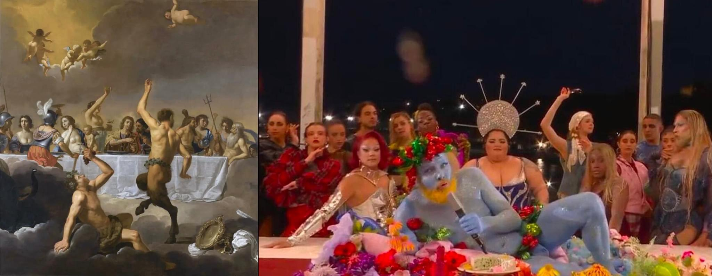
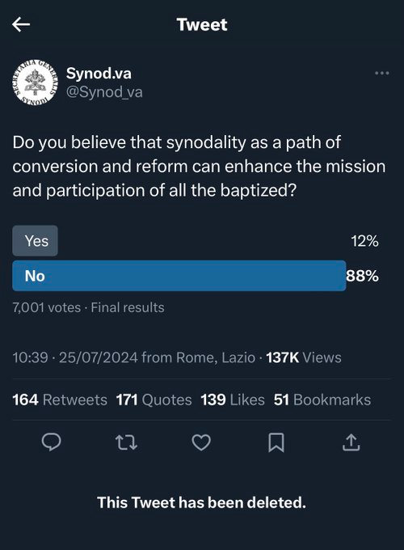
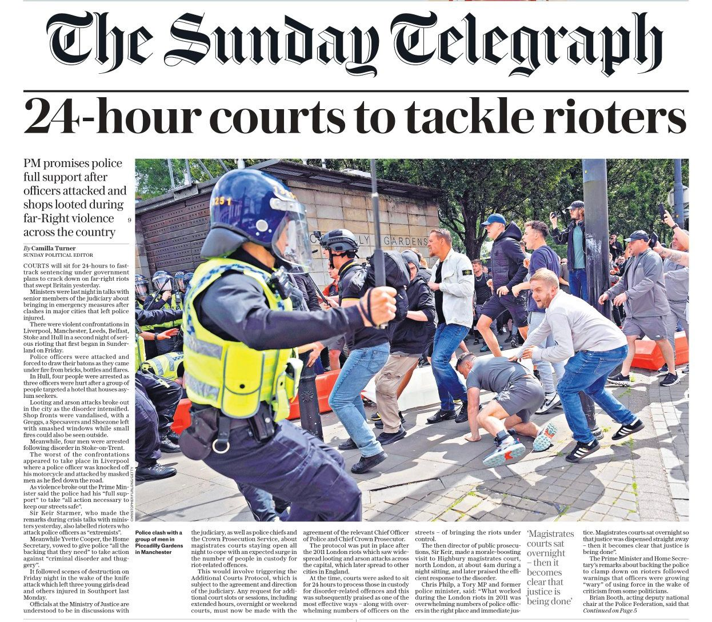

Bijna twee weken na de opening van de Olympische Spelen in Parijs, moet ik wel ongeveer de laatste zijn die nog een woordje gaat wijden aan de openingsceremonie. Daarmee klop ik in bezonnenheid zelfs de Heilige Stoel, die op 3 augustus 'pas' een [uiterst beknopte verklaring](https://press.vatican.va/content/salastampa/en/bollettino/pubblico/2024/08/03/240803d.html) uitbracht, om tegenover hoog-verontwaardigde curieleden toch te kunnen zeggen: kijk wij hebben ook iets gedaan! De brandbaarheid van dit soort zaken is hoog, maar de energiewaarde is laag, dus na een paar dagen, als iedereen zijn zeg heeft gedaan, is het al geen nieuws meer.

Wat de paus aangaat, die ligt van dat soort gehannes niet wakker en was even met iets anders bezig. Op 5 augustus publiceerde hij een [brief, gericht aan seminaristen](https://www.vatican.va/content/francesco/en/letters/2024/documents/20240717-lettera-ruolo-letteratura-formazione.html), met de opdracht meer te genieten van literatuur, die meer bijdraagt tot innerlijke vrede dan onze "schermpjes". Als de brief niet gedateerd was op 17 juli, een week vóór de openingsceremonie,&#x2014;of tenzij onze paus visionair is&#x2014;had dit mogen doorgaan als het échte antwoord van Rome.

Het was immers geen tafereel van het Laatste Avondmaal dat geëvoceerd werd, maar een feestmaal van Olympische goden, naar ik las geïnspireerd op het schilderij [*Het Feest der Goden*](https://en.wikipedia.org/wiki/Le_Festin_des_dieux) (1635-1640, Musée Magnin, Dijon) van Jan Hermansz van Bijlert.

Dat hadden we dus ook zelf kunnen uitvissen, als we ons wat minder met onze schermpjes en wat meer met (niet-religieuze) literatuur, of kunst in het algemeen, hadden beziggehouden, lijkt de paus te willen zeggen. En dan hadden we ons ook niet boos hoeven maken op sociale media.

Nog beter: dan hadden we nog eens goed kunnen lachen! Want zeg nu eerlijk, het *tableau vivant* waarmee de spelen werden geopend is toch je reinste zelfspot van het woke-artistiek establishment! Als op een middeleeuwse kermiswagen, worden de Olympische goden&#x2014;die op moreel vlak in hun godenwereld graag alle perken te buiten gingen&#x2014;voorgesteld door een schare LGBTQ'ers, de nieuwe goden van onze tijd&#x2014;die niet moeten onderdoen voor hun Olympische voorgangers.

Ik vind het satire, en dan nog van de betere soort, omdat het lelijk is en ook niet verbergt lelijk te wíllen zijn (althans, dat is mijn interpretatie, *de gustibus&#x2026; etc.*).

Johan Sanctorum duidt het juist in zijn stukje [*In vino veritas*](https://doorbraak.be/acta-sanctorum-146): "Samengevat: die cultuurpessimistische hysterie was de grap van het jaar, en toont aan dat we het ‘verval’ in de eerste plaats moeten zoeken bij een verlies van verbeelding, intellectuele beweeglijkheid en zin voor humor." Wat zijn religiekritiek betreft, zou ik erop willen wijzen dat "in vino veritas" vanuit katholiek oogpunt een rake definitie van het Heilig Sacrament inhoudt! Ook dat is verbeelding. Verbeelding&#x2014;niet: fantasie&#x2014;is een [belangrijke kwaliteit](https://gelovenleren.net/blog/verstarring-verbeelding-en-fantasie/) voor wie aan katholieke theologie wil doen! Verbeelding staat in relatie tot de waarheid, ook al gebruikt zij vormen en beelden. Verbeelding laat toe zaken te zeggen die onzegbaar zijn.

Ik zou het trouwens een interessant theologisch vraagstuk vinden, of je God wel met beelden kan beledigen. Natuurlijk is het loochenbaar om als gelovige een godslasterlijke spotternij *leuk* te vinden, maar het is voor een mens onmogelijk iets aan Gods grootheid af te doen. Je kan God niet persoonlijk beledigen. Je kan wel andere gelovigen, die daaraan [aanstoot nemen](https://gelovenleren.net/blog/schandalig-geloof/), ten val brengen, maar ook zij, als ze voldoende vervuld zijn van de Heilige Geest, kan de belediging niet treffen. 

Tenslotte, niet ongerelateerd, nog enkele topics die de vorige weken in mijn bubbel passeerden, en tot mijn verrassing (niet heus!) weinig of eenzijdige aandacht kregen in MSM:

-   50.000 katholieken wonen in de VS het Eucharistisch Congres bij, met een [impressionant aanbiddingsmoment](https://x.com/Sachinettiyil/status/1814303463616258357), dat tot de verbeelding spreekt!
-   Een instructie die volgens welingelichte bronnen op het Vaticaan zou circuleren, met verregaande maatregelen om het gebruik van de tridentijnse ritus, die veel meer op de verbeelding inwerkt dan de novus-ordomis, verder te onderdrukken, waarvan de publicatie door sommigen in juli werd verwacht, is [*niet* door de paus ondertekend](https://rorate-caeli.blogspot.com/2024/07/argentine-blog-prohibition-document.html)&#x2014;tot dusver.
-   Een Twitter-poll op het officiële account van de *Synode* kreeg zoveel negatieve stemmen dat hij spoorslags offline werd gehaald. De auteurs van de synode koesteren veel fantasieën, maar hebben weinig verbeeldingskracht.

-   Dat de moordaanslag op presidentskandidaat Donald Trump is mislukt, betreuren onze media in versluierde termen, "want het zal hem winst opleveren", waardoor hun fantasie het in eerste instantie instinctief overnam van hun werkelijkheidszin en ze schreven [dat het een verfkogel betrof](https://x.com/BenDreesen/status/1816774324122009639).
-   In Valencia zouden drie mensen op een paar dagen tijd zijn [onthoofd](https://x.com/243_cal/status/1819501328399528312). Typisch iets waar media van zouden smullen, maar je hoort er niks van? Zou de *modus operandi* teveel tot de verbeelding spreken?
-   In Groot-Brittannië worden drie kinderen vermoord. Daar hoor je wel van, omdat er protesten zijn, waartegen ongewoon hard wordt opgetreden. En *two-tier policing*, daar mogen we niet in geloven, dat is fantasie&#x2026;

