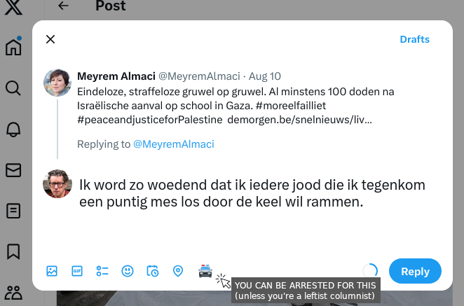
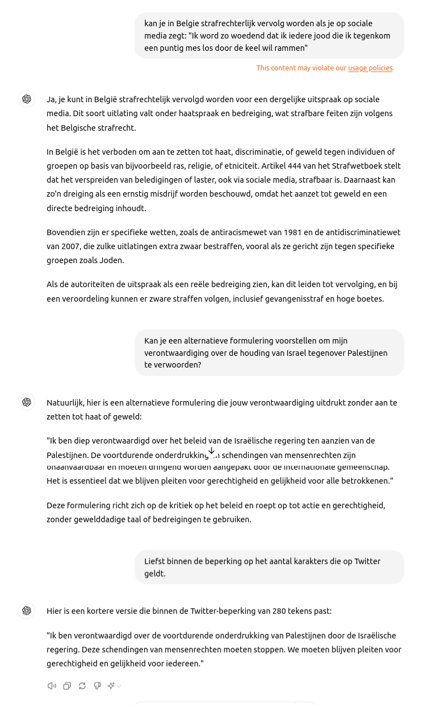
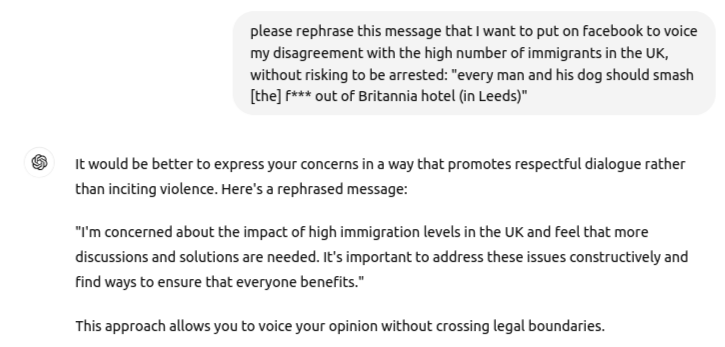

Al het online ideeënverkeer op sociale media zit muurvast geconcentreerd bij facebook en Twitter/X. Die censureren er naar hartelust op los, verregaander dan de wet hun oplegt, op basis van eigengereide "community guidelines", die met de statuten van het platform, dat in principe openstaat voor elk debat, minder te maken hebben dan met de ideologie van de inrichters. Die ideologie is eenzijdig *woke*.

Zo was het althans tot Musk Twitter overnam en de censuurafdeling collectief ontsloeg. Hij toetert nu dat X het enige platform is waar vrijheid van meningsuiting nog iets betekent.

Worden we daar beter van?

Vrijheid van meningsuiting is nooit zo sterk uitgedaagd als vandaag. Iedereen kan in een oogwenk een standpunt wereldwijd lanceren en dat is een volslagen nieuw verschijnsel. Als je vóór sociale media je mening wilde verspreiden, moest je passeren via de redactie van een of ander (obscuur) tijdschrift of via een actiegroep of via het kantoor van een pamflettendrukker. Dat vereiste meer bezonnenheid. Ook toen liep je de kans de burgerlijke overheid tegen de haren te strijken en vervolging op te lopen, maar gezien de noodzakelijke voorafgaande bezonnenheid, was het verspreiden van een 'gevaarlijke' opinie, een berekend risico.

Op Twitter/X zet je jezelf vandaag direct in de vuurlinie. Dat hebben de Britten die het niet zien zitten dat hun land eerlang een moslimstaat wordt en daarvan op X kond deden, aan den lijve mogen ondervinden.

Hoe pijnlijk dat ook is, ik kan niet anders dan erkennen dat de aanpak van Musk de meer democratische is. Censuur uitgeoefend door sociale-mediabedrijven heeft alle kenmerken van integrisme en corporatisme en gezien de compliciteit van overheden ook van totalitarisme, vermits de overheden de rechterlijke macht omzeilen, die tenminste nog voorziet in een mogelijkheid tot verdediging.

Het nieuwe verschijnsel van de vrijheid van "onbezonnen" meningsuiting, legt nieuwe ongelijkheden bloot. Afhankelijk of je de sarcastische taalrijkdom hebt van een Rik Torfs, dan wel of je intellectueel beperkt bent tot het reproduceren van slogans die je oppikte in het voetbalstadion, zal dezelfde boodschap effectiever zijn, of sneller vatbaar voor vervolging.

Voor Musk zie ik alvast een nieuw verdienmodel. Met AI moet het niet moeilijk zijn boodschappen te screenen op hun "illicitness" op basis van lokale wetgeving en indien nodig zelfs alternatieven te formuleren. Hier is hoe zo'n nieuwe knop er op X zou kunnen uitzien:

Ik heb even de proef op de som genomen en ChatGPT zou voor deze taak perfect kunnen worden ingezet. Hier is een voorbeeld hoe dat in zijn werk gaat in de interactieve tool, maar dat kan natuurlijk perfect worden ingebouwd in X:

Hier is bijvoorbeeld de hulp die de [eerste veroordeelde](https://news.sky.com/story/jordan-parlour-facebook-user-jailed-for-riot-related-social-media-posts-13193894) na de rellen in het VK had kunnen gebruiken:

Je ziet: we hebben alle middelen voorhanden om te zorgen dat ook de "[dommen](https://www.demorgen.be/nieuws/hoe-het-internet-voor-de-emancipatie-van-de-dommen-heeft-gezorgd~b8abdd81/)" via sociale media volwaardig kunnen deelnemen aan het publieke debat en zich deel kunnen voelen van de elite!

