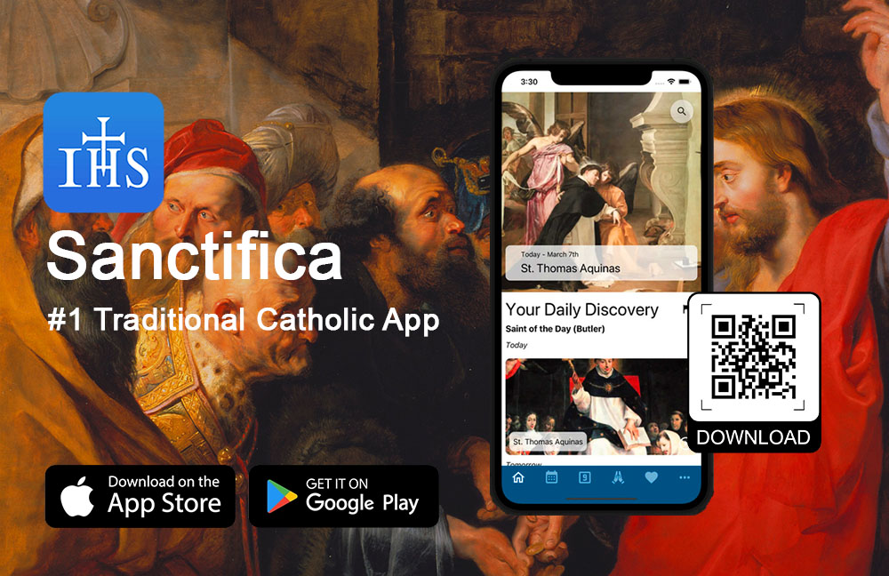

Met de app **Sanctifica** (<https://sanctifica.com>) verenigen traditionele katholieken eeuwenoude tradities en moderne technologie. Het resultaat? Een gebruiksvriendelijke gids die inspelt op de vraag naar zingeving in een digitale wereld.

In een samenleving waar technologische vooruitgang centraal staat, wordt het steeds moeilijker om tijd te maken voor diepgaande tradities. Voor wie zijn katholieke geloof actief wil beleven, biedt **Sanctifica** een innovatieve oplossing. Deze app vertaalt het rijke liturgische erfgoed naar een digitale ervaring, zonder in te boeten op authenticiteit.

## Een gepersonaliseerde toegang tot het liturgisch jaar

Centraal in **Sanctifica** staat Het *Liturgisch Jaar* van Dom Guéranger, een monumentaal werk dat beschikbaar is in zowel tekst- als audioformaat. Hiermee richt de app zich tot moderne gebruikers die onderweg, thuis of tijdens het gebed verdieping zoeken.

Maar **Sanctifica** is meer dan een digitale bibliotheek. De app volgt het ritme van het liturgische jaar en voorziet gebruikers dagelijks van actuele content over heiligenfeesten, devoties en Misgebeden. Via een intelligent notificatiesysteem helpt ze katholieken om bijzondere gebruiken, zoals de quatertemperdagen en eerste vrijdagen, niet uit het oog te verliezen.

Ook de rijkdom aan aanvullende content springt in het oog: van de *Romeinse Martyrologie* en Butler’s *Lives of the Saints* tot een Latijnse *Rozenkrans*, ingesproken door mgr. Athanasius Schneider. Dit alles maakt van **Sanctifica** een totaalervaring die traditie naar het hart van de 21ste eeuw brengt.

## Een nicheproduct met potentieel

In een markt waar apps vooral gericht zijn op entertainment of efficiëntie, biedt **Sanctifica** een opvallend alternatief. Het product mikt op een nichepubliek van traditionele katholieken, maar speelt tegelijkertijd in op een bredere trend: de zoektocht naar rust, verdieping en zingeving.

Hoewel de app momenteel enkel in het Engels beschikbaar is, vormt ze ook voor Nederlandstalige gebruikers een waardevolle bron. Vooral in Vlaanderen, met zijn sterke katholieke traditie, kan dit product inspelen op een groeiende interesse in spiritualiteit en erfgoed.

## Gratis, maar met een duidelijke meerwaarde

**Sanctifica** is gratis te downloaden via de App Store (<https://buff.ly/3LyWIkm>) en Google Play (<https://buff.ly/3LyWIkm>). De ontwikkelaars mikken duidelijk op een breed bereik, met een strategie die gebruikers wil aantrekken en hen daarna hoopt te engageren.

Voor wie op zoek is naar een manier om traditie te verzoenen met een drukke levensstijl, biedt **Sanctifica** een relevante en innovatieve oplossing. Dit is niet zomaar een app, maar een brug tussen het verleden en het heden, verpakt in een intuïtieve digitale ervaring.

