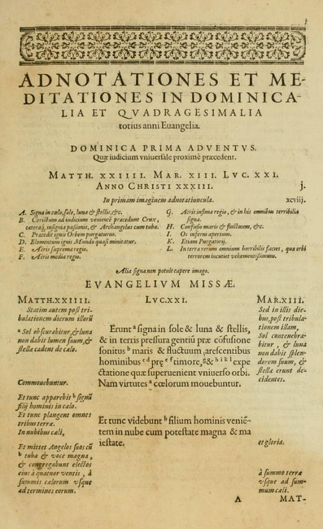

Als je beseft hoe vluchtig onze digitale wereld, is het verrassend dat er niet meer boeken gemaakt worden!

Met [Alledaags Geloven](https://alledaags.gelovenleren.net/) verwijs ik naar tientallen websites die korte stukjes aanbieden voor verdieping, gebed of bezinning. Jarenlang verschenen daar verwijzingen naar de website *Holy Home*, tot die plots uit de ether verdween, enkele weken geleden. Enig online speurwerk leerde me dat de auteur van die site **Simen Johannes Stamhuis** was, geboren in 1944 en [overleden](https://mensenlinq.nl/overlijdensberichten/simon-stamhuis-907906#obituary) op 7 oktober jl. Het was een gigantische website, waaraan je duidelijk kon zien dat er jarenlang aan gewerkt was, met voornamelijk teksten en bronnen uit het protestantisme, maar ook katholieke bronnen! De voorletters van zijn naam, S.J., blijken profetisch, want op zijn website publiceerde deze gewezen voorganger in gereformeerde en Nederlands-hervormde kerken, prenten van een onversneden contrareformatorische jezuïet!

{}Om een gearchiveerde website te downloaden, is er een betalende tool waarmee je voor €19 een ganse site van het archief kan plukken: <https://www.waybackmachinedownloader.com>{}
Ik heb me voorgenomen enkele stukken van die site nieuw leven in te blazen, maar dat is niet eenvoudig. Op [Internet Archive](https://web.archive.org/web/20230805010154/https://www.holyhome.nl/) is de ganse website gearchiveerd, echter heel wat afbeeldingen ontbreken, onder meer die van de evangelische bijbelprenten. Verder zoeken op internet leert me dat de prenten genomen waren uit een zestiende-eeuwse uitgave, voluit getiteld: *Evangelicæ historiæ imagines: ex ordine evangeliorum, quæ toto anno in missæ sacrificio recitantur, in ordinem temporis vitæ Christi digestæ*, of: "Afbeeldingen van het evangelieverhaal: gebaseerd op de volgorde van de evangeliën, die het hele jaar door worden gereciteerd tijdens het misoffer, gerangschikt in de chronologische volgorde van het leven van Christus". Een boek uitgegeven door de jezuïeten in Antwerpen in 1593. Dat situeert zich in hetzelfde tijdskader als de [catechismus van Makeblijde](https://gelovenleren.net/blog/de-mechelse-catechismus-van-makeblijde/), een andere jezuïet, waarmee ik vier jaar geleden op dit blog aan de slag ging naar aanleiding van het vinden van een schoolboek dat mijn grootvader nog gebruikt had, dat rechtstreeks terug te voeren was op zijn catechismus.

Ik laat even een andere website aan het woord om het opzet van *Evangelicae historiae imagines* te kaderen: *De Spanjaard Jerónimo Nadal (1507-1580), een wiskundige, behoorde tot de eerste jezuïeten rond De Loyola met wie hij nauw samenwerkte. Hij deed missiewerk in Azië en overleed uiteindelijk in China. Aangezien hij merkte dat communicatie daar vaak moeizaam verliep vanwege de taalproblematiek, maakte hij samen met de meester-graveurs Jan en Hieronymus Wierix uit Antwerpen een visuele bijbel met 153 schitterende kopergravures. De jezuïeten onderkenden vanaf het begin de cruciale rol van visuele kunst bij de verspreiding van het geloof. Vermoedelijk was het Ignatius de Loyola zelf die Jerónimo Nadal opdracht gaf om deze bijbel samen te stellen. De jezuïeten hadden deze bijbel op zak tijdens hun missiewerk. Zij lieten daarmee ook zien dat in het westen artistieke vaardigheden waren op het gebied van kopergravures en lineair perspectief.* (<https://exhibitions.library.maastrichtuniversity.nl/china-expositie/>)

Mocht die Nadal vierhonderd jaar later hebben geleefd, was hij ongetwijfeld een computerpionier geweest, zoniet uitvinder van het wereldwijde web. Terwijl de boekdrukkunst nog in haar kinderschoenen stond, liet hij een werk publiceren dat meer op een website lijkt dan op een boek.

Elke gravure in het prentenboek is een *slideshow* met een vervloeiing van verschillende taferelen uit het verhaal, voorzien van letters die verwijzen naar een korte begeleidende tekst onder de afbeelding. Bovendien is elke gravure voorzien van een reeks identificatiecodes, die je kan zien als *hyperlinks*. Elke gravure bevat dus volgende *links*:

-   een arabisch nummer, dat de volgorde van de prenten geeft volgens de chronologie van Jezus' leven
-   een romeins nummer, dat de volgorde van de prenten geeft volgens de lezingencyclus van het romeins missaal
-   de naam van de zondag of feestdag volgens het romeins missaal
-   verwijzingen naar de bijbelverzen waarop de prent is gebaseerd
-   de leeftijd van Jezus op het ogenblik dat het verhaal zich afspeelt

Die verwijzingen dienden ook om snel je weg te vinden in Nadals tweede boek, *Admontationes et meditationes*, met bezinnende teksten bij de liturgische dagen. Daarin krijg je opnieuw een kristalheldere layoutstructuur voorgeschoteld. Voor elke liturgische dag krijg je een concordantie van de betrokken evangelieteksten en een kort stukje met aantekeningen en een bezinningstekst, telkens voorzien van verwijzingen naar andere bijbelteksten in de kantlijn. Toonaangevende boekdrukkunst, die tot vandaag toe als referentiepunt mag gelden! Hier vind je nog een *long read* over Nadal en zijn publicaties: [Sublimia dona–sublimia mysteria: The Sublimity of Divine Speech in Jerónimo Nadal's Adnotationes et meditationes in Evangelia (Journal of Historians of Netherlandish Art)](https://jhna.org/articles/sublimia-dona-sublimia-mysteria-sublimity-divine-speech-jernimo-nadal-adnotationes-et-meditationes-in-evangelia/).

Ze zijn het overigens nog niet verleerd, de jezuïeten, om dat soort publicaties te maken. Zo is er [Bidden Onderweg](https://biddenonderweg.org/), een "dagelijkse gebedspodcast" en de—iets minder bekende—app van pater Bots sj [Luistert naar Hem](https://app.luistertnaarhem.nl/prayer) met dagelijks een langere gebedsbegeleiding, telkens gebaseerd op de evangelielezing van die dag. 

Van Nadals prentenboek vond ik op het Internet Archive een [gerestaureerde digitale versie](https://archive.org/details/EvangelicaeHistoriaeImagines/page/n11/mode/2up). Ook het boek met meditaties kan je daar [ingescand](https://archive.org/search?query=nadal+meditationes) vinden, maar er is geen online bron van de originele teksten. Een [Engelse vertaling](https://www.sjupress.com/pages/books/6/jerome-nadal-frederick-homann/annotations-and-meditations-on-the-gospels-volume-ii-the-passion-narrativeso) is wel te koop.

De beste plaats die ik die prenten kan geven, is als onderdeel van het [Lectionarium van de Tridentijnse Mis](http://lectionarium.gelovenleren.net/). De prenten vind je nu dus bij de bijhorende schriftlezingen. Van het gedrukte lectionarium zijn er nu twee versies, met en zonder afbeeldingen.

Bestel het lectionarium zoner prenten (309 blz.): <https://www.boekenbestellen.nl/boek/lectionarium-van-de-tridentijnse-mis>

Bestel het lectionarium met prenten (463 blz.): <https://www.boekenbestellen.nl/boek/lectionarium-van-de-tridentijnse-mis-met-prenten-bij-het-evangelie>
