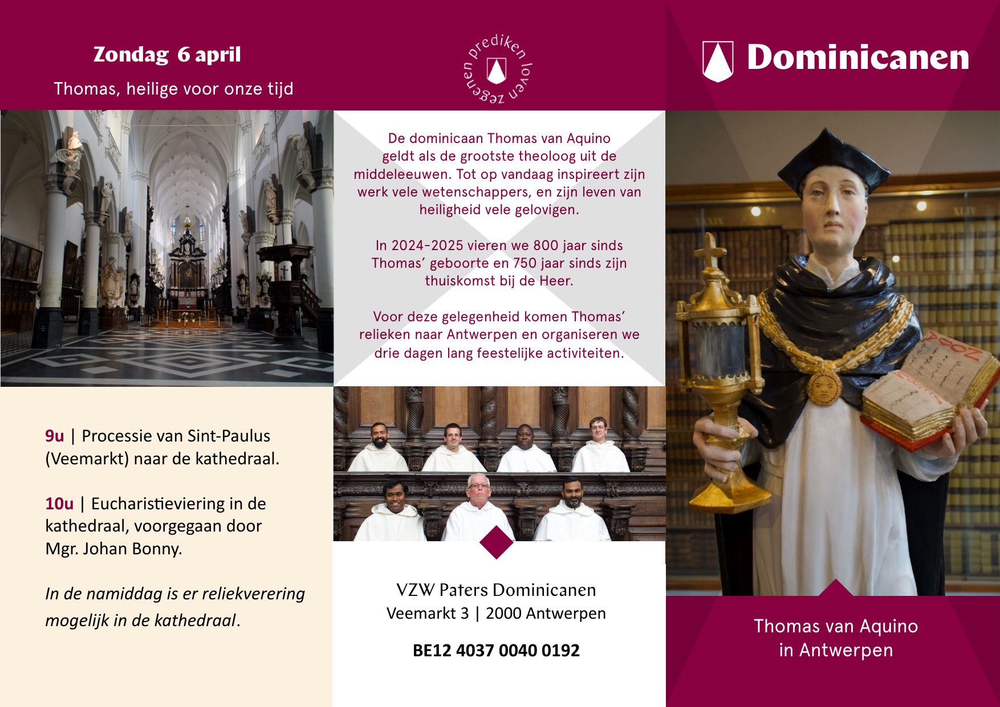
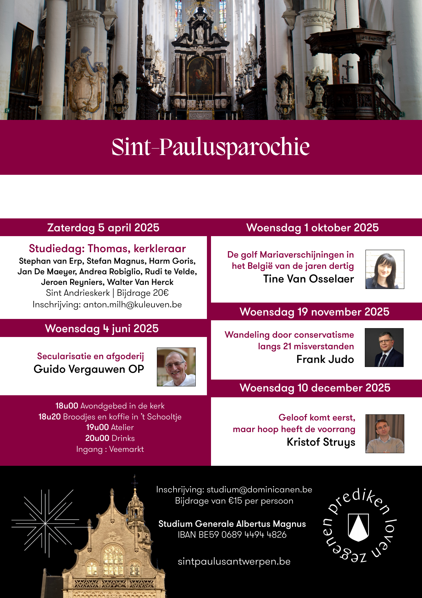

Dit artikel dient ter kennisgeving van een welhaast historisch te noemen evenement dat onder de hoede van de Dominicaanse gemeenschap plaatsvindt in bisdom Antwerpen in het weekend van 5 april e.k.

Ter gelegenheid van de 750ste verjaardag van de sterfdag van Sint-Thomas, bezoeken zijn relieken de stad Antwerpen, alwaar zij op vrijdag en zondag kunnen vereerd worden. Op zaterdag wijden acht sprekers de ganse dag aan studie van deze grote heilige.

In het jammerlijk schrale landschap van het katholiek vormingswerk zal deze dag stralen als een baken van licht en alle afwezigen zullen nog jarenlang onder tandgeknars door hun vergissing achtervolgd worden.

Het programma van het ganse weekend vind je op deze websites: [Dominicanen](https://www.dominicanen.org/nl/nieuws/relieken-van-thomas-van-aquino-naar-antwerpen-en-zwolle) en [UCSIA](https://www.ucsia.org/evenementen/thomas-kerkleraar/).

- Thomas van Aquino, een dominicaanse theoloog, Stephan van Erp (KU Leuven)
- Vriendschap met God? Thomas over de H. Geest, Stefan Mangnus OP (Tilburg University)
- Thomas over lichamelijk genot in en buiten het Paradijs, Harm Goris (Tilburg University)
- Het neothomisme van kardinaal Mercier. De betekenis voor het sociaal-maatschappelijk denken en handelen, Jan De Maeyer (KU Leuven)
- Tussen de dood van een broeder en zijn Translatio Reliquiarum. Over de onwaarschijnlijke heiligverklaring van Thomas van Aquino, Andrea Robiglio (KU Leuven)
- Thomas en zijn lichamelijke resten. Enkele filosofische overwegingen, Rudi te Velde (Tilburg University)
- De schedel van Sint Thomas in context. Wetenschappelijk reliekenonderzoek in België, Jeroen Reyniers (UGent – KIK-IRPA)
- Thomas als schrijver. Het intimistische portret door pater Piet Gils OP

De Dominicanen van de Sint-Paulusparochie hebben met hun *Studium Generale* een heel programma van interessante lezingen in petto in 2025. Lees de agenda op de website van de [Sint-Paulusparochie](https://www.sintpaulusantwerpen.be/sint-paulus-academie-redactie/studium-generale/uw-opiniestukken/).

