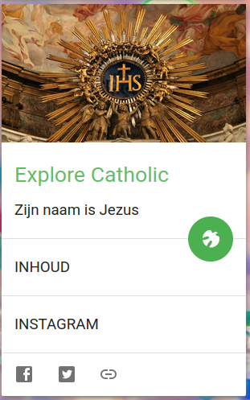
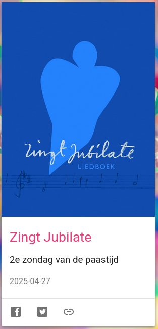
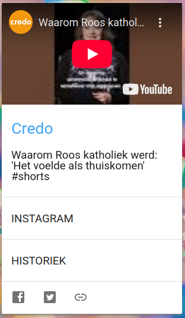
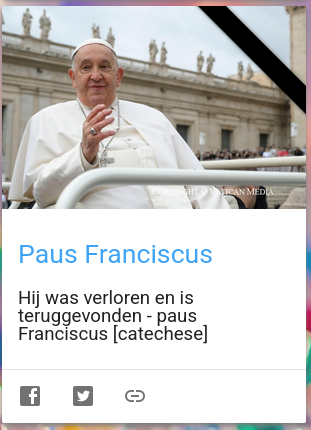

Wil je je geloof ontwikkelen, maar heb je geen tijd om er dikke boeken over te lezen, dan kan je op [Alledaags Geloven](https://alledaags.gelovenleren.net/) elke dag terecht voor korte stukjes tekst, video of podcasts, bezinnend of gekoppeld aan het liturgisch jaar, waarmee je op een paar minuten tijd telkens weer iets nieuws opsteekt. Geen opzoekwerk nodig en toch heel gevarieerd, daarvoor staat de verzameling van meer dan 70 katholieke websites garant, waaruit elke ochtend nieuwe content wordt opgehaald.

Heb je toch nog keuzestress door het overweldigende aanbod, gebruik dan het Heilige-geest-icoontje, dat voor jou een kaart uitkiest. Of focus op een bepaalde categorie kaarten: Lectionarium (de lezingen van de H. Mis), Heilige Schrift (bijbel), Catechismus (kerkleer), Martyrologium (heiligen), Gebed, Contemplatie, 🔊 Luisterkaarten en ▶ Kijkkaarten. Of gebruik de Android app [Alledaags Geloven - Apps op Google Play](https://play.google.com/store/apps/details?id=net.gelovenleren.alledaags).

Er zijn websites die zich richten op de allerkleinsten, zoals [Samuel Advies](https://alledaags.gelovenleren.net/link/MjMwOTQ0ODExNTMzNTY5), en er zijn websites die zelfs voor doorwinterde theologen haast ondoordringbaar zijn, zoals de [Summa Theologiae](https://alledaags.gelovenleren.net/link/NzYxNDE2NTM0ODE3NA==). Ervaringen kunnen verschillen, maar als je je samen met jongeren laat verrassen, maakt dat onderscheid niet veel uit, groot en klein kan uit elke kaart wel iets oppikken. De beste manier om de site te gebruiken is dan ook dagelijks een vast tijdstip te zoeken waarop je—samen met je kinderen—even tijd neemt om je door de Heilige Geest een kaart te laten voorschotelen en die te verwerken. Dat kan op een paar seconden gepiept zijn, of dat kan een boeiend gesprek opleveren.

Er zijn weer enkele kaarten bijgekomen:

De nieuwste website gelanceerd door bisdom Haarlem-Amsterdam heet [ExploreCatholic](https://explorecatholic.nl/) en daaruit is de verzameling gebeden opgenomen.

De website van het kerkliedboek [Zingt Jubilate](https://www.zingtjubilate.be/) geeft voor elke zondag liedsuggesties, achtergrondinformatie en links naar filmpjes waarin de liederen worden voorgezongen.

Een initiatief dat zich voornamelijk op Youtube en Instagram afspeelt is @Credo\_Katholiek. Allerhande vragen over wat het is om katholiek te zijn worden in korte filmpjes beantwoord.

De overige kaarten hebben een 'groot onderhoud' gekregen, wat nodig is als de achterliggende website content herschikt, van structuur verandert, of soms ook gewoon verdwijnt van het internet. Het is altijd spijtig als websites zomaar verdwijnen, maar zo'n onderhoud leert me telkens dat er netto steeds meer nederlandstalig geloofsmateriaal bijkomt, en dat is natuurlijk een goeie zaak!

Ken je zelf ook sites die in korte fragmenten aspecten van het katholieke geloof belichten, laat het gerust weten!

--

Paus Franciscus had ook een eigen kaart, met de catecheses die verschenen op [Otheo](https://www.otheo.be/artikel/verloren-teruggevonden-paus-franciscus-catechese), die blijft voorlopig natuurlijk staan, met een rouwlintje, tot—hopelijk—de publicatie wordt verdergezet met materiaal van de nieuwe opvolger van Petrus!

