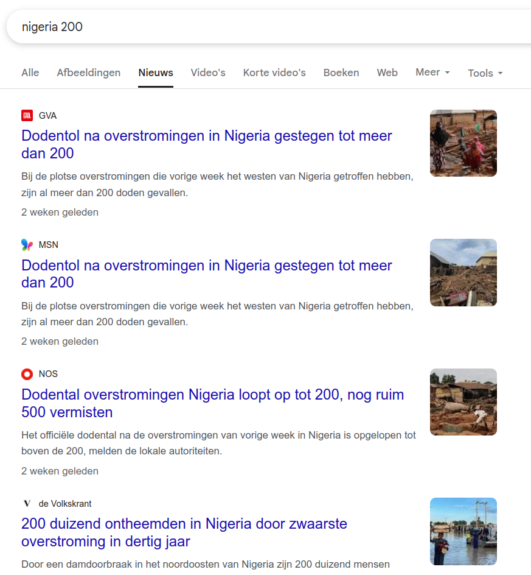

Vanmorgen was ik een beetje uit mijn hum, omdat ik op Aleteia, een katholieke nieuwssite, dit bericht las: *"[Nigeria : près de 200 personnes massacrées dans une mission catholique](https://fr.aleteia.org/2025/06/16/nigeria-pres-de-200-personnes-massacrees-dans-une-mission-catholique/)"*. Waarover ik nu ga ranten, is iedereen genoegzaam bekend, maar toch blijf ik het ervaren als een onaangename slag in het gezicht (ook daarover straks meer). Een vraag die in het ganse artikel over de moordpartij immers niet werd gesteld, laat staan beantwoord, is de eerste vraag die spontaan bij iedereen opkomt die zo'n nieuws verneemt: wie waren de daders?

Wie weet vinden we daarover elders op het internet wel informatie. Dit is wat Google Nieuws, dat alle kranten inventariseert, weet te vertellen:

Google zet de Nederlandstalige pers voor mij bovenaan, en wat blijkt: in geen enkele krant wordt over de moordpartij met 200 slachtoffers bericht. Wel verneem ik dat twee weken geleden in hetzelfde land 200 slachtoffers vielen bij een overstroming. Blijkbaar beslist men in de redactielokalen unaniem dat een slachtoffer van een natuurramp meer aandacht waard is dan een slachtoffer van een gruwelijke slachtpartij. Of is het omdat moordpartijen in Nigeria dagelijkse kost zijn en natuurrampen eerder zeldzaam? Nu ja, iedereen weet hoe bezeten de *mainstream* media zijn door klimaat, dus dit wekt geen verbazing, maar nu ligt het wel zwart op wit op tafel: de ene dode Nigeriaan is de andere niet&#x2026;

Na wat scrollen kom ik uit bij internationale pers, waar er wel wordt bericht over de moordpartij én over de daders. Het valt op dat enkel katholieke nieuwssites hierover berichten, en daarbij (op Aleteia) na, uitdrukkelijk de daders benoemen als Fulani jihadisten. De enige niet-katholieke nieuwsbron die ik vond, was BBC, dat de moorden kadert in een conflict tussen herders (Fulani moslims) en boeren (christenen).

Het zal dan misschien toch niet zo erg zijn in Nigeria? Wat zegt de website [Genocide Watch](https://www.genocidewatch.com/) over de toestand? Eerst voor de veiligheid even een benchmark nemen met de allerergste genocide van de laatste decennia (of misschien wel sinds WO II?): Gaza. De genocide-experten (ja, zoals je die dagelijks op radio en tv hoort), hanteren een schaal van 1 tot 10 om de verschillende stadia te identificeren die tot een werkelijke genocide leiden. Het [Rapport van Israel/Palestina](https://www.genocidewatch.com/country-pages/israel%2Fpalestine) leert dat dit conflict zich in de algemene toestand van "WARNING" bevindt, in de stadia "Stage 5 (organisation) Stage 6 (polarisation) Stage 7 (preparation)". Kijken we naar het [Rapport van Nigeria](https://www.genocidewatch.com/country-pages/nigeria), blijkt dat de genocide hier in staat van "EMERGENCY" is en fase "Stage 9: Extermination, Stage 10: Denial" heeft bereikt. Slachtoffers: "Christians, Moderate Muslims, LGBTQIA+ People". Daders: "Boko Haram, ISWAP, Fulani Jihadists", of beknopter: "Islam, Islam, Islam".

Ik dacht dat mijn vertrouwen in de pers al lang niet meer lager kon zinken, maar het is toch weer gelukt. De selectieve blindheid voor het ene en de drammerigheid over het andere maakt me misselijk en boos. Maar misschien keert dat nog in het verder verloop van dit artikel?

De reden waarom de katholieke media wel *en masse* over de moordpartij berichtten, was dat paus Leo XIV in zijn Angelusgebed vorige zondag voor de slachtoffers bad. De slachtoffers waren immers zelf reeds vluchtelingen in eigen land, ontheemd door eerder geweld en opgevangen in een katholieke missiepost. Het lijden van die mensen moet verschrikkelijk zijn.

In de loop van de dag heb ik me herhaaldelijk afgevraagd waarom Aleteia, waar ik het bericht eerst vernam, zweeg over de daders. Vanuit journalistiek oogpunt vind ik het een aanfluiting van de beroepsernst, maar vanuit katholiek perspectief vond ik toch één mogelijke verklaring.

Het bericht verscheen op maandag en op diezelfde dag valt in het lectionarium de evangelielezing met de bekende woorden van Jezus uit de bergrede: "[verzet je niet tegen wie kwaad doet, maar keer degene die je op de rechterwang slaat, ook de linkerwang toe.](https://www.bijbelcitaat.be/maandag-in-de-11%E1%B5%89-week-door-het-jaar/)" Het zou kunnen dat de auteur juist terugkwam van de ochtendmis en, het evangelie nog indachtig, schroom voelde om in zijn artikel een beschuldiging op te nemen die ongenuanceerd een ganse geloofsgroep in een slecht daglicht zou stellen, zo ook indirect zijn linkerwang toekerend aan zijn collega's uit andere media, die zo'n schroom nooit voelen als de bron van een of ander—al dan niet ingebeeld—kwaad het katholieke geloof zou betreffen.

Zijn christelijkheid wordt echter in de schaduw gesteld door het radikale pacifisme van zijn—wellicht ongelovige—collega's, die immers de pen laten vallen zodra een islamiet iets euvel te duiden is. Blijkbaar ervaren zij ook diezelfde schroom als de auteur van het artikel op Aleteia, en nog in hogere mate! Hun weg-met-ons-houding is een praktisering van het radikale pacifisme dat Jezus predikt. Hun hardnekkig zwijgen is een teken dat ze zich de uitersten van de christelijke liefde eigen maken. Zij beminnen door hun zwijgen hun vijanden&#x2026; en daarmee erkennen zij hen alsdusdanig.

